### What is the Cloud?

The US National Institute of Standards and Technology created it, although, there is nothing US specific about it.
Here it is, cloud computing is a way of using I.T. that has these five equally important traits.

- First, you get computing resources on-demand and self-service. All you have to do is use a simple interface and you get the processing power, storage, and network you need, with no need for human intervention.
- Second, you access these resources over the net from anywhere you want.
- Third, the provider of those resources has a big pool of them and allocates them to customers out of that pool. That allows the provider to get economies of scale by buying in bulk and pass the savings on to the customers. Customers don't have to know or care about the exact physical location of those resources.
- Fourth, the resources are elastic. If you need more resources you can get more, rapidly. If you need less, you can scale back.
- And last, the customers pay only for what they use or reserve as they go. If they stop using resources, they stop paying.

That's it. That's the definition of cloud.
 

### How Did We Get Here?

But why is this model so compelling nowadays? To understand why, we need to look at some history...

The first wave of the trend that brought us towards cloud computing was co-location, which IT shops have been doing for decades. Instead of building costly capital intensive data centers, they can rent space in shared facilities. That frees up capital for more flexible uses than real estate.

In the first decade of the 2000s, IT departments' need for efficiency drove them to use virtualization. The components of a virtualized data center match the parts of a physical data center; servers, disks and so on. But now there are virtual devices separately manageable from the underlying hardware.

Virtualization lets us all use resources more efficiently and just like colocation, it lets us be more flexible too. With virtualization you still buy, house and maintain the infrastructure. So, you're still in the business of guessing how much hardware you'll need and when, setting it up and keeping it running.

About 10 years ago, Google realized that its business couldn't move fast enough within the confines of the virtualization model. So, Google switched to a container based architecture, an automated, elastic, third wave cloud built from automated services. We'll explain exactly what containers are later in this course.

In Google's internal cloud, services automatically provision and configure the infrastructure that is used to run familiar Google applications. Google has spent billions of dollars building this platform and making it resilient and efficient. Today, Google Cloud platform makes it available to Google customers.
 

### Every Company is a Data Company

Google believes that in the future every company, regardless of size or industry, will differentiate itself from its competitors through technology largely in the form of software, great software centered on data.

Thus, every company will become a data company, if it isn't already one now. Google Cloud provides a wide variety of services for managing and getting value from data and doing that at scale.

 

### GCP Computing Architectures

Virtualized data centers brought you Infrastructure as a Service, `IaaS`, and Platform as a Service, `PaaS` offerings.

- IaaS offerings provide raw compute, storage, and network organized in ways that are familiar from data centers.

- PaaS offerings, on the other hand, bind application code you write to libraries that give access to the infrastructure your application needs.

That way, you can just focus on your application logic.

- In the IaaS model, you pay for what you allocate.
- In the PaaS model, you pay for what you use.

Both sure beat the old way where you bought everything in advance based on lots of risky forecasting.

As Cloud Computing has evolved, the momentum has shifted towards managed infrastructure and managed services.
GCP offers many services in which you need not worry about any resource provisioning at all.

They're easy to build into your applications and you pay per use.

By the way, now that I've mentioned PaaS and IaaS, you might be asking yourself what about SaaS? Of course, Google's popular applications like, Search, Gmail, Docs and Drive are Software as a Service applications in that they're consumed directly over the internet by end users.

 

### The Google Network

According to some estimates out there publicly, Google's network carries as much as 40 percent of the world's Internet traffic every day.

Google's network is the largest of its kind on earth and the company has invested billions of dollars over the years to build it.

It's designed to give its users the highest possible throughput and the lowest possible latencies for their applications.

The network interconnects at more than 90 Internet exchanges and more than 100 points of presence worldwide. When an Internet user sends traffic to a Google resource, Google responds to the user's request from an edge network location that will provide the lowest latency.

Google's Edge-caching network sites content close to end users to minimize latency.

 

### GCP Regions and Zomes

Here's how GCP is organized.

Let's start at the finest grain level, the Zone.
 

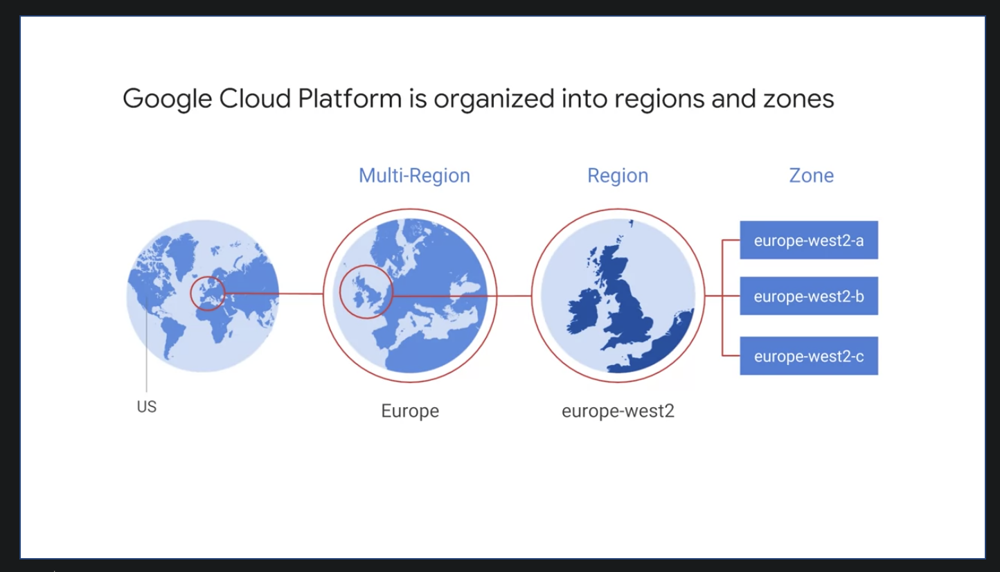
 

A zone is a deployment area for Google Cloud Platform Resources. For example, when you launch a virtual machine in GCP using Compute Engine, it runs in a zone you specify.

Although people think of a zone as being like a GCP Data Center, that's not strictly accurate because a zone doesn't always correspond to a single physical building. You can still visualize the zone that way, though.

Zones are grouped into regions, independent geographic areas, and you can choose what regions your GCP resources are in. All the zones within a region have fast network connectivity among them. Locations within regions usually have round trip network latencies of under five milliseconds.

Think of a zone as a single failure domain within a region. As part of building a fault tolerant application, you can spread their resources across multiple zones in a region. That helps protect against unexpected failures. You can run resources in different regions too.

Lots of GCP customers do that, both to bring their applications closer to users around the world, and also to protect against the loss of an entire region, say, due to a natural disaster.

A few Google Cloud Platform Services support placing resources in what we call a Multi-Region. For example, Google Cloud Storage, which we'll discuss later, lets you place data within the Europe Multi-Region. That means, it's stored redundantly in at least two geographic locations, separated by at least 160 kilometers within Europe.

As of the time of this courses's production, GCP had 15 regions. Visit [Google Cloud](cloud.google.com) to see what the total is up to today.
 

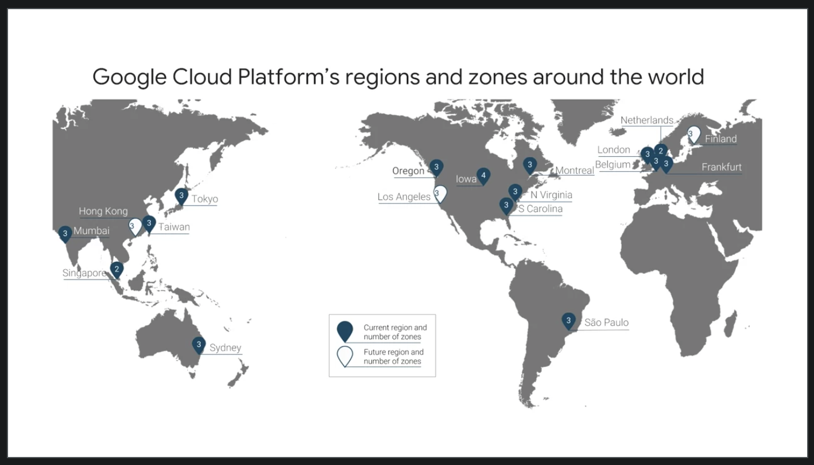

 

### Environmental Responsibility

The virtual world is built on physical infrastructure, and all those racks of humming servers use vast amounts of energy.

Together, all existing data centers use roughly two percent of the world's electricity, so Google works to make data centers run as efficiently as possible.

Google's data centers were the first to achieve ISO 14001 certification, which is a standard that maps out a framework for improving resource efficiency and reducing waste.

 

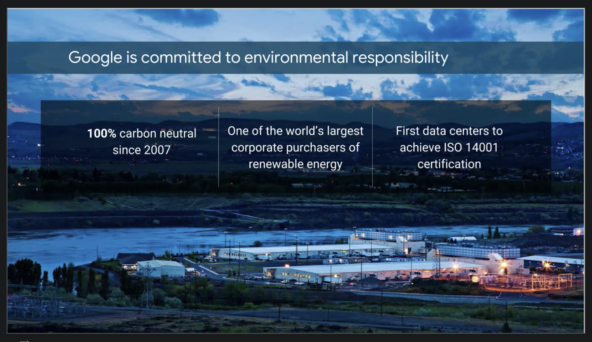

 

This is Google's data center in Hamina, Finland, one of the most advanced and efficient data centers in the Google fleet. Its cooling system uses seawater from the bay of Finland to reduce energy use. It's the first of its kind anywhere in the world.

Google is one of the world's largest corporate purchasers of wind and solar energy. Google has been a hundred percent carbon neutral since 2007, and will shortly reach a hundred percent renewable energy sources for its data centers.
Just like its customers, Google is trying to do the right things for the planet. GCP customers have environmental goals of their own, and running their workloads in GCP can be a part of meeting them.

 

### Google Offers Customer-Friendly Pricing

Google was the first major Cloud provider to deliver per second billing for its Infrastructure as a Service Compute offering, Google Compute Engine.

Fine-grain billing is a big cost savings for workloads that are bursty, which is a lot of them. Many of the best-known GCP services bill by the second, including Compute Engine and Kubernetes Engine and you'll learn about them and others in this course.

Compute Engine offers automatically applied sustained use discounts which are automatic discounts that you get for running a virtual machine instance for a significant portion of the billing month. Specifically, when you run an instance for more than 25 percent of a month, Compute Engine automatically gives you a discount for every incremental minute you use for that instance.

Compute Engines Custom Virtual Machine types lets you fine-tune virtual machines for their applications, which in turn lets you tailor your pricing for your workloads. The online pricing calculator can help estimate your costs.
 

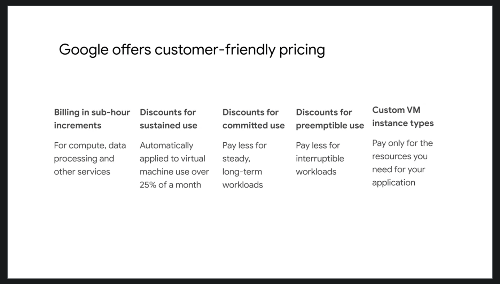

 

### Open APIs

Some people are afraid to bring their workloads to the cloud because they're afraid they'll get locked into a particular vendor. But in lots of ways, Google gives customers the ability to run their applications elsewhere, if Google becomes no longer the best provider for their needs.

Here are some examples of how Google helps its customers avoid feeling locked in:

- GCP services are compatible with open source products. For example, take Cloud Bigtable, a database we'll discuss later. Bigtable uses the interface of the open source database Apache HBase, which gives customers the benefit of code portability.

- Another example, Cloud Dataproc offers the open source big data environment Hadoop, as a managed service. Google publishes key elements of technology using open source licenses to create ecosystems that provide customers with options other than Google. For example, TensorFlow, an open source software library for machine learning developed inside Google, is at the heart of a strong open source ecosystem.

Many GCP technologies provide interoperability. Kubernetes gives customers the ability to mix and match microservices running across different clouds, and Google Stackdriver lets customers monitor workload across multiple cloud providers.

 

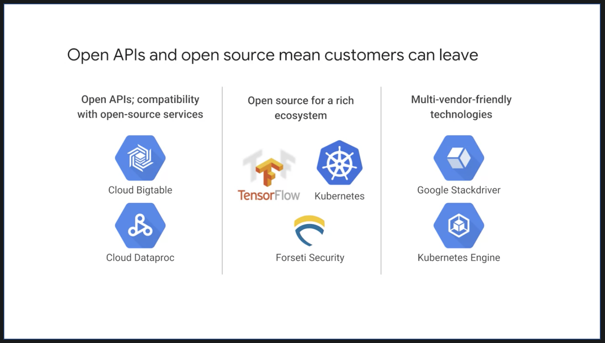

 

### Why Choose Google Cloud Platform

Google Cloud Platform lets you choose from computing, storage, big data, machine learning and application services for your web, mobile, analytics and back-end solutions.

It's global, it's cost effective, it's open source friendly and it's designed for security.

Let's sum up. Google Cloud Platform's products and services can be broadly categorized as compute, storage, big data, machine learning, networking and operations and tools.

This course considers each of the compute services and discusses why customers might choose each. The course will examine each of Google Cloud Platform storage services, how it works and when customers use it. To learn more about these services, you can participate in the training courses in Google Cloud's Data Analyst learning track. This course also examines the function and purpose of Google Cloud Platform's big data and machine learning services.

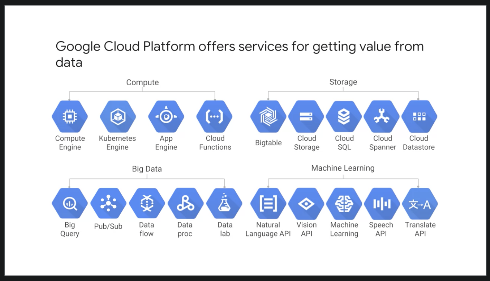

 

### Multi-layered Security Approach

Because Google has seven services with more than a billion users, you can bet security is always on the minds of Google's employees.

Design for security is pervasive, throughout the infrastructure, the GCP and Google services run-on.

Let's talk about a few ways Google works to keep customers' data safe, starting at the bottom and working up.

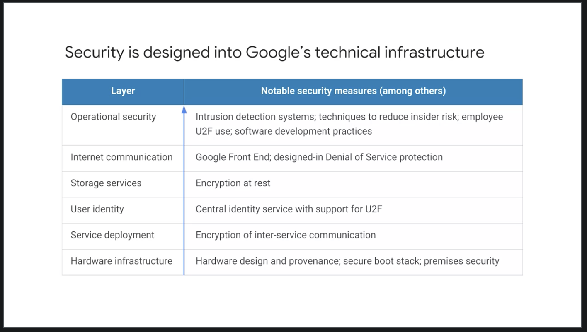

Both the server boards and the networking equipment in Google data centers are custom designed by Google. Google also designs custom chips, including a hardware security chip called Titan that's currently being deployed on both servers and peripherals.

Google server machines use cryptographic signatures to make sure they are booting the correct software. Google designs and builds its own data centers which incorporate multiple layers of physical security protections. Access to these data centers is limited to only a very small fraction of Google employees.

Google's infrastructure provides cryptographic privacy and integrity for remote procedure called data-on-the-network, which is how Google services communicate with each other.

The infrastructure automatically encrypts our PC traffic in transit between data centers.

Google Central Identity Service, which usually manifests to end users as the Google log-in page, goes beyond asking for a simple username and password. It also intelligently challenges users for additional information based on risk factors such as whether they have logged in from the same device or a similar location in the past. Users can also use second factors when signing in, including devices based on the universal second factor `U2F` open standard.

Most applications at Google access physical storage indirectly via storage services and encryption is built into those services. Google also enables hardware encryption support in hard drives and SSDs. That's how Google achieves encryption at rest of customer data. Google services that want to make themselves available on the Internet register themselves with an infrastructure service called the `Google Front End`, which checks incoming network connections for correct certificates and best practices. The GFE also additionally, applies protections against denial of service attacks. The sheer scale of its infrastructure, enables Google to simply absorb many denial of service attacks, even behind the GFEs.

Google also has multi-tier, multi-layer denial of service protections that further reduce the risk of any denial of service impact.

Inside Google's infrastructure, machine intelligence and rules warn of possible incidents. Google conducts Red Team exercises, simulated attacks to improve the effectiveness of its responses.

Google aggressively limits and actively monitors the activities of employees who have been granted administrative access to the infrastructure.

To guard against phishing attacks against Google employees, employee accounts including mine require use of `U2F` compatible security keys.

To help ensure that code is as secure as possible Google stores its source code centrally and requires two-party review of new code. Google also gives its developers libraries that keep them from introducing certain classes of security bugs. Externally, Google also runs a vulnerability rewards program, where we pay anyone who is able to discover and inform us of bugs in our infrastructure or applications.

 

### Budgets & Billing

You're probably thinking, "how can I make sure I don't accidentally run up a big GCP bill?"

GCP provides four tools to help: budgets and alerts, billing, export, reports and quotas.

Let's look at budgets and alerts first. You can define budgets either per billing account or per GCP project. A budget can be a fixed limit or you can tie it to another metric. For example, a percentage of the previous month spend. To be notified when costs approach your budget limit, create an alert. For example, with a budget limit of $20,000 and an alert set at 90 percent, you'll receive a notification alert when your expenses reach $18,000. Alerts are generally set at 50 percent, 90 percent, and 100 percent. But you can customize that.

 

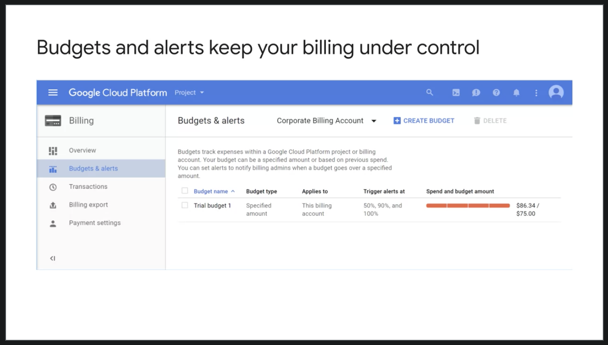

 

Billing export lets you store detailed billing information in places where it's easy to retrieve for more detailed analysis, such as a BigQuery dataset or a Cloud storage bucket. Reports is a visual tool in the GCP console that allows you to monitor your expenditure.

 

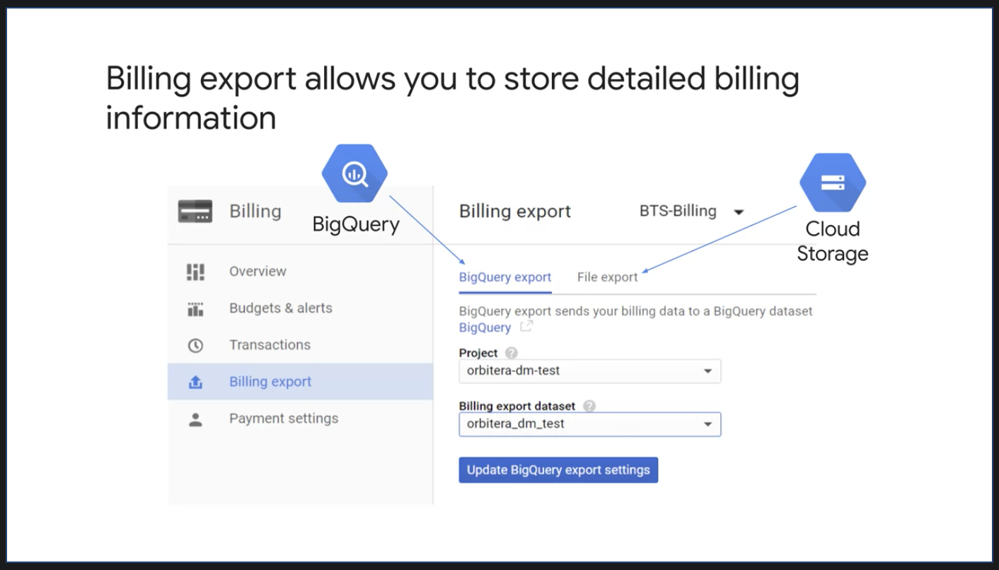

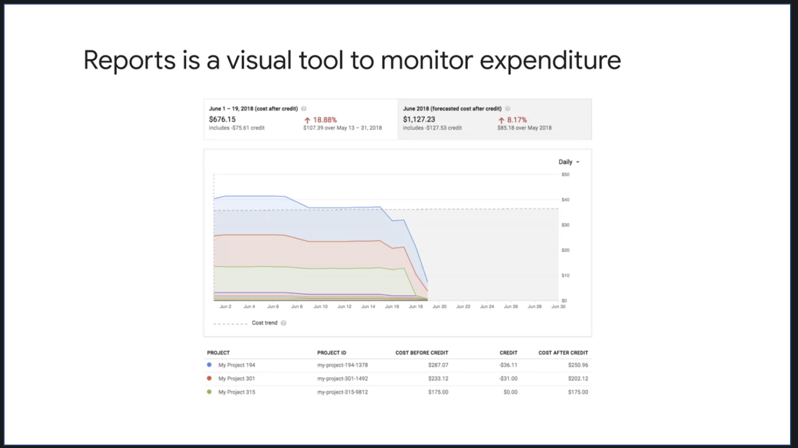

 

GCP also implements quotas, which protect both account owners and the GCP community as a whole. Quotas are designed to prevent the over-consumption of resources, whether because of error or malicious attack.

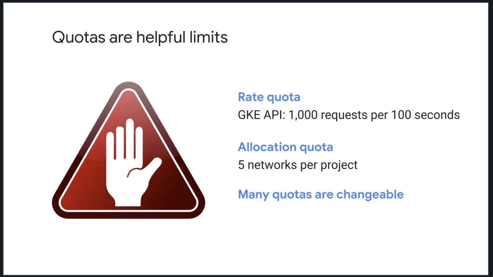

There are two types of quotas:
- rate quotas
- allocation quotas.

Both get applied at the level of the GCP project. Rate quotas reset after a specific time.

For example, by default, the Kubernetes Engine service sets a quota of a 1000 calls to its API from each GCP project every 100 seconds. After that 100 seconds, the limit is reset.

Allocation quotas, on the other hand, govern the number of resources you can have in your projects.

For example, by default, each GCP project has a quota allowing it no more than five Virtual Private Cloud networks.

Although projects all start with the same quotas, you can change some of them by requesting an increase from Google Cloud support.

 
