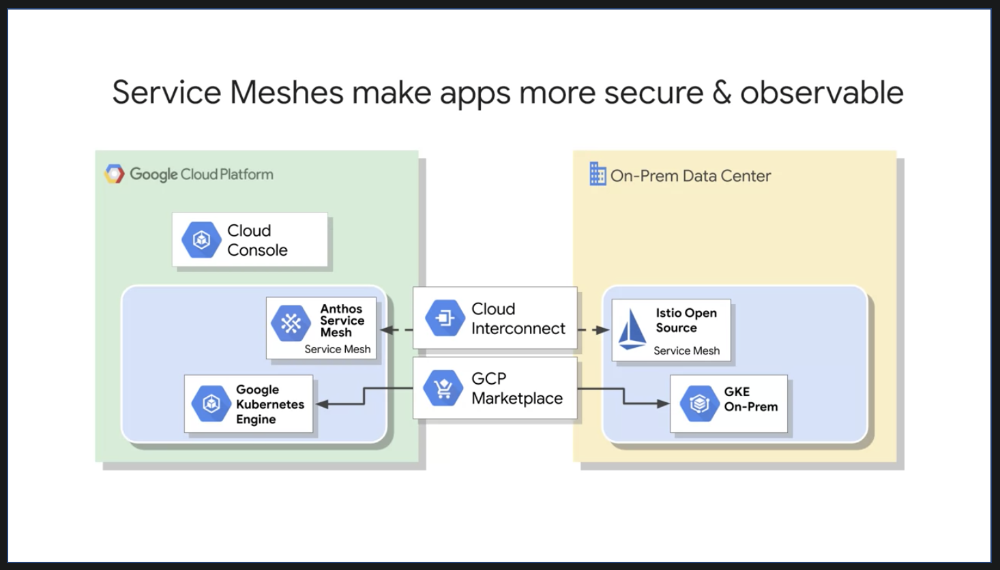

# Google Cloud Fundamentals Core Infrastructure

 

- [Google Cloud Fundamentals Core Infrastructure](#google-cloud-fundamentals-core-infrastructure)
  - [What is the Cloud?](#what-is-the-cloud)
    - [How Did We Get Here?](#how-did-we-get-here)
    - [Every Company is a Data Company](#every-company-is-a-data-company)
    - [GCP Computing Architectures](#gcp-computing-architectures)
    - [The Google Network](#the-google-network)
    - [GCP Regions and Zones](#gcp-regions-and-zones)
    - [Environmental Responsibility](#environmental-responsibility)
    - [Google Offers Customer-Friendly Pricing](#google-offers-customer-friendly-pricing)
    - [Open APIs](#open-apis)
    - [Why Choose Google Cloud Platform](#why-choose-google-cloud-platform)
    - [Multi-layered Security Approach](#multi-layered-security-approach)
    - [Budgets & Billing](#budgets--billing)
  - [Resource Management Module Intro](#resource-management-module-intro)
    - [The GCP Resource Hierarchy](#the-gcp-resource-hierarchy)
    - [Identity Access & Management](#identity-access--management)
    - [IAM Roles](#iam-roles)
    - [Interacting with Google Cloud Platform](#interacting-with-google-cloud-platform)
    - [Cloud Marketplace (formerly Cloud Launcher)](#cloud-marketplace-formerly-cloud-launcher)
      - [Demonstration, Lab](#demonstration-lab)
  - [Compute Engine Module Intro](#compute-engine-module-intro)
    - [Virtual Private Cloud (VPC) Network](#virtual-private-cloud-vpc-network)
    - [Compute Engine](#compute-engine)
    - [Important VPC Capabilities](#important-vpc-capabilities)
      - [- Lab: Getting Started with Compute Engine](#--lab-getting-started-with-compute-engine)
  - [Cloud Storage Module Intro](#cloud-storage-module-intro)
    - [Cloud Storage](#cloud-storage)
    - [Cloud Storage Interactions](#cloud-storage-interactions)
    - [Cloud Bigtable](#cloud-bigtable)
    - [Cloud SQL & Cloud Spanner](#cloud-sql--cloud-spanner)
    - [Cloud Datastore](#cloud-datastore)
    - [Comparing Storage Options](#comparing-storage-options)
      - [Lab: Getting started with Cloud Storage and Cloud SQL](#lab-getting-started-with-cloud-storage-and-cloud-sql)
  - [Containers, Kubernetes & Kubernetes Engine](#containers-kubernetes--kubernetes-engine)
    - [Introduction to Kubernetes and GKE](#introduction-to-kubernetes-and-gke)
    - [Introduction to Hybrid and Multi-Cloud Computing (Anthos)](#introduction-to-hybrid-and-multi-cloud-computing-anthos)
      - [Lab Intro - Getting Started with Kubernetes Engine](#lab-intro---getting-started-with-kubernetes-engine)
      - [Demo - Getting Started with Kubernetes Engine](#demo---getting-started-with-kubernetes-engine)
  - [Module Introduction - Introduction to App Engine](#module-introduction---introduction-to-app-engine)

## What is the Cloud?

The US National Institute of Standards and Technology created it, although, there is nothing US specific about it.
Here it is, cloud computing is a way of using I.T. that has these five equally important traits.

- First, you get computing resources on-demand and self-service. All you have to do is use a simple interface and you get the processing power, storage, and network you need, with no need for human intervention.
- Second, you access these resources over the net from anywhere you want.
- Third, the provider of those resources has a big pool of them and allocates them to customers out of that pool. That allows the provider to get economies of scale by buying in bulk and pass the savings on to the customers. Customers don't have to know or care about the exact physical location of those resources.
- Fourth, the resources are elastic. If you need more resources you can get more, rapidly. If you need less, you can scale back.
- And last, the customers pay only for what they use or reserve as they go. If they stop using resources, they stop paying.

That's it. That's the definition of cloud.
 

### How Did We Get Here?

But why is this model so compelling nowadays? To understand why, we need to look at some history...

The first wave of the trend that brought us towards cloud computing was co-location, which IT shops have been doing for decades. Instead of building costly capital intensive data centers, they can rent space in shared facilities. That frees up capital for more flexible uses than real estate.

In the first decade of the 2000s, IT departments' need for efficiency drove them to use virtualization. The components of a virtualized data center match the parts of a physical data center; servers, disks and so on. But now there are virtual devices separately manageable from the underlying hardware.

Virtualization lets us all use resources more efficiently and just like colocation, it lets us be more flexible too. With virtualization you still buy, house and maintain the infrastructure. So, you're still in the business of guessing how much hardware you'll need and when, setting it up and keeping it running.

About 10 years ago, Google realized that its business couldn't move fast enough within the confines of the virtualization model. So, Google switched to a container based architecture, an automated, elastic, third wave cloud built from automated services. We'll explain exactly what containers are later in this course.

In Google's internal cloud, services automatically provision and configure the infrastructure that is used to run familiar Google applications. Google has spent billions of dollars building this platform and making it resilient and efficient. Today, Google Cloud platform makes it available to Google customers.
 

### Every Company is a Data Company

Google believes that in the future every company, regardless of size or industry, will differentiate itself from its competitors through technology largely in the form of software, great software centered on data.

Thus, every company will become a data company, if it isn't already one now. Google Cloud provides a wide variety of services for managing and getting value from data and doing that at scale.

 

### GCP Computing Architectures

Virtualized data centers brought you Infrastructure as a Service, `IaaS`, and Platform as a Service, `PaaS` offerings.

- IaaS offerings provide raw compute, storage, and network organized in ways that are familiar from data centers.

- PaaS offerings, on the other hand, bind application code you write to libraries that give access to the infrastructure your application needs.

That way, you can just focus on your application logic.

- In the IaaS model, you pay for what you allocate.
- In the PaaS model, you pay for what you use.

Both sure beat the old way where you bought everything in advance based on lots of risky forecasting.

As Cloud Computing has evolved, the momentum has shifted towards managed infrastructure and managed services.
GCP offers many services in which you need not worry about any resource provisioning at all.

They're easy to build into your applications and you pay per use.

By the way, now that I've mentioned PaaS and IaaS, you might be asking yourself what about SaaS? Of course, Google's popular applications like, Search, Gmail, Docs and Drive are Software as a Service applications in that they're consumed directly over the internet by end users.

 

### The Google Network

According to some estimates out there publicly, Google's network carries as much as 40 percent of the world's Internet traffic every day.

Google's network is the largest of its kind on earth and the company has invested billions of dollars over the years to build it.

It's designed to give its users the highest possible throughput and the lowest possible latencies for their applications.

The network interconnects at more than 90 Internet exchanges and more than 100 points of presence worldwide. When an Internet user sends traffic to a Google resource, Google responds to the user's request from an edge network location that will provide the lowest latency.

Google's Edge-caching network sites content close to end users to minimize latency.

 

### GCP Regions and Zones

Here's how GCP is organized.

Let's start at the finest grain level, the Zone.
 

 

A zone is a deployment area for Google Cloud Platform Resources. For example, when you launch a virtual machine in GCP using Compute Engine, it runs in a zone you specify.

Although people think of a zone as being like a GCP Data Center, that's not strictly accurate because a zone doesn't always correspond to a single physical building. You can still visualize the zone that way, though.

Zones are grouped into regions, independent geographic areas, and you can choose what regions your GCP resources are in. All the zones within a region have fast network connectivity among them. Locations within regions usually have round trip network latencies of under five milliseconds.

Think of a zone as a single failure domain within a region. As part of building a fault tolerant application, you can spread their resources across multiple zones in a region. That helps protect against unexpected failures. You can run resources in different regions too.

Lots of GCP customers do that, both to bring their applications closer to users around the world, and also to protect against the loss of an entire region, say, due to a natural disaster.

A few Google Cloud Platform Services support placing resources in what we call a Multi-Region. For example, Google Cloud Storage, which we'll discuss later, lets you place data within the Europe Multi-Region. That means, it's stored redundantly in at least two geographic locations, separated by at least 160 kilometers within Europe.

As of the time of this courses's production, GCP had 15 regions. Visit [Google Cloud](cloud.google.com) to see what the total is up to today.
 

 

### Environmental Responsibility

The virtual world is built on physical infrastructure, and all those racks of humming servers use vast amounts of energy.

Together, all existing data centers use roughly two percent of the world's electricity, so Google works to make data centers run as efficiently as possible.

Google's data centers were the first to achieve ISO 14001 certification, which is a standard that maps out a framework for improving resource efficiency and reducing waste.

 

 

This is Google's data center in Hamina, Finland, one of the most advanced and efficient data centers in the Google fleet. Its cooling system uses seawater from the bay of Finland to reduce energy use. It's the first of its kind anywhere in the world.

Google is one of the world's largest corporate purchasers of wind and solar energy. Google has been a hundred percent carbon neutral since 2007, and will shortly reach a hundred percent renewable energy sources for its data centers.
Just like its customers, Google is trying to do the right things for the planet. GCP customers have environmental goals of their own, and running their workloads in GCP can be a part of meeting them.

 

### Google Offers Customer-Friendly Pricing

Google was the first major Cloud provider to deliver per second billing for its Infrastructure as a Service Compute offering, Google Compute Engine.

Fine-grain billing is a big cost savings for workloads that are bursty, which is a lot of them. Many of the best-known GCP services bill by the second, including Compute Engine and Kubernetes Engine and you'll learn about them and others in this course.

Compute Engine offers automatically applied sustained use discounts which are automatic discounts that you get for running a virtual machine instance for a significant portion of the billing month. Specifically, when you run an instance for more than 25 percent of a month, Compute Engine automatically gives you a discount for every incremental minute you use for that instance.

Compute Engines Custom Virtual Machine types lets you fine-tune virtual machines for their applications, which in turn lets you tailor your pricing for your workloads. The online pricing calculator can help estimate your costs.
 

 

### Open APIs

Some people are afraid to bring their workloads to the cloud because they're afraid they'll get locked into a particular vendor. But in lots of ways, Google gives customers the ability to run their applications elsewhere, if Google becomes no longer the best provider for their needs.

Here are some examples of how Google helps its customers avoid feeling locked in:

- GCP services are compatible with open source products. For example, take Cloud Bigtable, a database we'll discuss later. Bigtable uses the interface of the open source database Apache HBase, which gives customers the benefit of code portability.

- Another example, Cloud Dataproc offers the open source big data environment Hadoop, as a managed service. Google publishes key elements of technology using open source licenses to create ecosystems that provide customers with options other than Google. For example, TensorFlow, an open source software library for machine learning developed inside Google, is at the heart of a strong open source ecosystem.

Many GCP technologies provide interoperability. Kubernetes gives customers the ability to mix and match microservices running across different clouds, and Google Stackdriver lets customers monitor workload across multiple cloud providers.

 

 

### Why Choose Google Cloud Platform

Google Cloud Platform lets you choose from computing, storage, big data, machine learning and application services for your web, mobile, analytics and back-end solutions.

It's global, it's cost effective, it's open source friendly and it's designed for security.

Let's sum up. Google Cloud Platform's products and services can be broadly categorized as compute, storage, big data, machine learning, networking and operations and tools.

This course considers each of the compute services and discusses why customers might choose each. The course will examine each of Google Cloud Platform storage services, how it works and when customers use it. To learn more about these services, you can participate in the training courses in Google Cloud's Data Analyst learning track. This course also examines the function and purpose of Google Cloud Platform's big data and machine learning services.

 

### Multi-layered Security Approach

Because Google has seven services with more than a billion users, you can bet security is always on the minds of Google's employees.

Design for security is pervasive, throughout the infrastructure, the GCP and Google services run-on.

Let's talk about a few ways Google works to keep customers' data safe, starting at the bottom and working up.

Both the server boards and the networking equipment in Google data centers are custom designed by Google. Google also designs custom chips, including a hardware security chip called Titan that's currently being deployed on both servers and peripherals.

Google server machines use cryptographic signatures to make sure they are booting the correct software. Google designs and builds its own data centers which incorporate multiple layers of physical security protections. Access to these data centers is limited to only a very small fraction of Google employees.

Google's infrastructure provides cryptographic privacy and integrity for remote procedure called data-on-the-network, which is how Google services communicate with each other.

The infrastructure automatically encrypts our PC traffic in transit between data centers.

Google Central Identity Service, which usually manifests to end users as the Google log-in page, goes beyond asking for a simple username and password. It also intelligently challenges users for additional information based on risk factors such as whether they have logged in from the same device or a similar location in the past. Users can also use second factors when signing in, including devices based on the universal second factor `U2F` open standard.

Most applications at Google access physical storage indirectly via storage services and encryption is built into those services. Google also enables hardware encryption support in hard drives and SSDs. That's how Google achieves encryption at rest of customer data. Google services that want to make themselves available on the Internet register themselves with an infrastructure service called the `Google Front End`, which checks incoming network connections for correct certificates and best practices. The GFE also additionally, applies protections against denial of service attacks. The sheer scale of its infrastructure, enables Google to simply absorb many denial of service attacks, even behind the GFEs.

Google also has multi-tier, multi-layer denial of service protections that further reduce the risk of any denial of service impact.

Inside Google's infrastructure, machine intelligence and rules warn of possible incidents. Google conducts Red Team exercises, simulated attacks to improve the effectiveness of its responses.

Google aggressively limits and actively monitors the activities of employees who have been granted administrative access to the infrastructure.

To guard against phishing attacks against Google employees, employee accounts including mine require use of `U2F` compatible security keys.

To help ensure that code is as secure as possible Google stores its source code centrally and requires two-party review of new code. Google also gives its developers libraries that keep them from introducing certain classes of security bugs. Externally, Google also runs a vulnerability rewards program, where we pay anyone who is able to discover and inform us of bugs in our infrastructure or applications.

 

### Budgets & Billing

You're probably thinking, "how can I make sure I don't accidentally run up a big GCP bill?"

GCP provides four tools to help: budgets and alerts, billing, export, reports and quotas.

Let's look at budgets and alerts first. You can define budgets either per billing account or per GCP project. A budget can be a fixed limit or you can tie it to another metric. For example, a percentage of the previous month spend. To be notified when costs approach your budget limit, create an alert. For example, with a budget limit of $20,000 and an alert set at 90 percent, you'll receive a notification alert when your expenses reach $18,000. Alerts are generally set at 50 percent, 90 percent, and 100 percent. But you can customize that.

 

 

Billing export lets you store detailed billing information in places where it's easy to retrieve for more detailed analysis, such as a BigQuery dataset or a Cloud storage bucket. Reports is a visual tool in the GCP console that allows you to monitor your expenditure.

 

 

GCP also implements quotas, which protect both account owners and the GCP community as a whole. Quotas are designed to prevent the over-consumption of resources, whether because of error or malicious attack.

There are two types of quotas:
- rate quotas
- allocation quotas.

Both get applied at the level of the GCP project. Rate quotas reset after a specific time.

For example, by default, the Kubernetes Engine service sets a quota of a 1000 calls to its API from each GCP project every 100 seconds. After that 100 seconds, the limit is reset.

Allocation quotas, on the other hand, govern the number of resources you can have in your projects.

For example, by default, each GCP project has a quota allowing it no more than five Virtual Private Cloud networks.

Although projects all start with the same quotas, you can change some of them by requesting an increase from Google Cloud support.

 

## Resource Management Module Intro

When you run your workloads in GCP, you use projects to organize them.

You use Google Cloud Identity, and Access Management, also called IM, or IAM to control who can do what. And you use your choice of several interfaces to connect.

In this module, you'll use these basics to get started. Projects are the main way you organize the resources you use in GCP. Use them to group together related resources, usually because they have a common business objective.

The principle of least privilege is very important in managing any kind of compute infrastructure, whether it's in the Cloud or on-premises. This principle says that each user should have only those privileges needed to do their jobs.

In a least-privilege environment, people are protected from an entire class of errors. A coworker of mine once accidentally deleted a running production database. Why? Because he was working as the root user on the system when he shouldn't have been.

 

 

GCP customers use IM to implement least privilege, and it makes everybody happier.

There are four ways to interact with GCP's management layer:

- Through the web-based console
- Through the SDK and its command-line tools
- Through the APIs
- Through a mobile app.

In this class, you'll mostly use the console and the command-line tools.

When you build an application on your on-premises infrastructure, you're responsible for the entire stack security. From the physical security of the hardware, and the premises in which they're housed, through the encryption of the data on disk, the integrity of your network, all the way up to securing the content stored in those applications.

When you move an application to Google Cloud Platform, Google handles many of the lower layers of security. Because of its scale, Google can deliver a higher level of security at these layers than most of its customers could afford to do on their own.

The upper layers of the security stack remain the customers' responsibility. Google provides tools such as IAM to help customers implement the policies they choose at these layers.

 

### The GCP Resource Hierarchy

You may find it easiest to understand the GCP resource hierarchy from the bottom up.

All the resources you use, whether they're virtual machines, cloud storage buckets, tables and big query or anything else in GCP are organized into projects. Optionally, these projects may be organized into folders. Folders can contain other folders. All the folders and projects used by your organization can be brought together under an organization node. Projects, folders and organization nodes are all places where the policies can be defined. Some GCP resources let you put policies on individual resources too.

 

 

In the meantime, remember that policies are inherited downwards in the hierarchy. All Google Cloud platform resources belong to a project. Projects are the basis for enabling and using GCP services like managing APIs, enabling billing and adding and removing collaborators and enabling other Google services. Each project is a separate compartment and each resource belongs to exactly one. Projects can have different owners and users - they're built separately and they're managed separately.

Each GCP project has a name and a project ID that you assign. The project ID is a permanent, unchangeable identifier and it has to be unique across GCP. You use project IDs in several contexts to tell GCP which project you want to work with.

On the other hand, project names are for your convenience and you can assign them. GCP also assigns each of your projects a unique project number and you'll see a display to you in various contexts. But using it is mostly outside the scope of this course.

In general, project IDs are made to be human readable strings and you'll use them frequently to refer to projects.

 

 

You can organize projects into folders, although you don't have to. They're a tool at your disposal to make your life easier. For example, you can use folders to represent different departments, teams, applications or environments in your organization. Folders let teams have the ability to delegate administrative rights, so they can work independently.

The resources in a folder inherit IAM policies from the folder. So, if project three and four are administered by the same team by design, you can put IAM policies into folder B instead. Doing it the other way, putting duplicate copies of those policies on project three and project four would be tedious and error prone.

One word of caution: to use folders, you need an organization node at the top of the hierarchy.

So what's that? Let's talk about it now.

You probably want to organize all the projects in your company into a single structure. Most companies want the ability to have centralized visibility on how resources are being used and to apply policy centrally. That's what the organization node is for. It's the top of the hierarchy. There are some special roles associated with it.

 

 

For example, you can designate an organization policy administrator so that only people with privilege can change policies. You can also assign a project creator role, which is a great way to control who can spend money.

So how do you get an organization node?

In part the answer depends on whether your company is also a G Suite customer. If you have a G Suite domain, GCP projects will automatically belong to your organization node. Otherwise, you can use Google Cloud Identity to create one.

Here's a tip. When you get a new organization node, it lets anyone in the domain create projects and billing accounts just as they could before. That's to avoid surprises and disruption. But it'd be a great first step with a new organization node to decide who on your team should really be able to do those things.

Once you have an organization node, you can create folders underneath it and put it in projects.

Here's an example of how you might organize your resources.

 

 

There are three projects each of which uses resources from several GCP services. In this example, we haven't used any folders, although we could always move projects into folders. Resources inherit the policies of their parent resource. For instance, if you set a policy at the organization level, it is automatically inherited by all its children projects.

And this inheritance is transitive, which means that **all** the resources in those projects inherit the policy too.

There's one important rule to keep in mind.

The policies implemented at a higher level in this hierarchy can't take away access that's granted at a lower level. For example, suppose that a policy applied on the bookshelf project gives user "Pat" the right to modify a cloud storage bucket, but a policy at the organization level says that Pat can only view cloud storage buckets not change them.

The more generous policy is the one that takes effect. Keep this in mind as you design your policies.

 

### Identity Access & Management

IAM lets administrators authorize who can take action on specific resources.

An IAM policy has a "who" part, a "can do what" part, and an "on which resource" part.

 

 

The "who" part names the user or users you're talking about. The "who" part of an IAM policy can be defined either by a Google account, a Google group, a Service account, an entire G Suite, or a Cloud Identity domain. The "can do what" part is defined by an IAM role. An IAM role is a collection of permissions. Most of the time, to do any meaningful operations, you need more than one permission.

For example, to manage instances in a project, you need to create, delete, start, stop, and change an instance. So the permissions are grouped together into a role that makes them easier to manage.

The "who" part of an IAM policy can be a Google account, a Google group, a Service account, or an entire G Suite, or Cloud Identity domain.

There are three kinds of roles in Cloud IAM. Let's talk about each in turn.

 

 

 

Primitive roles are broad. You apply them to a GCP project and they affect all resources in that project. These are the owner, editor, and viewer roles. If you're a viewer on a given resource, you can examine it but not change its state. If you're an editor, you can do everything a viewer can do, plus change its state. And if you are an owner, you can do everything an editor can do, plus manage roles and permissions on the resource.

 

 

The owner role on a project also lets you do one more thing: set up billing. Often, companies want someone to be able to control the billing for a project without the right to change the resources in the project. And that's why you can grant someone the billing administrator role.

Be careful, if you have several people working together on a project that contains sensitive data, primitive roles are probably too coarse. Fortunately, GCP IAM provides a finer grained types of roles.

 

 

GCP services offer their own sets of predefined roles and they define where those roles can be applied. For example, later in this course, we'll talk about Compute Engine, which offers virtual machines as a service.

Compute Engine offers a set of predefined roles, and you can apply them to Compute Engine resources in a given project, a given folder, or in an entire organization. Another example.

Consider Cloud Bigtable, which is a managed database service. Cloud Bigtable offers roles that can apply across an entire organization to a particular project or even to individual Bigtable database instances.

 

### IAM Roles

Compute Engines `InstanceAdmin` Role lets whoever has that role perform a certain set of actions on virtual machines.

The actions are:

- listing them
- reading and changing their configurations
- starting and stopping them.

 

 

And which virtual machines? Well, that depends on where the roles apply.

In this example, all the users of a certain Google Group have the role, and they have it on all the virtual machines in `project_a`.

If you need something even finer-grained, there are custom roles.

A lot of companies have a least-privileged model in which each person in your organization has the minimum amount of privilege needed to do his or her job.

 

 

So, for example, maybe I want to define an `InstanceOperator` Role to allow some users to start and stop Compute Engine and virtual machines, but not reconfigure them. Custom roles allow me to do that.

A couple cautions about custom roles.

- First, you have to decide to use custom roles. You'll need to manage their permissions. Some companies decide they'd rather stick with the predefined roles.
- Second, custom roles can only be used at the project or organization levels. They can't be used at the folder level.

What if you want to give permissions to a Compute Engine virtual machine, rather than to a person?  Then you would use a service account.

 

 

For instance, maybe you have an application running in a virtual machine that needs to store data in Google Cloud Storage, but you don't want to let just anyone on the Internet have access to that data, only that virtual machine. So, you'd create a service account to authenticate your VM to cloud storage.

Service accounts are named with an email address. But instead of passwords, they use cryptographic keys to access resources.

 

 

In this simple example, a service account has been granted Compute Engine's InstanceAdmin Role. This would allow an application running in a VM with that service account to create, modify, and delete other VMs.

Incidentally, service accounts need to be managed, too. For example, maybe Alice needs to manage what can act as a given service account, while Bob just needs to be able to view them.

Fortunately, in addition to being an identity, a service account is also a resource. So it can have IAM policies on its own attached to it.

For instance, Alice can have an editor role in a service account and Bob can have the viewer role. This is just like granting roles for any other GCP resource.

You can grant different groups of VMs in your project different identities. This makes it easier to manage different permissions for each group. You can also change the permissions of the service accounts without having to recreate the VMs.

Here's a more complex example.

 

 

Say you have an application that's implemented across a group of Compute Engine virtual machines. One component of your application needs to have an editor role on another project, but another component doesn't. So you would create two different service accounts, one for each subgroup of virtual machines. Only the first service account has privilege on the other project. That reduces the potential impact of a mis-coded application or a compromised virtual machine.

 

### Interacting with Google Cloud Platform

There are four ways you can interact with Google Cloud Platform, and we'll talk about each in turn:
- the Console
- the SDK and Cloud Shell
- the Mobile App
- the APIs.

 

 

The GCP Console is a web-based administrative interface. If you build an application in GCP, you'll use it. Although, the end users of your application won't. It lets you view and manage all your projects and all the resources they use.
It also lets you enable, disable and explore the APIs of GCP services.

And it gives you access to Cloud Shell. That's a command-line interface to GCP that's easily accessed from your browser. From Cloud Shell, you can use the tools provided by the Google Cloud Software Development kit `SDK`, without having to first install them somewhere.

What's the Software Development Kit?

The Google Cloud SDK is a set of tools that you can use to manage your resources and your applications on GCP.

These include the `gcloud` tool, which provides the main command line interface for Google Cloud Platform products and services.

There's also `gsutil` which is for Google Cloud Storage and `bq` which is for BigQuery.

The easiest way to get to the SDK commands is to click the Cloud Shell button on a GCP Console. You get a command line in your web browser on a virtual machine with all these commands already installed. You can also install the SDK on your own computers - your laptop, your on-premise servers of virtual machines and other clouds. The SDK is also available as a docker image, which is a really easy and clean way to work with it.

The services that make up GCP offer application programming interfaces so that the code you write can control them.

 

 

These APIs are what's called RESTful. In other words they follow the `representational state transfer paradigm`.

We don't need to go into much detail of what that means here. Basically, it means that your code can use Google services in much the same way that web browsers talk to web servers. The APIs name resources and GCP with URLs. Your code can pass information to the APIs using JSON, which is a very popular way of passing textual information over the web. And there's an open system for user log in and access control.

The GCP Console lets you turn on and off APIs. Many APIs are off by default, and many are associated with quotas and limits. These restrictions help protect you from using resources inadvertently. You can enable only those APIs you need and you can request increases in quotas when you need more resources.

For example, if you're writing an application that needs to control GCP resources, you'll need to get your use of the APIs just right. And to do that, you'll use APIs Explorer.

 

 

The GCP Console includes a tool called the APIs Explorer that helps you learn about the APIs interactively. It lets you see what APIs are available and in what versions. These APIs expect parameters and documentation on them is built in.
You can try the APIs interactively even with user authentication.

Suppose you have explored an API and you're ready to build an application that uses it. Do you have to start coding from scratch? No. Google provides client libraries that take a lot of the drudgery out of the task of calling GCP from your code.

 

 

There are two kinds of libraries.

The Cloud Client Libraries are Google clouds latest and recommended libraries for its APIs. They adopt the native styles and idioms of each language.

On the other hand, sometimes a Cloud Client Library doesn't support the newest services and features. In that case, you can use the Google API Client Library for your desired languages. These libraries are designed for generality and completeness.

Finally, one more tool that's of interest to everyone, not just developers. There's a mobile App for Android and iOS that lets you examine and manage the resources you're using in GCP. It lets you build dashboards so that you can get the information you need at a glance.

 

### Cloud Marketplace (formerly Cloud Launcher)

Say you want a quick way to get started with GCP with minimal effort. That's what Google Marketplace provides. I

t's a tool for quickly deploying functional software packages on Google Cloud Platform. There's no need to manually configure the software, virtual machine instances, storage or network settings. Although, you can modify many of them before you launch if you like.

Most software packages in Marketplace are at no additional charge beyond the normal usage fees for GCP resources. Some Cloud Launcher images charge usage fees, particularly those published by third parties with commercially licensed software. But they all show you estimates of their monthly charges before you launch them.

Be aware that these estimates are just that, estimates.

In particular, they don't attempt to estimate networking costs since those will vary based on how you use the applications.

A second note of caution. GCP updates the base images for these software packages to fix critical issues and vulnerabilities. But it doesn't update the software after it's been deployed. Fortunately, you'll have access to the deployed systems, so you can maintain them.

 

#### Demonstration, Lab

In this demonstration, I'll use Cloud Launcher to deploy a solution on Google Cloud platform. The solution I've chosen is a LAMP stack. LAMP stands for Linux, Apache, MySQL, PHP. It's an easy environment for developing web applications. I'll use Cloud Launcher to deploy that Stack into a Compute Engine Instance. In the GCP Console's Products and Services menu, I click Cloud Launcher.

In the Search Bar, I type LAMP.

LAMP Stacks are environments for web development.

Notice that estimated costs are provided. Now I click Launch On Compute Engine. I leave the deployment name at lampstack-1 and I'll accept the default GCP Zone. I'll accept the other defaults and click Deploy. It takes a few minutes to create the deployment.

When the deployment is finished, the console displays a summary of information about what has been deployed. Let's visit our website's temporary home page. It works.

It's performing some configuration. I login using SSH. We'll change to the directory where the software is installed,

and we'll copy in a test page for PHP.

Let's end our SSH session and confirm that our PHP test page is visible.

Now I could continue to configure my PHP website. In this demonstration, I used Cloud Launcher to deploy a LAMP Stack into a Compute Engine Instance.

 

## Compute Engine Module Intro

Of all the ways you can run workloads in the cloud, Virtual Machines may be the most familiar.

Compute Engine lets you run virtual machines on Google's global infrastructure.

In this module, we'll learn how Google Compute Engine works with a focus on Google virtual networking.

One of the nice things about virtual machines is that they have the power and generality of a full-fledged operating system in each. You configure a virtual machine much like you build out a physical server by specifying its amounts of CPU, power and memory, its amounts and types of storage and its operating system.

You can flexibly reconfigure them and a VM running on Google's cloud has unmatched worldwide network connectivity.

 

### Virtual Private Cloud (VPC) Network

The way a lot of people get started with GCP is to define their own Virtual Private Cloud inside their first GCP project, or they can simply choose the default VPC and get started with that.

Regardless, your VPC networks connect your Google Cloud platform resources to each other and to the internet.

You can segment your networks, use firewall rules to restrict access to instances, and create static routes to forward traffic to specific destinations.

Here's something that surprises a lot of people who are new to GCP.

 

 

The Virtual Private Cloud networks that you define have global scope. They can have subnets in any GCP region worldwide and subnets can span the zones that make up a region. This architecture makes it easy for you to define your own network layout with global scope.

You can also have resources in different zones on the same subnet. You can dynamically increase the size of a subnet in a custom network by expanding the range of IP addresses allocated to it. Doing that doesn't affect already configured VMs.

In this example, your VPC has one network. So far, it has one subnet defined in GCP us-east1 region. Notice that it has two Compute Engine VMs attached to it. They're neighbors on the same subnet even though they are in different zones.
You can use this capability to build solutions that are resilient but still have simple network layouts.

 

### Compute Engine

Compute Engine lets you create and run virtual machines on Google infrastructure.

There are no upfront investments and you can run thousands of virtual CPUs on a system that is designed to be fast and to offer consistent performance.

You can create a virtual machine instance by using the Google Cloud Platform console or the GCloud command line tool.
Your VM can run Linux and Windows Server images provided by Google or customized versions of these images, and you can even import images for many of your physical servers.

When you create a VM, pick a machine type which determines how much memory and how many virtual CPUs it has. These types range from very small to very large indeed. If you can't find a predefined type that meets your needs perfectly, you can make a custom VM.

Speaking of processing power, if you have workloads like machine learning and data processing that can take advantage of GPUs, many GCP zones have GPUs available for you.

Just like physical computers need disks, so do VM. You can choose two kinds of persistent storage; standard or SSD.

If your application needs high-performance scratch space, you can attach a local SSD, but be sure to store data of permanent value somewhere else because local SSDs content doesn't last past when the VM terminates. That's why the other kinds are called persistent disks.

Anyway, most people start off with standard persistent disks and that's the default.

You'll also choose a boot image.

GCP offers lots of versions of Linux and Windows ready to go and you can import your own images too.

Lots of GCP customers want their VMs to always come up with certain configurations like installing software packages on first boot. It's very common to pass GCP VM startup scripts that do just that. You can also pass in other kinds of metadata too.

Once your VMs are running, it's easy to take a durable snapshot of their disks. You can keep these as backups or use them when you need to migrate a VM to another region.

Suppose you have a workload that no human being is sitting around waiting to finish, say a batch job analyzing large dataset, you can save money by choosing `preemptible` VMs to run the job.

A `preemptible` VM is different from an ordinary Compute Engine VM in only one respect. You've given compute engine permission to terminate it if it's resources are needed elsewhere. You can save a lot of money with `preemptible` VMs, although be sure to make your job able to be stopped and restarted.

You can choose the machine properties of your instances such as the number of virtual CPUs and the amount of memory by using a set of predefined machine types or by creating your own custom machine types.

I mentioned a bit ago that you can make very large VMs in compute engine.

 

 

At the time this video was produced, the maximum number of virtual CPUs and the VM was 96 and the maximum memory size was in beta at 624 gigabytes.

Check the [GCP](https://cloud.google.com) website to see where these maximums are today.

These huge VMs are great for workloads like in-memory databases and CPU intensive analytics, but most GCP customers start off with scaling out not scaling up.

Compute Engine has a feature called auto scaling that lets you add and take away VMs from your application based on load metrics.

The other part of making that work is balancing the incoming traffic across the VMs, and Google VPC supports several different kinds of load balancing.

 

### Important VPC Capabilities

Much like physical networks, VPCs have routing tables. These are used to forward traffic from one instance to another instance within the same network. Even across sub-networks and even between GCP zones without requiring an external IP address.

VPCs routing tables are built in, you don't have to provision or manage a router. Another thing you don't have to provision or manage for GCP, a firewall instance. VPCs give you a global distributed firewall you can control to restrict access to instances, both incoming and outgoing traffic.

You can define firewall rules in terms of metadata tags on Compute Engine instances, which is really convenient.

For example, you can tag all your web servers with say, "web," and write a firewall rule saying that traffic on ports `80` or `443` is allowed into all VMs with the "web" tag, no matter what their IP address happens to be.

Remember, I mentioned that VPCs belong to GCP projects.

But what if your company has several GCP projects and the VPCs need to talk to each other? Don't worry, that's totally doable and manageable.

If you simply want to establish a peering relationship between two VPCs so that they can exchange traffic, that's what VPC Peering does.

On the other hand, if you want to use the full power of IAM to control who and what in one project can interact with a VPC in another, that's what Shared VPC is for.

A few slides back, we talked about how virtual machines can auto-scale to respond to changing load.

 

 

But how do your customers get to your application when it might be provided by four VMs one moment and 40 VMs at another?

Cloud Load Balancing is the answer.

Cloud Load Balancing is a fully distributed, software-defined managed service for all your traffic. And because the load balancers don't run in VMs you have to manage, you don't have to worry about scaling or managing them.

You can put Cloud Load Balancing in front of all your traffic - `HTTP` and `HTTPS`, other `TCP` and `SSL` traffic, and `UDP` traffic too.

With Cloud Load Balancing, a single anycast IP frontends all your backend instances in regions around the world. It provides cross-region load balancing, including automatic multi-region failover, which gently moves traffic in fractions if backends become unhealthy.

Cloud Load Balancing reacts quickly to changes in users, traffic, backend health, network conditions, and other related conditions.

And what if you anticipate a huge spike in demand?

Say, your online game is going to be a hit. Do you need to file a support ticket to warn Google of the incoming load? No. No so-called pre-warning is required.

 

 

If you need cross regional load balancing for a web application, use `HTTPS` load balancing.

For Secure Sockets Layer traffic that is not `HTTP`, use the global `SSL` proxy load balancer.
If it's other `TCP` traffic that does not use Secure Sockets Layer, use the global `TCP` proxy load balancer.

Those two proxy services only work for specific port numbers, and they only work for `TCP`. If you want to load balance `UDP` traffic or traffic on any port number, you can still load balance across a GCP region with the regional load balancer.

Finally, what all those services have in common is that they're intended for traffic coming into the Google network from the internet.

But what if you want to load balance traffic inside your project? Say, between the presentation layer and the business logic layer of your application?

For that, use the internal load balancer. It accepts traffic on a GCP internal IP address and load balances it across Compute Engine VMs.

One of the most famous Google services that people don't pay for is `8.8.8.8`, which provides a public domain name service to the world.

DNS is what translates internet host names to addresses. And as you would imagine, Google has a highly developed DNS infrastructure.

It makes `8.8.8.8` available so that everybody can take advantage of it. But what about the internet host names and addresses of applications you build in GCP?

GCP offers Cloud DNS to help the world find them.

It's a managed DNS service running on the same infrastructure as Google. It has low latency and high availability and it's a cost-effective way to make your applications and services available to your users. The DNS information you publish is served from redundant locations around the world.

Cloud DNS is also programmable.

You can publish and manage millions of DNS zones and records using the GCP console, the command line interface or the API.

Google has a global system of edge caches. You can use this system to accelerate content delivery in your application using Google Cloud CDN. Your customers will experience lower network latency. The origins of your content will experience reduced load and you can save money too.

Once you've set up `HTTPS` load balancing, simply enable Cloud CDN with a single checkbox.

There are lots of other CDNs out there of course. What if you're already using one? Chances are, your CDN is a part of GCPs, CDN interconnect partner program and you can continue to use it.

 

 

Lots of GCP customers want to interconnect their other networks to their Google VPCs, such as on-premises networks or their networks in other clouds. There are many good choices.

Many customers start with a Virtual Private Network connection over the internet using the `IPSEC` protocol. To make that dynamic, they use a GCP feature called Cloud Router. Cloud Router lets your other networks and your Google VPC exchange route information over the VPN using the Border Gateway Protocol.

For instance, if you add a new subnet to your Google VPC, your on-premises network will automatically get routes to it.

But some customers don't want to use the internet, either because of security concerns or because they need more reliable bandwidth. They can consider peering with Google using Direct Peering.

Peering means putting a router in the same public data center as a Google point of presence and exchanging traffic.

Google has more than 100 points of presence around the world. Customers who aren't already in a point of presence can contract with a partner in the carrier peering program to get connected.

One downside of peering though is that it isn't covered by a Google service level agreement. Customers who want the highest uptimes for their interconnection with Google should use Dedicated Interconnect, in which customers get one or more direct private connections to Google.

If these connections have topologies that meet Google's specifications, they can be covered by up to a 99.99 percent SLA. These connections can be backed up by a VPN for even greater reliability.

 

#### - Lab: Getting Started with Compute Engine

1. First, create a virtual machine, using the GCP console.
2. In the Products & services menu, I scroll down to Compute Engine and choose VM instances. I click Create.
3. I'm going to name my VM instance `my-vm1`
4. accept the zone that's offered to me. I'll accept the default machine type.
5. I'll accept Debian GNU/Linux 9 for its operating system. I'll leave its identity and API access the same. And I'm going to modify its firewall to allow inbound HTTP traffic.
6. Now I click Create
7. Now Ill demonstrate building a virtual machine using the command line.
8. To do this Ill launch Cloud Shell
9. Let's put a Cloud Shell in its own window.
10. I'd like to put this virtual machine in the same region, but a different zone as the previous one.
11. Our first VM is in the us central1 region.
12. Let's display a list of all of the zones in that region.
13. There are four zones and they're all up.
14. I'm going to set my default zone for new virtual machines.
15. I'm going to set my default zone for new virtual machines to zone c.
16. Now I'll launch a new virtual machine using the G Cloud command.
17. This command creates a new virtual machine called my-vm-2. It's machine type will be n1-standard-1. It'll be a Debian Linux 9 version machine, and it'll be connected to my default subnet Now it's been created.
18. Now, I'll close my Cloud Shell window.
19. Let's refresh our VM instances display. Notice that both virtual machines are now listed. First, I'll SSH into my-vm-2.
20. I'll try to ping my-vm-1
21. Success, Now I'm going to log into my-vm-1 using SSH.
22. Because I've never done so before, I'm asked to confirm the key fingerprint.
23. Now Im logged in into my-vm-1. Now Im going to install a simple web server.
24. And I will edit its default home page.
25. In this demonstration I'll use the nano text editor.
26. I'm going to edit the homepage simply to include a custom message
27. Now, I'll write out my file and exit.
28. Now let's confirm that the web server is serving my new page. I'll use the curl command line web browser.
29. Yes, I see the message I included
30. Now, let's exit my SSH session on my-vm-1 and return my-vm-2.
31. Can my-vm-2 see the message I put on the web server homepage?
32. Yes, again
33. Now I'm going to exit from this SSH session and return to the VM instances list.
34. Notice that the external IP address is shown from my-vm-1. Let's attempt to connect to it.
35. And here, once again, is my custom message.
36. HTTP traffic is allowed into this virtual machine.

 

## Cloud Storage Module Intro

Every application needs to store data, maybe media to be streamed or sensor data from devices or customer account balances, or maybe the fact that my Dragonite has more than 2600 CP.

Different applications and workloads required different storage database solutions.

You already know that you can store data on your VM's persistent disk.

Google Cloud Platform has other storage options to meet your needs for structured, unstructured, transactional and relational data.

In this module, I'll tell you about the core storage options:
- Cloud Storage
- Cloud SQL
- Cloud Spanner
- Cloud Data Store
- Google Big Table.

Depending on your application, you might want to use one or several of these services to get the job done.

 

### Cloud Storage

Let's start with Google Cloud Storage.

What's object storage? It's not the same as file storage, in which you manage your data as a hierarchy of folders.
It's not the same as block storage, in which your operating system manages your data as chunks of disk.

Instead, object storage means you save to your storage here, you keep this arbitrary bunch of bytes I give you and the storage lets you address it with a unique key. That's it.

Often these unique keys are in the form of URLs which means object storage interacts nicely with Web technologies.

Cloud Storage works just like that, except better.

It's a fully managed scalable service. That means that you don't need to provision capacity ahead of time. Just make objects and the service stores them with high durability and high availability.

You can use Cloud Storage for lots of things: serving website content, storing data for archival and disaster recovery, or distributing large data objects to your end users via Direct Download.

Cloud Storage is not a file system because each of your objects in Cloud Storage has a URL. Each feels like a file in a lot of ways and that's okay to use the word "file" informally to describe your objects, but still it's not a file system.

You would not use Cloud Storage as the root file system of your Linux box.

Instead, Cloud Storage is comprised of buckets you create and configure and use to hold your storage objects.

The storage objects are immutable, which means that you do not edit them in place but instead you create new versions.

Cloud Storage always encrypts your data on the server side before it is written to disk and you don't pay extra for that. Also by default, data in-transit is encrypted using HTTPS.

Speaking of transferring data, there are services you can use to get large amounts of data into Cloud Storage conveniently. We'll discuss them later in this module.

Once they are in Cloud Storage, you can move them onwards to other GCP storage services.

Just as discussed, your Cloud Storage files are organized into buckets. When you create a bucket, you give it a globally unique name. You specify a geographic location where the bucket and its contents are stored and you choose a default storage class. Pick a location that minimizes latency for your users. In other words, if most of your users are in Europe, you probably want to pick a European location.

 

 

Speaking of your users, there are several ways to control access to your objects and buckets.

For most purposes, Cloud IAM is sufficient. Roles are inherited from project to bucket to object. If you need finer control, you can create access control lists - `ACLs` - that offer finer control.

ACLs define who has access to your buckets and objects as well as what level of access they have. Each ACL consists of two pieces of information, a scope which defines who can perform the specified actions, for example, a specific user or group of users and a permission which defines what actions can be performed.

For example, read or write.

Remember it was mentioned that Cloud Storage objects are immutable. You can turn on object versioning on your buckets if you want. If you do, Cloud Storage keeps a history of modifications. That is, it overrides or deletes all of the objects in the bucket.

You can list the archived versions of an object, restore an object to an older state or permanently delete a version as needed.

If you don't turn on object versioning, new always overrides old.

What if versioning sounds good to you but you're worried about junk accumulating? Cloud Storage also offers lifecycle management policies.

For example, you could tell Cloud Storage to delete objects older than 365 days. Or you could tell it to delete objects created before January 1, 2013 or keep only the three most recent versions of each object in a bucket that has versioning enabled.

 

### Cloud Storage Interactions

 

 

Cloud Storage lets you choose among four different types of storage classes:
- Regional
- Multi-regional
- Nearline
- Coldline

Here's how to think about them.

Multi-regional and Regional are high-performance object storage, whereas Nearline and Coldline are backup and archival storage.

That's why I placed that heavy dividing line between these two groups.

All of the storage classes are accessed in comparable ways using the cloud storage API and they all offer millisecond access times.

Now, let's talk about how they differ.

Regional storage lets you store your data in a specific GCP region: US Central one, Europe West one or Asia East one. It's cheaper than Multi-regional storage but it offers less redundancy.

Multi-regional storage on the other hand, cost a bit more but it's Geo-redundant. That means you pick a broad geographical location like the United States, the European Union, or Asia and cloud storage stores your data in at least two geographic locations separated by at least 160 kilometers.

Multi-regional storage is appropriate for storing frequently accessed data.

For example,
- website content
- interactive workloads,
- data that's part of mobile and gaming applications.

People use regional storage on the other hand, to store data close to their Compute Engine, virtual machines, or their Kubernetes engine clusters. That gives better performance for data-intensive computations.

Nearline storage is a low-cost, highly durable service for storing infrequently accessed data. The storage class is a better choice than Multi-regional storage or Regional storage in scenarios where you plan to read or modify your data once a month or less on average.

For example, if you want to continuously add files to cloud storage and plan to access those files once a month for analysis, Nearline storage is a great choice.

Coldline storage is a very low cost, highly durable service for data archiving, online backup, and disaster recovery.

Coldline storage is the best choice for data that you plan to access -at most - once a year. This is due to its slightly lower availability, 90-day minimum storage duration, costs for data access, and higher per operation costs.

For example, if you want to archive data or have access to it in case of a disaster recovery event.

Availability of these storage classes varies with Multi-regional having the highest availability of 99.95 percent followed by Regional with 99.9 percent and Nearline and Coldline with 99 percent.

As for pricing, all storage classes incur a cost per gigabyte of data stored per month, with Multi-regional having the highest storage price and Coldline the lowest storage price.

Egress and data transfer charges may also apply.

In addition to those charges, Nearline storage also incurs an access fee per gigabyte of data read and Coldline storage incurs a higher fee per gigabyte of data read.

Regardless of which storage class you choose, there are several ways to bring data into cloud storage.

 

 

Many customers simply use `gsutil` which is the cloud storage command from this cloud SDK. You can also move data in with a drag and drop in the GCP console, _if you use the Google Chrome browser_.

But what if you have to upload terabytes or even petabytes of data? Google Cloud platform offers the online storage transfer service and the offline transfer appliance to help.

The storage transfer service lets you schedule and manage batch transfers to cloud storage from another cloud provider, from a different cloud storage region or from an HTTPS endpoint.

The transfer appliance is a rackable, high-capacity storage server that you lease from Google Cloud. You simply connect it to your network, load it with data, and then ship it to an upload facility where the data is uploaded to cloud storage. This service enables you to securely transfer up to a petabyte of data on a single appliance.

*As of this course, it's still beta and it's not available everywhere. So, check the website for details.*

There are other ways of getting your data into cloud storage as this storage option is tightly integrated with many of the Google cloud platform products and services.

For example, you can import and export tables from and to BigQuery as well as Cloud SQL. You can also store App Engine logs, cloud data store backups, and objects used by App Engine applications like images.

Cloud storage can also store instant startup scripts, Compute Engine images, and objects used by Compute Engine applications. In short, cloud storage is often the ingestion point for data being moved into the cloud and is frequently the long-term storage location for data.

 

### Cloud Bigtable

Cloud Bigtable is Google's NoSQL, big data database service.

What is NoSQL mean?

Think first of a relational database as offering you tables in which every row has the same set of columns, and the database engine enforces that rule and other rules you specify for each table.

That's called the database schema.

An enforced schema is a big help for some applications and a huge pain for others. Some applications call for a much more flexible approach.

For example, a NoSQL schema.

In other words, for these applications not all the rows might need to have the same columns.

And in fact, the database might be designed to take advantage of that by sparsely populating the rows. That's part of what makes a NoSQL database what it is.

Which brings us to Bigtable.

Your databases in Bigtable are sparsely populated tables that can scale to billions of rows and thousands of columns allowing you to store petabytes of data.

GCP fully manages the surface, so you don't have to configure and tune it. It's ideal for data that has a single lookup key. Some applications developers think of Bigtable as a persistent hash table.

Cloud Bigtable is ideal for storing large amounts of data with very low latency. It supports high throughput, both read and write, so it's a great choice for both operational and analytical applications including Internet of Things, user analytics and financial data analysis.

Cloud Bigtable is offered through the same open source API as `HBase`, which is the native database for the Apache Hadoop project.

Anyway, having the same API enables portability of applications between `HBase` and Bigtable. Given that you could manage your own Apache `HBase` installation, you might ask yourself, why should I choose Bigtable?

Here are a few reasons why you might.

First, scalability. If you manage your own `Hbase` installation, scaling past a certain rate of queries per second is going to be tough, but with Bigtable you can just increase your machine count which doesn't even require downtime.

Also, Cloud Bigtable handles administration tasks like upgrades and restarts transparently.

All data in Cloud Bigtable is encrypted in both in-flight and at rest. You can even use IAM permissions to control who has access to Bigtable data.

One last reference point.

Bigtable is actually the same database that powers many of Google's core services including search, analytics, maps and Gmail.

 

 

As Cloud Bigtable is part of the GCP ecosystem, it can interact with other GCP services and third-party clients. From an application API perspective, data can be read from and written to Cloud Bigtable through a data service layer like Managed VMs, the HBase rest server or a Java server using the HBase client.

Typically, this will be to serve data to applications, dashboards and data services.

Data can also be streamed in through a variety of popular stream processing frameworks, like Cloud Dataflow Streaming, Spark Streaming and Storm.

If streaming is not an option, data can also be read from and written to Cloud Bigtable through batch processes like Hadoop map reduce, Dataflow or Spark.

Often summarized or newly calculated data is written back to Cloud Bigtable or to a downstream database.

 

### Cloud SQL & Cloud Spanner

A moment ago, I discussed NoSQL databases.

Now, let's turn our attention to relational database services.

Remember, these services use a database schema to help your application keep your data consistent and correct. Another feature of relational database services that helps with the same goal - transactions.

Your application can designate a group of database changes as all or nothing. Either they all get made, or none do.

Without database transactions, your online bank wouldn't be able to offer you the ability to move money from one account to another.

  What if, after subtracting $10,000 from one of your accounts, some glitch prevented it from adding that 10,000 to the destination account?

Your bank would have just misplaced $10,000. Classically, relational databases are a lot of work to set up, maintain, manage, and administer.

If that doesn't sound like a good use of your time but you still want the protections of a relational database, consider Cloud SQL.

It offers you your choice of the MySQL or PostgreSQL database engines as a fully managed service.

Cloud SQL offers both MySQL and PostgreSQL databases that are capable of handling terabytes of storage.

*As of this course, Cloud SQL for PostgreSQL is in beta. So, check the website for details of its status.*

Of course, you could always run your own database server inside a Compute Engine virtual machine, which a lot of GCP customers do.

But there are some benefits of using the Cloud SQL managed service instead.

 

 

First, Cloud SQL provides several replica services like read, failover, and external replicas. This means that if an outage occurs, Cloud SQL can replicate data between multiple zones with automatic failover.

Cloud SQL also helps you backup your data with either on-demand or scheduled backups. It can also scale both vertically by changing the machine type, and horizontally via read replicas.

From a security perspective, Cloud SQL instances include network firewalls, and customer data is encrypted when on Google's internal networks, and when stored in database tables, temporary files, and backups.

Another benefit of Cloud SQL instances, is they are accessible by other GCP services and even external services.

You can authorize Compute Engine instances for access Cloud SQL instances and configure the Cloud SQL instance to be in the same zone as your virtual machine.

Cloud SQL also supports other applications and tools that you might be used to, like SQL WorkBench, Toad, and other external applications using standard MySQL drivers.

If Cloud SQL does not fit your requirements because you need horizontal scaleability, consider using Cloud Spanner.

It offers transactional consistency at a global scale, schemas, SQL, and automatic synchronous replication for high availability. And, it can provide petabytes of capacity.

Consider using Cloud Spanner if you have outgrown any relational database, or sharding your databases for throughput high performance, need transactional consistency, global data and strong consistency, or just want to consolidate your database.

Natural use cases include, financial applications, and inventory applications.

 

### Cloud Datastore

We already discussed one GCP NoSQL database service: Cloud Bigtable.

Another highly scalable NoSQL database choice for your applications is Cloud Datastore.

One of its main use cases is to store structured data from App Engine apps. You can also build solutions that span App Engine and Compute Engine with Cloud Datastore as the integration point.

As you would expect from a fully-managed service, Cloud Datastore automatically handles sharding and replication, providing you with a highly available and durable database that scales automatically to handle load.

Unlike Cloud Bigtable, it also offers transactions that affect multiple database rows, and it lets you do SQL-like queries. To get you started, Cloud Datastore has a free daily quota that provides storage, reads, writes, deletes and small operations at no charge.

 

### Comparing Storage Options

Now that we've covered GCP's core storage options, let's compare them to help you choose the right service for your application or workflow.

 

 

This table focuses on the technical differentiators of the storage services.

Each row has a technical specification and each column is a service. Lets cover each service from left to right.

Consider using Cloud Datastore if you need to store structured objects or if you require support for transactions and SQL-like queries.

This storage service provides terabytes of capacity with a maximum unit size of one megabyte per entity.

Consider using Cloud Bigtable if you need to store a large amount of structured objects. Cloud Bigtable does not support SQL's queries nor does it support multi-row transactions. This storage service provides petabytes of capacity with a maximum unit size of 10 megabytes per cell and 100 megabytes per row.

Consider using Cloud Storage if you need to store immutable blobs larger than 10 megabytes such as large images or movies. This storage service provides petabytes of capacity with a maximum unit size of five terabytes per object.

Consider using Cloud SQL or Cloud Spanner if you need full SQL support for an online transaction processing system. Cloud SQL provides terabytes of capacity, while Cloud Spanner provides petabytes. If Cloud SQL does not fit your requirements because you need horizontal scalability not just through read replicas, consider using Cloud Spanner.

We didn't cover BigQuery in this module as it sits on the edge between data storage and data processing, but you will learn more about it in the "Big Data and Machine Learning in the Cloud" Module. The usual reason to store data in BigQuery is to use its big data analysis and interactive querying capabilities. You would not want to use BigQuery, for example, as the backings store for an online application.

Considering the technical differentiators of the different storage services, help some people decide which storage service to choose. Others like to consider use cases. Let me go through each service one more time.

- Cloud Datastore is the best for semi-structured application data that is used in app engines' applications.
- Bigtable is best for analytical data with heavy read/write events like AdTech, Financial or IoT data.
- Cloud Storage is best for structured and unstructured, binary or object data like images, large media files and backups.
- Cloud SQL is best for web frameworks and in existing applications like storing user credentials and customer orders.
- Cloud Spanner is best for large scale database applications that are larger than two terabytes; for example, for financial trading and e-commerce use cases.

As I mentioned at the beginning of the module, depending on your application, you might use one or several of these services to get the job done.

#### Lab: Getting started with Cloud Storage and Cloud SQL

1. First we create a web server. In the GCP Console's Products and Services menu, I scroll down to Compute Engine, and choose VM instances.
2. I'll create an instance.
3. I'll name the instance: `bloghost`.
4. And I'll leave it in the offered zone us-central1-a. I'll take the other defaults. And I'll configure the firewall to allow HTTP traffic in.
5. I also want to add a startup script. This startup script will install a web server.
  - `apt-get update`
  - `apt-get install apache2 php php-mysql -y`
  - `service apache2 restart`
6. I click Create, and the Virtual Machine instance is created for me.
7. Notice its external IP address. We'll need that later.
8. Now I'm going to make a Cloud Storage bucket using Cloud Shell.
9. I enter the command: `gsutil mb -l` then I name the location in which I want the bucket to reside. In this case, the US Multi-Region. The name of my Cloud Storage bucket must be globally unique, and the easiest way to make sure of this is to name the bucket after my GCP Project ID, which is also globally unique. In the Cloud Shell, the environment variable `$DEVSHELL_PROJECT_ID` always contains my project ID.
10. Now I've created my bucket. I'm going to copy a graphical image from another Cloud Storage bucket, this one called: `cloud-training`.
11. Now I have the graphical image here in my directory, `my-excellent-blog.png`. Now I use the `gsutil cp` command again to upload it to my own Cloud Storage bucket.
12. can see the resulting file, both from the command line using: `gsutil ls`...
13. ...and also from the GCP Console's Storage Browser.
14. There's my bucket, and there's the object I created in the bucket.
15. Recall that my VM instance is in zone `us-central1-a`. Now we'll create a Cloud SQL instance in the same zone. In the Products and Services menu, we scroll down to SQL. We choose MySQL for our database engine, Second Generation.
16. We name our instance "blog-db" and we define a root password. We'll place this instance in the same zone as our Compute instance.
17. When the database instance has been made, we click on its name to configure it. With my database instance finished provisioning, I can click on its name to configure it.
18. I want to create a MySQL username called: `blogdbuser`.
19. I'll define a password.
20. Now I want to configure this database instance so that it can be only contacted from my Virtual Machine instance. So I need to go back to its entry in the VM instance's listing and capture its public IP address.
21. There it is. We'll copy it.
22. We return to our SQL instance, click on our instance name, and click Authorization. We wish to authorize a network consisting only of the desired VM instance. We'll name the network: `web front end` and insert the IP address of that instance followed by `/32`.
23. Now our database instance is protected from broad internet access. Now I'm going to return to my Virtual Machine and configure it to use the resources we've set up.
24. I'll log into it using SSH.
25. I'm going to edit its PHP homepage.
26. I've prepared a page that I can paste in.
27. I'll fill in my database's IP address and password.
28. Notice the comment. In a real blog, we would never store the MySQL password anywhere in the document root. Instead, we would store it in a separate configuration file somewhere else in the web server Virtual Machine.
29. Now let's try it. We'll restart the web server daemon.
    - `sudo service apache2 restart`
1.  Now we'll return to the GCP Console's VM instances list and attempt to view the homepage.
2.  Our database connection succeeded. If this were a real blog, we would now begin to load blog content into our SQL database.
3.  Now let's enhance our homepage by adding our graphical image to it.
4.  In the GCP Console, we'll navigate to the Storage Browser and create a public link to our graphical image.
5.  There's the image. We check the box: Share publicly. That gives us a hyperlink that we can clone.
6.  Now we return to our PHP homepage and add in an HTML reference to that image.
7.  Now let's return to our PHP homepage and refresh it. Our page now contains an image hosted in Google Cloud Storage.

 

## Containers, Kubernetes & Kubernetes Engine

This module is on software containers and running them using Google Kubernetes Engine.

We've already discussed Compute Engine, which is GCPs Infrastructure as a Service offering, which lets you run Virtual Machine in the cloud and gives you persistent storage and networking for them, and App Engine, which is one of GCP's platform as a service offerings.

Now we're going to introduce you to a service called Kubernetes Engine.

It's like an Infrastructure as a Service offering in that it saves you infrastructure chores. It's also like a platform as a service offering, in that it was built with the needs of developers in mind.

First, I'll tell you about a way to package software called Containers. I'll describe why Containers are useful, and how to manage them in Kubernetes Engine.

Let's begin by remembering that infrastructure as a service offerings let you share compute resources with others by virtualizing the hardware.

Each Virtual Machine has its own instance of an operating system, your choice, and you can build and run applications on it with access to memory, file systems, networking interfaces, and the other attributes that physical computers also have.

But flexibility comes with a cost. In an environment like this, the smallest unit of compute is a Virtual Machine together with its application. The guest OS, that is the operating system maybe large, even gigabytes in size. It can take minutes to boot up. Often it's worth it.

Virtual Machine are highly configurable, and you can install and run your tools of choice. So you can configure the underlying system resources such as disks and networking, and you can install your own web server, database or a middle ware.

But suppose your application is a big success. As demand for it increases, you have to scale out in units of an entire Virtual Machine with a guest operating system for each. That can mean your resource consumption grows faster than you like.

Now, let's make a contrast with a Platform as a Service environment like App Engine.

From the perspective of someone deploying on App Engine, it feels very different. Instead of getting a blank Virtual Machine, you get access to a family of services that applications need.

So all you do is write your code and self-contained workloads that use these services and include any dependent libraries.

As demand for your application increases, the platform scales your applications seamlessly and independently by workload and infrastructure. This scales rapidly, but you give up control of the underlying server architecture.

That's where Containers come in.

The idea of a Container is to give you the independent scalability of workloads like you get in a PaaS environment, and an abstraction layer of the operating system and hardware, like you get in an Infrastructure as a Service environment.

What do you get as an invisible box around your code and its dependencies with limited access to its own partition of the file system and hardware.

Remember that in Windows, Linux, and other operating systems, a process is an instance of a running program. A Container starts as quickly as a new process. Compare that to how long it takes to boot up an entirely new instance of an operating system.

All you need on each host is an operating system that supports Containers and a Container run-time. In essence, you're visualizing the operating system rather than the hardware.

The environment scales like PaaS but gives you nearly the same flexibility as Infrastructure as a Service.

The container abstraction makes your code very portable. You can treat the operating system and hardware as a black box. So you can move your code from development, to staging, to production, or from your laptop to the Cloud without changing or rebuilding anything.

If you went to scale for example a web server, you can do so in seconds, and deploy dozens or hundreds of them depending on the size of your workload on a single host.

Let's consider a more complicated case.

You'll likely want to build your applications using lots of Containers, each performing their own function, say using the micro-services pattern. The units of code running in these Containers can communicate with each other over a network fabric. If you build this way, you can make applications modular. They deploy easily and scale independently across a group of hosts. The host can scale up and down, and start and stop Containers as demand for your application changes, or even as hosts fail and are replaced.

A tool that helps you do this well is Kubernetes.

Kubernetes makes it easy to orchestrate many Containers on many hosts. Scale them, roll out new versions of them, and even roll back to the old version if things go wrong.

First, I'll show you how you build and run containers. The most common format for Container images is the one defined by the open source tool Docker.

In my example, I'll use Docker to bundle an application and its dependencies into a Container. You could use a different tool.

For example, Google Cloud offers Cloud Build, a managed service for building Containers. It's up to you. Here is an example of some code you may have written.

It's a Python web application, and it uses the very popular Flask framework. Whenever a web browser talks to it by asking for its top-most document, it replies "hello world". Or if the browser instead `appends/version` to the request, the application replies with its version.

So how do you deploy this application?

It needs a specific version of Python and a specific version of Flask, which we control using Python's `requirements.txt` file, together with its other dependencies too.

So you use a Dockerfile to specify how your code gets packaged into a Container.

For example, Ubuntu is a popular distribution of Linux. Let's start there. You can install Python the same way you would on your development environment. Of course, now that it's in a file, it's repeatable.

Let's copy in the `requirements.txt` file we created earlier, and use it to install our applications dependencies.

We'll also copy in the files that make up our application and tell the environment that launches this Container how to run it.

Then I use the `docker build` command to build the Container. This builds the Container and stores it on the local system as a runnable image.

Then I can use the `docker run` command to run the image. In a real-world situation, you'd probably upload the image to a Container Registry service, such as the Google Container Registry and share or download it from there.

Great, we packaged an application, but building a reliable, scalable, distributed system takes a lot more. How about application configuration, service discovery, managing updates, and monitoring?

In the next lesson, we'll talk about how a Kubernetes and Kubernetes Engine help us there.

 

### Introduction to Kubernetes and GKE

Now that we've covered the basics of containers and containerizing your applications, I'll show you where Kubernetes comes in.

Kubernetes is an open-source orchestrator for containers so you can better manage and scale your applications. Kubernetes offers an API that lets people, that is authorized people, not just anybody, control its operation through several utilities. Very soon we'll meet one of those utilities, the `kubectl` command. Kubernetes lets you deploy containers on a set of nodes called a cluster. What's a cluster? It's a set of master components that control the system as a whole and a set of nodes that run containers. In Kubernetes, a node represents a computing instance. In Google Cloud, nodes are virtual machines running in Compute Engine.

To use Kubernetes, you can describe a set of applications and how they should interact with each other, and Kubernetes figures out how to make that happen.

Kubernetes makes it easy to run containerized applications like the one we built in the last lesson, but how do you get a Kubernetes cluster?

You can always build one yourself on your own hardware, or in any environment that provides virtual machines, but that's work. And if you've built it yourself, you have to maintain it. That's even more toil.

Because that effort is not always a valuable use of your time, Google Cloud provides Kubernetes Engine, which is Kubernetes as a managed service in the cloud. You can create a Kubernetes cluster with Kubernetes Engine using the GCP console or the g-cloud command that's provided by the Cloud SDK.

GKE clusters can be customized, and they support different machine types, numbers of nodes and network settings. Here's a sample command for building a Kubernetes cluster using GKE. `gcloud container clusters create k1`. When this command completes, you will have a cluster called K1, complete, configured and ready to go. You can check its status in the GCP console. Whenever Kubernetes deploys a container or a set of related containers, it does so inside an abstraction called a pod. A pod is the smallest deployable unit in Kubernetes. Think of a pod as if it were a running process on your cluster. It could be one component of your application or even an entire application.

 

 

It's common to have only one container per pod. But if you have multiple containers with a hard dependency, you can package them into a single pod. They'll automatically share networking and they can have disk storage volumes in common. Each pod in Kubernetes gets a unique IP address and set of ports for your containers. Because containers inside a pod can communicate with each other using the localhost network interface, they don't know or care which nodes they're deployed on.

One way to run a container in a pod in Kubernetes is to use the `kubectl` run command. We'll learn a better way later in this module, but this gets you started quickly. Running the `kubectl run` command starts a deployment with a container running a pod. In this example, the container running inside the pod is an image of the popular nginx open source web server. The `kubectl` command is smart enough to fetch an image of nginx of the version we request from a container registry.

So what is a deployment? A deployment represents a group of replicas of the same pod. It keeps your pods running even if a node on which some of them run on fails. You can use a deployment to contain a component of your application or even the entire application. In this case, it's the nginx web server. To see the running nginx pods, run the command `kubectl get pods`.

By default, pods in a deployment or only accessible inside your cluster, but what if you want people on the Internet to be able to access the content in your nginx web server? To make the pods in your deployment publicly available, you can connect a load balancer to it by running the `kubectl expose` command. Kubernetes then creates a service with a fixed IP address for your pods.

A service is the fundamental way Kubernetes represents load balancing. To be specific, you requested Kubernetes to attach an external load balancer with a public IP address to your service so that others outside the cluster can access it.

In GKE, this kind of load balancer is created as a network load balancer. This is one of the managed load balancing services that Compute Engine makes available to virtual machines. GKE makes it easy to use it with containers.

Any client that hits that IP address will be routed to a pod behind the service. In this case, there is only one pod, your simple nginx pod.

So what exactly is a service? A service groups a set of pods together and provides a stable endpoint for them. In our case, a public IP address managed by a network load balancer, although there are other choices. But why do you need a service? Why not just use pods' IP addresses directly? Suppose instead your application consisted of a front end and a back end. Couldn't the front end just access the back end using those pods' internal IP addresses without the need for a service? Yes, but it would be a management problem.

As deployments create and destroy pods, pods get their own IP addresses, but those addresses don't remain stable over time. Services provide that stable endpoint you need. As you learn more about Kubernetes, you'll discover other service types that are suitable for internal application back ends.

 

 

The `kubectl get services` command shows you your service's public IP address. Clients can use this address to hit the nginx container remotely.

What if you need more power? To scale a deployment, run the `kubectl scale` command. Now our deployment has 3 nginx web servers, but they're all behind the service and they're all available through one fixed IP address. You could also use auto scaling with all kinds of useful parameters.

For example, here's how to auto scale a deployment based on CPU usage. In the command shown, you specify a minimum number of pods, 10, a maximum number of pods, 15, and the criteria for scaling up. In this case, Kubernetes will scale up the number of pods when CPU usage hits 80% of capacity.

So far, I've shown you how to run imperative commands like expose and scale. This works well to learn and test Kubernetes step by step, but the real strength of Kubernetes comes when you work in a declarative way. Instead of issuing commands, you provide a configuration file that tells Kubernetes what you want your desired state to look like and Kubernetes figures out how to do it.

These configuration files then become your management tools. To make a change, edit the file and then present the changed version to Kubernetes. The command on the slide is one way we could get a starting point for one of these files based on the work we've already done. That command's output would look something like this. These files are intimidating the first time you see them because they're long and they contain syntax you don't yet understand. But with a little familiarity, they're easy to work with. And you can save them in a version control system to keep track of the changes you made to your infrastructure.

In this case, the deployment configuration file declares that you want 3 replicas of your nginx pod. It defines a selector field, so your deployment knows how to group specific pods as replicas. It works because all of those specific pods share a label. Their app is tagged as `nginx`.

To illustrate the flexibility of this declarative method, in order to run 5 replicas instead of 3, all you need to do is edit the deployment config file, changing 3 to 5. And then run the `kubectl apply` command to use the updated config file. Now use the `kubectl get replicasets` command to view your replicas and see their updated state. Then use the `kubectl get pods` command to watch the pods come online. In this case, all 5 are ready and running. Finally, let's check the deployments to make sure the proper number of replicas are running using `kubectl get deployments`. In this case, all 5 pod replicas are available. And clients can still hit your endpoint, just like before. The `kubectl get services` command confirms that the external IP of the service is unaffected.

Now you have 5 copies of your nginx pod running in GKE, and you have a single service that's proxying the traffic to all 5 pods.

 

 

This technique allows you to share the load and scale your service in Kubernetes. Remember the Python application you containerized in the previous lesson? You could have substituted it in place of nginx and used all the same tools to deploy and scale it too.

The last question we will answer is, what happens when you want to update the version of your application? You will definitely want to update your container and get the new code out in front of your users as soon as possible, but it could be risky to roll out all those changes at once. You do not want your users to experience downtime while your application rebuilds and redeploys. That's why one attribute of a deployment is its update strategy. Here's an example, a rolling update. When you choose a rolling update for a deployment and then give it a new version of the software that it manages, Kubernetes will create pods of the new version one-by-one, waiting for each new version pod to become available before destroying one of the old version pods. Rolling updates are a quick way to push out a new version of your application while still sparing your users from experiencing downtime.

 

### Introduction to Hybrid and Multi-Cloud Computing (Anthos)

Now that you understand containers, let's take that understanding a step further and talk about using them in a modern hybrid cloud on multi-cloud architecture.

But before we do that, let's have a quick look at a typical on-premises distributed systems architecture. Which is how business is traditionally made their enterprise computing needs before cloud computing.

As you may know, most enterprise scale applications are designed as distributed systems. Spreading the computing workload required to provide services over two or more network servers. Over the past few years, containers have become a popular way to break these workloads down into microservices, so they can be more easily maintained and expanded.

 

 

Traditionally, these Enterprise systems and their workloads, containerized or not, have been housed on-premises, which means they're housed on a set of high-capacity servers running somewhere within the company's network or within a company owned data center.

When an application's computing needs begin to outstrip its available computing resources, a company using on-premises systems would need to procure more powerful servers. Install them on the company network after any necessary network changes or expansions. Configure the new servers and finally load the application and it's dependencies onto the new servers before resource bottlenecks could be resolved.

The time required to complete an on-premises upgrade of this kind could be anywhere from several months to one or more years. It may also be quite costly, especially when you consider the useful lifespan of the average server is only three to five years.

But, what if you need more computing power now, not months from now? What if your company wants to begin to relocate some workloads away from on-premises to the Cloud to take advantage of lower cost and higher availability, but is unwilling or unable to move the enterprise application from the on-premises network?

What if you want to use specialized products and services that only available in the Cloud? This is where a modern hybrid or multi-cloud architecture can help. To summarize, it allows you to keep parts of your systems infrastructure on-premises while moving other parts to the Cloud, creating an environment that is uniquely suited to your company's needs.

Move only specific workloads to the Cloud at your own pace because a full scale migration is not required for it to work. Take advantage of the flexibility, scalability, and lower computing costs offered by cloud services for running the workloads you decide to migrate. Add specialized services such as machine learning, content caching, data analysis, long-term storage, and IoT to your computing resources tool kit.

 

 

You may have heard a lot of discussions recently concerning the adoption of hybrid architecture for powering distributed systems and services. You may have even heard discussions of Google's answer to modern hybrid and multi-cloud distributed systems and service management called Anthos.

But, what is Anthos? Anthos is a hybrid and multi-cloud solution powered by the latest innovations in distributed systems, and service management software from Google. The Anthos framework rests on Kubernetes and Google Kubernetes engine deployed on-prem. Which provides the foundation for an architecture that is fully integrated with centralized management through a central control plane that supports policy based application lifecycle delivery across hybrid and multi-cloud environments.

Anthos also provides a rich set of tools for monitoring and maintaining the consistency of your applications across all of your network, whether on-premises, in the Cloud, or in multiple clouds.

Let's take a deeper look at this framework as we build a modern hybrid infrastructure stack step by step with Anthos.

First, let's look at Google Kubernetes Engine on the Cloud side of your hybrid network. Google Kubernetes Engine is a managed production-ready environment for deploying containerized applications. Operates seamlessly with high availability and an SLA. Runs certified Kubernetes ensuring portability across clouds and on-premises.

Includes auto-node repair, and auto-upgrade, and auto-scaling. Uses regional clusters for high availability with multiple masters. Node storage replication across multiple zones. This was as of October 2019, the number of zones is three.

Its counterpart on the on-premises side of a hybrid network is Google Kubernetes Engine deployed on-prem.

GKE deployed on-prem is a turn-key production-grade conformed version of Kubernetes with the best practice configuration already pre-loaded. Provides an easy upgrade path to the latest Kubernetes releases that have been validated and tested by Google. Provides access to container services on Google Cloud platform, such as Cloud build, container registry, audit logging, and more. It also integrates with Istio, Knative and Marketplace Solutions. Ensures a consistent Kubernetes version and experience across Cloud and on-premises environments.

As mentioned, both Google Kubernetes Engine in the Cloud and Google Kubernetes Engine deployed on-premises integrate with Marketplace, so that all of the clusters in your network, whether on-premises or in the Cloud, have access to the same repository of containerized applications. This allows you to use the same configurations on both the sides of the network, reducing the time spent developing applications.

It's like write once, replicate anywhere and maintaining conformity between your clusters.

 

 

Enterprise applications may use hundreds of microservices to handle computing workloads. Keeping track of all of these services and monitoring their health can quickly become a challenge.

 

 

Anthos, an Istio Open Source service mesh take all of these guesswork out of managing and securing your microservices. These service mesh layers communicate across the hybrid network using Cloud interconnect, as shown to sync and pass their data.

 

 

Stackdriver is the built-in logging and monitoring solution for Google Cloud. Stackdriver offers a fully managed logging, metrics collection, monitoring dashboarding, and alerting solution that watches all sides of your hybrid on multi-cloud network. Stackdriver is the ideal solution for customers wanting a single easy to configure powerful cloud-based observability solution, that also gives you a single pane of glass dashboard to monitor all of your environments.

 

 

Lastly, Anthos Configuration Management provides a single source of truth for your clusters configuration. That source of truth is kept in the policy repository, which is actually a git repository.

In this illustration, this repository is happen to be located on-premises, but it can also be hosted in the Cloud.

The Anthos Configuration Management agents use the policy repository to enforce configurations locally in each environment, managing the complexity of owning clusters across environments. Anthos Configuration Management also provides administrators and developers the ability to deploy code changes with a single repository commit. And the option to implement configuration inheritance, by using namespaces. To learn more about Anthos, here are some resources to get you started.

[__Anthos General Overview__](https://cloud.google.com/anthos/)

[__Anthos Technical Documentation__](https://cloud.google.com/anthos/docs/)

#### Lab Intro - Getting Started with Kubernetes Engine

There are a lot of features in Kubernetes and GKE we haven't even touched on such as:
- configuring health checks
- setting session affinity
- managing different rollout strategies
- deploying pods across regions for high availability.

But for now that's enough. Let's get some hands-on experience with building and running containerized applications, orchestrating and scaling them on a cluster. Finally, deploying them using rollouts. Lets see how to do this in a demo, and then you'll practice it in a lab exercise.

 

#### Demo - Getting Started with Kubernetes Engine

In this demonstration, I'll create a Kubernetes Engine cluster and I'll deploy a load balance service to it. I'll scale the service and we'll see what happens.

1. First, let's use the GCP console to confirm that the APIs we need are enabled. In the Products and Services menu, we scroll down to APIs and Services.
2. We're looking for the Kubernetes Engine API and the Container Registry API.
3. There's the Kubernetes Engine API, it's enabled. There's Container Registry. It's also enabled. Now, we're ready to start a cluster. For this activity, we'll use the command line in the Cloud Shell.
4. For convenience, I'm going to define an environment variable that contains my preferred GCP zone.
5. Now, I'll launch a Kubernetes cluster in that zone.
6. The cluster will have two nodes.
7. Now, the cluster is ready. Let's confirm what version of Kubernetes the cluster is running.
8. It's version 1.8. When you launch a Kubernetes cluster, you may see a newer version.
9.  Remember that Kubernetes cluster nodes are Compute Engine virtual machines. Let's go back to the GCP console and view them. In the Products and Services menu, scroll to Compute Engine and click on VM instances. There are cluster nodes.
10. We can also view the cluster in the Kubernetes Engine console.
11. The console reports the cluster name, its location and its size.
12. Now, let's return to Cloud Shell.
13. Let's run a web server in our cluster.
14. We've created a Kubernetes deployment called nginx. The deployment consists of a single pod. Let's confirm that it's running.
15. There's our pod. Now, let's expose the deployment we created so that clients from outside Kubernetes can access it.
16. Now, let's view the new service.
17. It takes a moment for an external IP address to be assigned.
18. Now, an external IP address has been assigned.
19. Let's attempt to visit this IP address using a web browser.
20. We see the nginx home page. Our web server running inside of a Kubernetes deployment is accessible from the Internet.
21. Now, let's scale up our deployment. We would do this if load were rising.
22. We named the deployment and specified the new number of replicas.
23. Now, let's look at the new number of pods.
24. There are additional pods. Now, they're in the running state.
25. Let's also confirm that the external IP address did not change.
26. he external IP address is the same. Let's refresh the home page.
27. We've confirmed that the web server deployment continues to work. In this lab, I created a Kubernetes Engine cluster. I deployed a load balance service to it and we tried the scaling operation, and we saw how seamlessly it worked.

 

## Module Introduction - Introduction to App Engine

