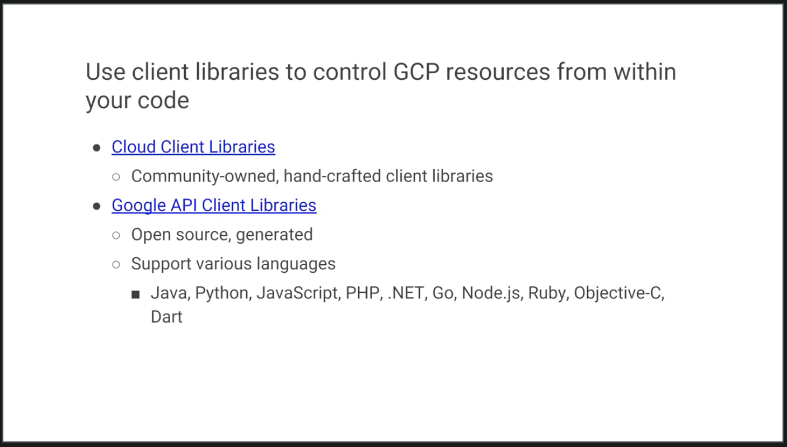

# Google Cloud Fundamentals Core Infrastructure

 

- [Google Cloud Fundamentals Core Infrastructure](#google-cloud-fundamentals-core-infrastructure)
  - [What is the Cloud?](#what-is-the-cloud)
    - [How Did We Get Here?](#how-did-we-get-here)
    - [Every Company is a Data Company](#every-company-is-a-data-company)
    - [GCP Computing Architectures](#gcp-computing-architectures)
    - [The Google Network](#the-google-network)
    - [GCP Regions and Zones](#gcp-regions-and-zones)
    - [Environmental Responsibility](#environmental-responsibility)
    - [Google Offers Customer-Friendly Pricing](#google-offers-customer-friendly-pricing)
    - [Open APIs](#open-apis)
    - [Why Choose Google Cloud Platform](#why-choose-google-cloud-platform)
    - [Multi-layered Security Approach](#multi-layered-security-approach)
    - [Budgets & Billing](#budgets--billing)
  - [Module Intro](#module-intro)
    - [The GCP Resource Hierarchy](#the-gcp-resource-hierarchy)
    - [Identity Access & Management](#identity-access--management)

## What is the Cloud?

The US National Institute of Standards and Technology created it, although, there is nothing US specific about it.
Here it is, cloud computing is a way of using I.T. that has these five equally important traits.

- First, you get computing resources on-demand and self-service. All you have to do is use a simple interface and you get the processing power, storage, and network you need, with no need for human intervention.
- Second, you access these resources over the net from anywhere you want.
- Third, the provider of those resources has a big pool of them and allocates them to customers out of that pool. That allows the provider to get economies of scale by buying in bulk and pass the savings on to the customers. Customers don't have to know or care about the exact physical location of those resources.
- Fourth, the resources are elastic. If you need more resources you can get more, rapidly. If you need less, you can scale back.
- And last, the customers pay only for what they use or reserve as they go. If they stop using resources, they stop paying.

That's it. That's the definition of cloud.
 

### How Did We Get Here?

But why is this model so compelling nowadays? To understand why, we need to look at some history...

The first wave of the trend that brought us towards cloud computing was co-location, which IT shops have been doing for decades. Instead of building costly capital intensive data centers, they can rent space in shared facilities. That frees up capital for more flexible uses than real estate.

In the first decade of the 2000s, IT departments' need for efficiency drove them to use virtualization. The components of a virtualized data center match the parts of a physical data center; servers, disks and so on. But now there are virtual devices separately manageable from the underlying hardware.

Virtualization lets us all use resources more efficiently and just like colocation, it lets us be more flexible too. With virtualization you still buy, house and maintain the infrastructure. So, you're still in the business of guessing how much hardware you'll need and when, setting it up and keeping it running.

About 10 years ago, Google realized that its business couldn't move fast enough within the confines of the virtualization model. So, Google switched to a container based architecture, an automated, elastic, third wave cloud built from automated services. We'll explain exactly what containers are later in this course.

In Google's internal cloud, services automatically provision and configure the infrastructure that is used to run familiar Google applications. Google has spent billions of dollars building this platform and making it resilient and efficient. Today, Google Cloud platform makes it available to Google customers.
 

### Every Company is a Data Company

Google believes that in the future every company, regardless of size or industry, will differentiate itself from its competitors through technology largely in the form of software, great software centered on data.

Thus, every company will become a data company, if it isn't already one now. Google Cloud provides a wide variety of services for managing and getting value from data and doing that at scale.

 

### GCP Computing Architectures

Virtualized data centers brought you Infrastructure as a Service, `IaaS`, and Platform as a Service, `PaaS` offerings.

- IaaS offerings provide raw compute, storage, and network organized in ways that are familiar from data centers.

- PaaS offerings, on the other hand, bind application code you write to libraries that give access to the infrastructure your application needs.

That way, you can just focus on your application logic.

- In the IaaS model, you pay for what you allocate.
- In the PaaS model, you pay for what you use.

Both sure beat the old way where you bought everything in advance based on lots of risky forecasting.

As Cloud Computing has evolved, the momentum has shifted towards managed infrastructure and managed services.
GCP offers many services in which you need not worry about any resource provisioning at all.

They're easy to build into your applications and you pay per use.

By the way, now that I've mentioned PaaS and IaaS, you might be asking yourself what about SaaS? Of course, Google's popular applications like, Search, Gmail, Docs and Drive are Software as a Service applications in that they're consumed directly over the internet by end users.

 

### The Google Network

According to some estimates out there publicly, Google's network carries as much as 40 percent of the world's Internet traffic every day.

Google's network is the largest of its kind on earth and the company has invested billions of dollars over the years to build it.

It's designed to give its users the highest possible throughput and the lowest possible latencies for their applications.

The network interconnects at more than 90 Internet exchanges and more than 100 points of presence worldwide. When an Internet user sends traffic to a Google resource, Google responds to the user's request from an edge network location that will provide the lowest latency.

Google's Edge-caching network sites content close to end users to minimize latency.

 

### GCP Regions and Zones

Here's how GCP is organized.

Let's start at the finest grain level, the Zone.
 

 

A zone is a deployment area for Google Cloud Platform Resources. For example, when you launch a virtual machine in GCP using Compute Engine, it runs in a zone you specify.

Although people think of a zone as being like a GCP Data Center, that's not strictly accurate because a zone doesn't always correspond to a single physical building. You can still visualize the zone that way, though.

Zones are grouped into regions, independent geographic areas, and you can choose what regions your GCP resources are in. All the zones within a region have fast network connectivity among them. Locations within regions usually have round trip network latencies of under five milliseconds.

Think of a zone as a single failure domain within a region. As part of building a fault tolerant application, you can spread their resources across multiple zones in a region. That helps protect against unexpected failures. You can run resources in different regions too.

Lots of GCP customers do that, both to bring their applications closer to users around the world, and also to protect against the loss of an entire region, say, due to a natural disaster.

A few Google Cloud Platform Services support placing resources in what we call a Multi-Region. For example, Google Cloud Storage, which we'll discuss later, lets you place data within the Europe Multi-Region. That means, it's stored redundantly in at least two geographic locations, separated by at least 160 kilometers within Europe.

As of the time of this courses's production, GCP had 15 regions. Visit [Google Cloud](cloud.google.com) to see what the total is up to today.
 

 

### Environmental Responsibility

The virtual world is built on physical infrastructure, and all those racks of humming servers use vast amounts of energy.

Together, all existing data centers use roughly two percent of the world's electricity, so Google works to make data centers run as efficiently as possible.

Google's data centers were the first to achieve ISO 14001 certification, which is a standard that maps out a framework for improving resource efficiency and reducing waste.

 

 

This is Google's data center in Hamina, Finland, one of the most advanced and efficient data centers in the Google fleet. Its cooling system uses seawater from the bay of Finland to reduce energy use. It's the first of its kind anywhere in the world.

Google is one of the world's largest corporate purchasers of wind and solar energy. Google has been a hundred percent carbon neutral since 2007, and will shortly reach a hundred percent renewable energy sources for its data centers.
Just like its customers, Google is trying to do the right things for the planet. GCP customers have environmental goals of their own, and running their workloads in GCP can be a part of meeting them.

 

### Google Offers Customer-Friendly Pricing

Google was the first major Cloud provider to deliver per second billing for its Infrastructure as a Service Compute offering, Google Compute Engine.

Fine-grain billing is a big cost savings for workloads that are bursty, which is a lot of them. Many of the best-known GCP services bill by the second, including Compute Engine and Kubernetes Engine and you'll learn about them and others in this course.

Compute Engine offers automatically applied sustained use discounts which are automatic discounts that you get for running a virtual machine instance for a significant portion of the billing month. Specifically, when you run an instance for more than 25 percent of a month, Compute Engine automatically gives you a discount for every incremental minute you use for that instance.

Compute Engines Custom Virtual Machine types lets you fine-tune virtual machines for their applications, which in turn lets you tailor your pricing for your workloads. The online pricing calculator can help estimate your costs.
 

 

### Open APIs

Some people are afraid to bring their workloads to the cloud because they're afraid they'll get locked into a particular vendor. But in lots of ways, Google gives customers the ability to run their applications elsewhere, if Google becomes no longer the best provider for their needs.

Here are some examples of how Google helps its customers avoid feeling locked in:

- GCP services are compatible with open source products. For example, take Cloud Bigtable, a database we'll discuss later. Bigtable uses the interface of the open source database Apache HBase, which gives customers the benefit of code portability.

- Another example, Cloud Dataproc offers the open source big data environment Hadoop, as a managed service. Google publishes key elements of technology using open source licenses to create ecosystems that provide customers with options other than Google. For example, TensorFlow, an open source software library for machine learning developed inside Google, is at the heart of a strong open source ecosystem.

Many GCP technologies provide interoperability. Kubernetes gives customers the ability to mix and match microservices running across different clouds, and Google Stackdriver lets customers monitor workload across multiple cloud providers.

 

 

### Why Choose Google Cloud Platform

Google Cloud Platform lets you choose from computing, storage, big data, machine learning and application services for your web, mobile, analytics and back-end solutions.

It's global, it's cost effective, it's open source friendly and it's designed for security.

Let's sum up. Google Cloud Platform's products and services can be broadly categorized as compute, storage, big data, machine learning, networking and operations and tools.

This course considers each of the compute services and discusses why customers might choose each. The course will examine each of Google Cloud Platform storage services, how it works and when customers use it. To learn more about these services, you can participate in the training courses in Google Cloud's Data Analyst learning track. This course also examines the function and purpose of Google Cloud Platform's big data and machine learning services.

 

### Multi-layered Security Approach

Because Google has seven services with more than a billion users, you can bet security is always on the minds of Google's employees.

Design for security is pervasive, throughout the infrastructure, the GCP and Google services run-on.

Let's talk about a few ways Google works to keep customers' data safe, starting at the bottom and working up.

Both the server boards and the networking equipment in Google data centers are custom designed by Google. Google also designs custom chips, including a hardware security chip called Titan that's currently being deployed on both servers and peripherals.

Google server machines use cryptographic signatures to make sure they are booting the correct software. Google designs and builds its own data centers which incorporate multiple layers of physical security protections. Access to these data centers is limited to only a very small fraction of Google employees.

Google's infrastructure provides cryptographic privacy and integrity for remote procedure called data-on-the-network, which is how Google services communicate with each other.

The infrastructure automatically encrypts our PC traffic in transit between data centers.

Google Central Identity Service, which usually manifests to end users as the Google log-in page, goes beyond asking for a simple username and password. It also intelligently challenges users for additional information based on risk factors such as whether they have logged in from the same device or a similar location in the past. Users can also use second factors when signing in, including devices based on the universal second factor `U2F` open standard.

Most applications at Google access physical storage indirectly via storage services and encryption is built into those services. Google also enables hardware encryption support in hard drives and SSDs. That's how Google achieves encryption at rest of customer data. Google services that want to make themselves available on the Internet register themselves with an infrastructure service called the `Google Front End`, which checks incoming network connections for correct certificates and best practices. The GFE also additionally, applies protections against denial of service attacks. The sheer scale of its infrastructure, enables Google to simply absorb many denial of service attacks, even behind the GFEs.

Google also has multi-tier, multi-layer denial of service protections that further reduce the risk of any denial of service impact.

Inside Google's infrastructure, machine intelligence and rules warn of possible incidents. Google conducts Red Team exercises, simulated attacks to improve the effectiveness of its responses.

Google aggressively limits and actively monitors the activities of employees who have been granted administrative access to the infrastructure.

To guard against phishing attacks against Google employees, employee accounts including mine require use of `U2F` compatible security keys.

To help ensure that code is as secure as possible Google stores its source code centrally and requires two-party review of new code. Google also gives its developers libraries that keep them from introducing certain classes of security bugs. Externally, Google also runs a vulnerability rewards program, where we pay anyone who is able to discover and inform us of bugs in our infrastructure or applications.

 

### Budgets & Billing

You're probably thinking, "how can I make sure I don't accidentally run up a big GCP bill?"

GCP provides four tools to help: budgets and alerts, billing, export, reports and quotas.

Let's look at budgets and alerts first. You can define budgets either per billing account or per GCP project. A budget can be a fixed limit or you can tie it to another metric. For example, a percentage of the previous month spend. To be notified when costs approach your budget limit, create an alert. For example, with a budget limit of $20,000 and an alert set at 90 percent, you'll receive a notification alert when your expenses reach $18,000. Alerts are generally set at 50 percent, 90 percent, and 100 percent. But you can customize that.

 

 

Billing export lets you store detailed billing information in places where it's easy to retrieve for more detailed analysis, such as a BigQuery dataset or a Cloud storage bucket. Reports is a visual tool in the GCP console that allows you to monitor your expenditure.

 

 

GCP also implements quotas, which protect both account owners and the GCP community as a whole. Quotas are designed to prevent the over-consumption of resources, whether because of error or malicious attack.

There are two types of quotas:
- rate quotas
- allocation quotas.

Both get applied at the level of the GCP project. Rate quotas reset after a specific time.

For example, by default, the Kubernetes Engine service sets a quota of a 1000 calls to its API from each GCP project every 100 seconds. After that 100 seconds, the limit is reset.

Allocation quotas, on the other hand, govern the number of resources you can have in your projects.

For example, by default, each GCP project has a quota allowing it no more than five Virtual Private Cloud networks.

Although projects all start with the same quotas, you can change some of them by requesting an increase from Google Cloud support.

 

## Resouce Management Module Intro

When you run your workloads in GCP, you use projects to organize them.

You use Google Cloud Identity, and Access Management, also called IM, or IAM to control who can do what. And you use your choice of several interfaces to connect.

In this module, you'll use these basics to get started. Projects are the main way you organize the resources you use in GCP. Use them to group together related resources, usually because they have a common business objective.

The principle of least privilege is very important in managing any kind of compute infrastructure, whether it's in the Cloud or on-premises. This principle says that each user should have only those privileges needed to do their jobs.

In a least-privilege environment, people are protected from an entire class of errors. A coworker of mine once accidentally deleted a running production database. Why? Because he was working as the root user on the system when he shouldn't have been.

 

 

GCP customers use IM to implement least privilege, and it makes everybody happier.

There are four ways to interact with GCP's management layer:

- Through the web-based console
- Through the SDK and its command-line tools
- Through the APIs
- Through a mobile app.

In this class, you'll mostly use the console and the command-line tools.

When you build an application on your on-premises infrastructure, you're responsible for the entire stack security. From the physical security of the hardware, and the premises in which they're housed, through the encryption of the data on disk, the integrity of your network, all the way up to securing the content stored in those applications.

When you move an application to Google Cloud Platform, Google handles many of the lower layers of security. Because of its scale, Google can deliver a higher level of security at these layers than most of its customers could afford to do on their own.

The upper layers of the security stack remain the customers' responsibility. Google provides tools such as IAM to help customers implement the policies they choose at these layers.

 

### The GCP Resource Hierarchy

You may find it easiest to understand the GCP resource hierarchy from the bottom up.

All the resources you use, whether they're virtual machines, cloud storage buckets, tables and big query or anything else in GCP are organized into projects. Optionally, these projects may be organized into folders. Folders can contain other folders. All the folders and projects used by your organization can be brought together under an organization node. Projects, folders and organization nodes are all places where the policies can be defined. Some GCP resources let you put policies on individual resources too.

 

 

In the meantime, remember that policies are inherited downwards in the hierarchy. All Google Cloud platform resources belong to a project. Projects are the basis for enabling and using GCP services like managing APIs, enabling billing and adding and removing collaborators and enabling other Google services. Each project is a separate compartment and each resource belongs to exactly one. Projects can have different owners and users - they're built separately and they're managed separately.

Each GCP project has a name and a project ID that you assign. The project ID is a permanent, unchangeable identifier and it has to be unique across GCP. You use project IDs in several contexts to tell GCP which project you want to work with.

On the other hand, project names are for your convenience and you can assign them. GCP also assigns each of your projects a unique project number and you'll see a display to you in various contexts. But using it is mostly outside the scope of this course.

In general, project IDs are made to be human readable strings and you'll use them frequently to refer to projects.

 

 

You can organize projects into folders, although you don't have to. They're a tool at your disposal to make your life easier. For example, you can use folders to represent different departments, teams, applications or environments in your organization. Folders let teams have the ability to delegate administrative rights, so they can work independently.

The resources in a folder inherit IAM policies from the folder. So, if project three and four are administered by the same team by design, you can put IAM policies into folder B instead. Doing it the other way, putting duplicate copies of those policies on project three and project four would be tedious and error prone.

One word of caution: to use folders, you need an organization node at the top of the hierarchy.

So what's that? Let's talk about it now.

You probably want to organize all the projects in your company into a single structure. Most companies want the ability to have centralized visibility on how resources are being used and to apply policy centrally. That's what the organization node is for. It's the top of the hierarchy. There are some special roles associated with it.

 

 

For example, you can designate an organization policy administrator so that only people with privilege can change policies. You can also assign a project creator role, which is a great way to control who can spend money.

So how do you get an organization node?

In part the answer depends on whether your company is also a G Suite customer. If you have a G Suite domain, GCP projects will automatically belong to your organization node. Otherwise, you can use Google Cloud Identity to create one.

Here's a tip. When you get a new organization node, it lets anyone in the domain create projects and billing accounts just as they could before. That's to avoid surprises and disruption. But it'd be a great first step with a new organization node to decide who on your team should really be able to do those things.

Once you have an organization node, you can create folders underneath it and put it in projects.

Here's an example of how you might organize your resources.

 

 

There are three projects each of which uses resources from several GCP services. In this example, we haven't used any folders, although we could always move projects into folders. Resources inherit the policies of their parent resource. For instance, if you set a policy at the organization level, it is automatically inherited by all its children projects.

And this inheritance is transitive, which means that **all** the resources in those projects inherit the policy too.

There's one important rule to keep in mind.

The policies implemented at a higher level in this hierarchy can't take away access that's granted at a lower level. For example, suppose that a policy applied on the bookshelf project gives user "Pat" the right to modify a cloud storage bucket, but a policy at the organization level says that Pat can only view cloud storage buckets not change them.

The more generous policy is the one that takes effect. Keep this in mind as you design your policies.

 

### Identity Access & Management

IAM lets administrators authorize who can take action on specific resources.

An IAM policy has a "who" part, a "can do what" part, and an "on which resource" part.

 

 

The "who" part names the user or users you're talking about. The "who" part of an IAM policy can be defined either by a Google account, a Google group, a Service account, an entire G Suite, or a Cloud Identity domain. The "can do what" part is defined by an IAM role. An IAM role is a collection of permissions. Most of the time, to do any meaningful operations, you need more than one permission.

For example, to manage instances in a project, you need to create, delete, start, stop, and change an instance. So the permissions are grouped together into a role that makes them easier to manage.

The "who" part of an IAM policy can be a Google account, a Google group, a Service account, or an entire G Suite, or Cloud Identity domain.

There are three kinds of roles in Cloud IAM. Let's talk about each in turn.

 

 

 

Primitive roles are broad. You apply them to a GCP project and they affect all resources in that project. These are the owner, editor, and viewer roles. If you're a viewer on a given resource, you can examine it but not change its state. If you're an editor, you can do everything a viewer can do, plus change its state. And if you are an owner, you can do everything an editor can do, plus manage roles and permissions on the resource.

 

 

The owner role on a project also lets you do one more thing: set up billing. Often, companies want someone to be able to control the billing for a project without the right to change the resources in the project. And that's why you can grant someone the billing administrator role.

Be careful, if you have several people working together on a project that contains sensitive data, primitive roles are probably too coarse. Fortunately, GCP IAM provides a finer grained types of roles.

 

 

GCP services offer their own sets of predefined roles and they define where those roles can be applied. For example, later in this course, we'll talk about Compute Engine, which offers virtual machines as a service.

Compute Engine offers a set of predefined roles, and you can apply them to Compute Engine resources in a given project, a given folder, or in an entire organization. Another example.

Consider Cloud Bigtable, which is a managed database service. Cloud Bigtable offers roles that can apply across an entire organization to a particular project or even to individual Bigtable database instances.

 

### IAM Roles

Compute Engines `InstanceAdmin` Role lets whoever has that role perform a certain set of actions on virtual machines.

The actions are:

- listing them
- reading and changing their configurations
- starting and stopping them.

 

 

And which virtual machines? Well, that depends on where the roles apply.

In this example, all the users of a certain Google Group have the role, and they have it on all the virtual machines in `project_a`.

If you need something even finer-grained, there are custom roles.

A lot of companies have a least-privileged model in which each person in your organization has the minimum amount of privilege needed to do his or her job.

 

 

So, for example, maybe I want to define an `InstanceOperator` Role to allow some users to start and stop Compute Engine and virtual machines, but not reconfigure them. Custom roles allow me to do that.

A couple cautions about custom roles.

- First, you have to decide to use custom roles. You'll need to manage their permissions. Some companies decide they'd rather stick with the predefined roles.
- Second, custom roles can only be used at the project or organization levels. They can't be used at the folder level.

What if you want to give permissions to a Compute Engine virtual machine, rather than to a person?  Then you would use a service account.

 

 

For instance, maybe you have an application running in a virtual machine that needs to store data in Google Cloud Storage, but you don't want to let just anyone on the Internet have access to that data, only that virtual machine. So, you'd create a service account to authenticate your VM to cloud storage.

Service accounts are named with an email address. But instead of passwords, they use cryptographic keys to access resources.

 

 

In this simple example, a service account has been granted Compute Engine's InstanceAdmin Role. This would allow an application running in a VM with that service account to create, modify, and delete other VMs.

Incidentally, service accounts need to be managed, too. For example, maybe Alice needs to manage what can act as a given service account, while Bob just needs to be able to view them.

Fortunately, in addition to being an identity, a service account is also a resource. So it can have IAM policies on its own attached to it.

For instance, Alice can have an editor role in a service account and Bob can have the viewer role. This is just like granting roles for any other GCP resource.

You can grant different groups of VMs in your project different identities. This makes it easier to manage different permissions for each group. You can also change the permissions of the service accounts without having to recreate the VMs.

Here's a more complex example.

 

 

Say you have an application that's implemented across a group of Compute Engine virtual machines. One component of your application needs to have an editor role on another project, but another component doesn't. So you would create two different service accounts, one for each subgroup of virtual machines. Only the first service account has privilege on the other project. That reduces the potential impact of a mis-coded application or a compromised virtual machine.

 

### Interacting with Google Cloud Platform

There are four ways you can interact with Google Cloud Platform, and we'll talk about each in turn:
- the Console
- the SDK and Cloud Shell
- the Mobile App
- the APIs.

 

 

The GCP Console is a web-based administrative interface. If you build an application in GCP, you'll use it. Although, the end users of your application won't. It lets you view and manage all your projects and all the resources they use.
It also lets you enable, disable and explore the APIs of GCP services.

And it gives you access to Cloud Shell. That's a command-line interface to GCP that's easily accessed from your browser. From Cloud Shell, you can use the tools provided by the Google Cloud Software Development kit `SDK`, without having to first install them somewhere.

What's the Software Development Kit?

The Google Cloud SDK is a set of tools that you can use to manage your resources and your applications on GCP.

These include the `gcloud` tool, which provides the main command line interface for Google Cloud Platform products and services.

There's also `gsutil` which is for Google Cloud Storage and `bq` which is for BigQuery.

The easiest way to get to the SDK commands is to click the Cloud Shell button on a GCP Console. You get a command line in your web browser on a virtual machine with all these commands already installed. You can also install the SDK on your own computers - your laptop, your on-premise servers of virtual machines and other clouds. The SDK is also available as a docker image, which is a really easy and clean way to work with it.

The services that make up GCP offer application programming interfaces so that the code you write can control them.

 

 

These APIs are what's called RESTful. In other words they follow the `representational state transfer paradigm`.

We don't need to go into much detail of what that means here. Basically, it means that your code can use Google services in much the same way that web browsers talk to web servers. The APIs name resources and GCP with URLs. Your code can pass information to the APIs using JSON, which is a very popular way of passing textual information over the web. And there's an open system for user log in and access control.

The GCP Console lets you turn on and off APIs. Many APIs are off by default, and many are associated with quotas and limits. These restrictions help protect you from using resources inadvertently. You can enable only those APIs you need and you can request increases in quotas when you need more resources.

For example, if you're writing an application that needs to control GCP resources, you'll need to get your use of the APIs just right. And to do that, you'll use APIs Explorer.

 

 

The GCP Console includes a tool called the APIs Explorer that helps you learn about the APIs interactively. It lets you see what APIs are available and in what versions. These APIs expect parameters and documentation on them is built in.
You can try the APIs interactively even with user authentication.

Suppose you have explored an API and you're ready to build an application that uses it. Do you have to start coding from scratch? No. Google provides client libraries that take a lot of the drudgery out of the task of calling GCP from your code.

 

 

There are two kinds of libraries.

The Cloud Client Libraries are Google clouds latest and recommended libraries for its APIs. They adopt the native styles and idioms of each language.

On the other hand, sometimes a Cloud Client Library doesn't support the newest services and features. In that case, you can use the Google API Client Library for your desired languages. These libraries are designed for generality and completeness.

Finally, one more tool that's of interest to everyone, not just developers. There's a mobile App for Android and iOS that lets you examine and manage the resources you're using in GCP. It lets you build dashboards so that you can get the information you need at a glance.

 

### Cloud Marketplace (formerly Cloud Launcher)

Say you want a quick way to get started with GCP with minimal effort. That's what Google Marketplace provides. I

t's a tool for quickly deploying functional software packages on Google Cloud Platform. There's no need to manually configure the software, virtual machine instances, storage or network settings. Although, you can modify many of them before you launch if you like.

Most software packages in Marketplace are at no additional charge beyond the normal usage fees for GCP resources. Some Cloud Launcher images charge usage fees, particularly those published by third parties with commercially licensed software. But they all show you estimates of their monthly charges before you launch them.

Be aware that these estimates are just that, estimates.

In particular, they don't attempt to estimate networking costs since those will vary based on how you use the applications.

A second note of caution. GCP updates the base images for these software packages to fix critical issues and vulnerabilities. But it doesn't update the software after it's been deployed. Fortunately, you'll have access to the deployed systems, so you can maintain them.

 

### Demonstration, Lab

In this demonstration, I'll use Cloud Launcher to deploy a solution on Google Cloud platform. The solution I've chosen is a LAMP stack. LAMP stands for Linux, Apache, MySQL, PHP. It's an easy environment for developing web applications. I'll use Cloud Launcher to deploy that Stack into a Compute Engine Instance. In the GCP Console's Products and Services menu, I click Cloud Launcher.

In the Search Bar, I type LAMP.

LAMP Stacks are environments for web development.

Notice that estimated costs are provided. Now I click Launch On Compute Engine. I leave the deployment name at lampstack-1 and I'll accept the default GCP Zone. I'll accept the other defaults and click Deploy. It takes a few minutes to create the deployment.

When the deployment is finished, the console displays a summary of information about what has been deployed. Let's visit our website's temporary home page. It works.

It's performing some configuration. I login using SSH. We'll change to the directory where the software is installed,

and we'll copy in a test page for PHP.

Let's end our SSH session and confirm that our PHP test page is visible.

Now I could continue to configure my PHP website. In this demonstration, I used Cloud Launcher to deploy a LAMP Stack into a Compute Engine Instance.

 

## Compute Engine Module Intro

Of all the ways you can run workloads in the cloud, Virtual Machines may be the most familiar.

Compute Engine lets you run virtual machines on Google's global infrastructure.

In this module, we'll learn how Google Compute Engine works with a focus on Google virtual networking.

One of the nice things about virtual machines is that they have the power and generality of a full-fledged operating system in each. You configure a virtual machine much like you build out a physical server by specifying its amounts of CPU, power and memory, its amounts and types of storage and its operating system.

You can flexibly reconfigure them and a VM running on Google's cloud has unmatched worldwide network connectivity.

 

### Virtual Private Cloud (VPC) Network

The way a lot of people get started with GCP is to define their own Virtual Private Cloud inside their first GCP project, or they can simply choose the default VPC and get started with that.

Regardless, your VPC networks connect your Google Cloud platform resources to each other and to the internet.

You can segment your networks, use firewall rules to restrict access to instances, and create static routes to forward traffic to specific destinations.

Here's something that surprises a lot of people who are new to GCP.

 

 

The Virtual Private Cloud networks that you define have global scope. They can have subnets in any GCP region worldwide and subnets can span the zones that make up a region. This architecture makes it easy for you to define your own network layout with global scope.

You can also have resources in different zones on the same subnet. You can dynamically increase the size of a subnet in a custom network by expanding the range of IP addresses allocated to it. Doing that doesn't affect already configured VMs.

In this example, your VPC has one network. So far, it has one subnet defined in GCP us-east1 region. Notice that it has two Compute Engine VMs attached to it. They're neighbors on the same subnet even though they are in different zones.
You can use this capability to build solutions that are resilient but still have simple network layouts.

 

### Compute Engine

Compute Engine lets you create and run virtual machines on Google infrastructure.

There are no upfront investments and you can run thousands of virtual CPUs on a system that is designed to be fast and to offer consistent performance.

You can create a virtual machine instance by using the Google Cloud Platform console or the GCloud command line tool.
Your VM can run Linux and Windows Server images provided by Google or customized versions of these images, and you can even import images for many of your physical servers.

When you create a VM, pick a machine type which determines how much memory and how many virtual CPUs it has. These types range from very small to very large indeed. If you can't find a predefined type that meets your needs perfectly, you can make a custom VM.

Speaking of processing power, if you have workloads like machine learning and data processing that can take advantage of GPUs, many GCP zones have GPUs available for you.

Just like physical computers need disks, so do VM. You can choose two kinds of persistent storage; standard or SSD.

If your application needs high-performance scratch space, you can attach a local SSD, but be sure to store data of permanent value somewhere else because local SSDs content doesn't last past when the VM terminates. That's why the other kinds are called persistent disks.

Anyway, most people start off with standard persistent disks and that's the default.

You'll also choose a boot image.

GCP offers lots of versions of Linux and Windows ready to go and you can import your own images too.

Lots of GCP customers want their VMs to always come up with certain configurations like installing software packages on first boot. It's very common to pass GCP VM startup scripts that do just that. You can also pass in other kinds of metadata too.

Once your VMs are running, it's easy to take a durable snapshot of their disks. You can keep these as backups or use them when you need to migrate a VM to another region.

Suppose you have a workload that no human being is sitting around waiting to finish, say a batch job analyzing large dataset, you can save money by choosing `preemptible` VMs to run the job.

A `preemptible` VM is different from an ordinary Compute Engine VM in only one respect. You've given compute engine permission to terminate it if it's resources are needed elsewhere. You can save a lot of money with `preemptible` VMs, although be sure to make your job able to be stopped and restarted.

You can choose the machine properties of your instances such as the number of virtual CPUs and the amount of memory by using a set of predefined machine types or by creating your own custom machine types.

I mentioned a bit ago that you can make very large VMs in compute engine.

 

 

At the time this video was produced, the maximum number of virtual CPUs and the VM was 96 and the maximum memory size was in beta at 624 gigabytes.

Check the [GCP](https://cloud.google.com) website to see where these maximums are today.

These huge VMs are great for workloads like in-memory databases and CPU intensive analytics, but most GCP customers start off with scaling out not scaling up.

Compute Engine has a feature called auto scaling that lets you add and take away VMs from your application based on load metrics.

The other part of making that work is balancing the incoming traffic across the VMs, and Google VPC supports several different kinds of load balancing.

 

### Important VPC Capabilities
