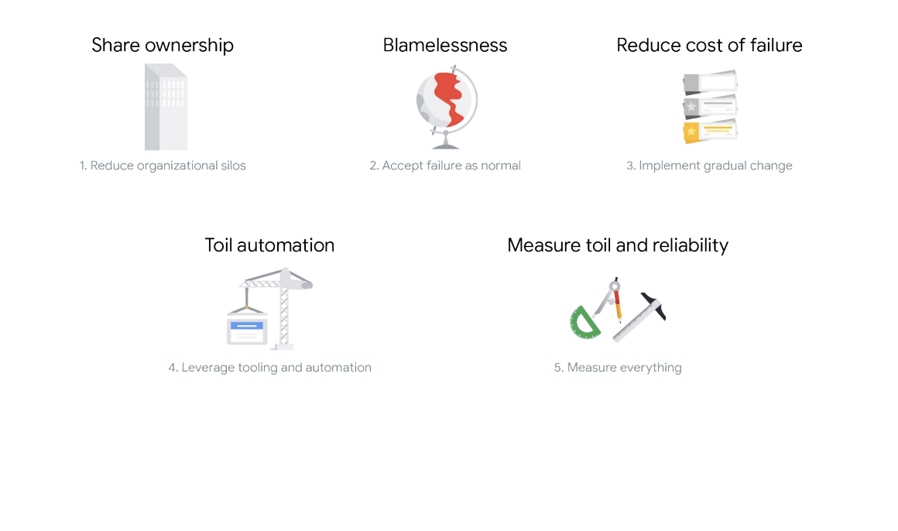

- [Getting Started](#getting-started)
  - [Course Intro](#course-intro)
    - [Module 1 Key Points and Reflection](#module-1-key-points-and-reflection)
  - [DevOps, SRE & Why they exist](#devops-sre--why-they-exist)
  - [DevOps & SRE](#devops--sre)
    - [Module 2 Exercise](#module-2-exercise)
  - [SLOs with Consequences - Module Intro](#slos-with-consequences---module-intro)
  - [SRE Value](#sre-value)
  - [Postmortems](#postmortems)
  - [Blamelessness and Psychological Safety](#blamelessness-and-psychological-safety)
  - [SLOs and Error Budgets](#slos-and-error-budgets)
  - [Share Vision & Knowledge](#share-vision--knowledge)
    - [Module 3 Exercise - Reading](#module-3-exercise---reading)
- [Make Tomorrow Better Than Today: Module Intro](#make-tomorrow-better-than-today-module-intro)
  - [Continuous Integration, Continuous Delivery, and Canarying](#continuous-integration-continuous-delivery-and-canarying)
  - [Design Thinking and Prototyping](#design-thinking-and-prototyping)
  - [Toil](#toil)
  - [Psychology of Change](#psychology-of-change)
    - [Module 4 Exercise - Reading](#module-4-exercise---reading)
- [Regulate Workload - Module Intro](#regulate-workload---module-intro)

## Getting Started

Welcome to Developing a Google SRE Culture! By enrolling in this course, you’ll be joining a huge, international community of business and IT leaders who are helping their organizations work towards adoption of Site Reliability Engineering technical and cultural practices.

What is Site Reliability Engineering (SRE)?

Site Reliability Engineering, or SRE, is both a practice and a job role, where engineering directly supports software operations. At Google, SRE is described by its founder as "what happens when you ask a software engineer to design an operations team."

What to expect during this training course?

During this training course, you will be presented with a series of modules that will take you through the journey to SRE. You will learn about how both DevOps and SRE emerged in software engineering, and get an overview of important technical and cultural practices that are critical to an organization’s success in adopting SRE. The modules in this course may have videos, exercises, and quizzes.

In order to pass the quizzes, remembering details from the videos and exercises is advised.

In order to get the best training experience, please ensure that you are prepared:

- Ensure that you have headphones or your speakers are on, if you're in an enclosed space.
- Watch videos in their entirety and review the recommended module exercises.

What's Next?

- Watch the Course introduction video and then move onto the next lesson!

 

### Course Intro

Welcome to Developing a Google SRE Culture. I've teamed up with experts from Google Cloud, SRE and Professional Services teams to create this course for IT and business leaders who want to learn about and embrace SRE culture in their organizations.

Have you ever had a concern about the reliability of your services? Have you ever seen a decline in customer engagement, but when you question your team, they can't explain why it's happening? Both your development and operations teams say, "Everything's green." But you know, there must be something wrong because your end users, your customers, are telling you so.

If you've spent any significant amount of time producing and running production software, you've probably also felt the frustration of negatively impacting customers when deploying minor updates. You've probably also questioned whether the production freeze your ops team ordered is really based on fact, because you're desperate to push your next release for the important features.

If these situations seem familiar to you, you're probably wondering why your development and operations teams often have conflicting priorities, and why they continue to work in silos. Google has spent years running systems in massive scale. Over time, we've standardize our practices to balance our velocity of features with the risk to reliability, both for us and for our customers. Those practices, combined with a culture to support them, we call Site Reliability Engineering or SRE.

Whether you're still deciding how and when to make the move to the Cloud, or you're already an adopter of Cloud technology, this course can help you understand how practical and cultural SRE principals could have a lasting positive impact on both your IT transformation projects and day-to-day work. You'll also learn how an organization size and maturity level for SRE can affect the implementation of these principles.

This course will give you an overview of SRE technical and cultural fundamentals, and will explain where and how you can apply them in your organization. Because SRE principles are closely aligned with DevOps philosophy practices, the course will also cover the basics of DevOps. Even if you're already familiar with DevOps practices, you'll hear how Google interprets the philosophy, so hopefully you'll learn something new.

This course has several overall learning objectives. By the end of this course, you'll be able to
- discuss Google's view on DevOps philosophy, and the relationship between DevOps and SRE;
- understand the value SRE can provide to your IT operations;
- articulate Google's technical and cultural fundamentals of SRE;
- assess your organization's maturity level in adopting SRE;
- identify what skills to look for in a Site Reliability Engineer, and how to train your existing workforce;
- understand how Google can help you jumpstart SRE in your organization.

Now let's review the course components in structure. This course has seven modules. The first six consists of video lessons, activities, and quizzes. In the seventh module, you'll need to pass a graded assessment to show what you've learned.

The first module is the course introduction and structure, which I'm covering right now. In the second module, DevOps, SRE, and why they exist, you'll be introduced to DevOps philosophy and how SRE practices emerged. Modules 3-5 will cover the journey to SRE.

In module 3, SLOs with Consequences. You'll learn about the SRE concepts of service level objectives, error budgets, blamelessness, and psychological safety. Module 4, Make Tomorrow Better Than Today, will cover the concepts of toil monitoring, implementing gradual change, and the impact automation has on IT teams. The fifth module, Regulate Workload, covers topics around measurement and SRE practices related to measuring toil and reliability.

Once you've learned about the key SRE technical and cultural fundamentals, the sixth module, Apply SRE in Your Organization will discuss steps to begin SRE implementation in your organization. Finally, the last module contains a summative graded assessment to evaluate the knowledge you've acquired throughout the course. I hope you're excited to dive in. Now, let's get started.

 

#### Module 1 Key Points and Reflection

1. Key Points

- Customers’ experiences with your service tell you how reliable it is.
- In many IT organizations, development and operations teams have conflicting priorities.
- Site Reliability Engineering (SRE) is the practice of balancing the velocity of development features with the risk to reliability.
- SRE can benefit IT teams, regardless of whether they are using cloud or on-premises technology, for both large projects and daily work.

2. Refection Activity

- Have you ever had a concern about your service’s reliability? If so, what caused this concern? Were there internal or external factors? How did you address it?
- Write down your thoughts, and keep your experience in mind as you learn about Google’s SRE practices.

 

### DevOps, SRE & Why they exist

Now that you understand what this course will cover, let's get started. In this module, you'll learn about the practice of DevOps, why Site Reliability Engineering, or SRE was developed, and who in an organization can and should apply these practices. But first, I want to tell you the story of an online retailer. Their application is similar to so many other online retailers. Customers browse the catalog, add items to their carts, and then complete their purchases.

The operations team at this online retailer holds weekly reviews of key metrics. At a recent review, the team noticed that the time between the customers clicking pay and the status coming back as confirmed, was slowly increasing. They recognize that this was not a critical issue, but it did need to be addressed. The team spent some time quietly working on addressing the latency issue.

Over time, on the business side of things, the product development team kept pushing features. Can you guess what happened? Well, developers started working overtime, not only to keep up with the business requests of pushing out new features, but also to resolve the small latency bug that was identified earlier.

The product teams still weren't pleased with the pace of development. Basically, the IT teams put forth a heroic effort to both satisfy the business and also fix the bug. They suffer from burnout in order to meet the needs of both the business and reliability.

Later, when the IT team's efforts became apparent, the product teams agreed that if they had known about the latency bug they definitely would have prioritize fixing that first before pushing new features. But because the business and IT didn't have shared standards for communication, this didn't happen.

So what can you learn from this? Do you think there are ways that the business and IT can communicate better? How do you think you could achieve this in your organization?

Google thought a good place to start was changing the way we think about, measure, and incentivize reliability. We call this collection of principles and practices Site Reliability Engineering, or SRE.

Perhaps you've heard of the DevOps movement. It is a movement that like SRE, strives to align principles, practices and incentives across teams. DevOps and SRE have a lot in common, and they're often discussed together. In fact, you may be wondering how they are different. We will explore some of the common aspects between the two, and how they complement one another in the next video.

 

### DevOps & SRE

So what is DevOps? To understand what it is, you first need to understand why DevOps exists. Traditionally, IT teams consist of developers and operators. Developers are responsible for writing code for systems and operators are responsible for ensuring that those systems operate reliably, so customers are happy. Developers are expected to be agile and are often pushed to write and deploy new code as quickly as possible. Essentially, developers want to work faster, innovating, and succeeding or failing quickly.

This resulted in developers throwing their code over the wall to operators who then had to deal with code that was written without much understanding of how it would run in production. Operators who are expected to keep systems stable would prefer to work slower, focusing on reliability and consistency. Quite understandably, this way of working wasn't sustainable between these two groups. Their priorities caused tension between the two teams, and they were not necessarily aligned with the needs of the business.

As a way to knock down the wall and close the gap between developers and operators, a culture instead of practices known as DevOps was born. Let's take a look at how Google categorizes DevOps.

There are five key areas.

 

 

The first is to reduce organizational silos. You can increase and foster collaboration by breaking down barriers across teams.

Second, you need to accept failure is normal. Computers are inherently unreliable, so you can't expect perfect execution, and when you introduce humans into the system, you get even more imperfection. Things failing will inevitably become part of the process.

Third, you'll want to implement gradual change. Small incremental changes are easier to review, and if a gradual change does release a bug in production, it allows you to reduce the time to recover making it simple to roll back.

Fourth, you need to leverage tooling and automation. Identifying manual work that you can then automate is key to helping your IT team work efficiently and focus on the tasks that matter.

Finally, you'll want to measure everything. Measurement is a critical gauge for success. There's no way to tell whether what you're doing is successful if you have no way to measure it.

It's important to understand that DevOps is a philosophy versus a development methodology or technology. Although DevOps philosophy highlights critical ways for IT teams to operate, it doesn't give explicit guidance on how an organization should implement practices to be successful.

That's where SRE comes in. So what is SRE? SRE evolved at Google in early 2000's separately from DevOps. Back in 2003, Benjamin Treynor Sloss, currently a VP of engineering at Google, was tasked with managing a team of engineers who are responsible for keeping Google's websites up and running. You're probably wondering, "Wait, so a bunch of software engineers who write the code now also have to be responsible for running their production systems? But doesn't the Ops team do that?" Well the answer, at least traditionally, is yes. However, this team only had software engineers, so Ben had them spend some of their time on operations tasks in addition to development tasks. So they could better understand how their code ran and production.

This way of working is what led the team to site reliability engineering and the associated job role were SREs, who are generally engineers, are responsible for operations. Just as DevOps aims to close the gap between software development and software operations, this new SRE approach is a concrete way to solve problems that the DevOps philosophy addresses.

Note that SRE is both a practice and a role.

Not every organization that follows SRE principles necessarily must have engineers with the title SRE. This course mostly focuses on the practices and principles themselves, things like titles and team structures are implementation details.

Several SRE practices align to Google's categorizations of DevOps, and in addition to implementing SRE technical practices, you'll also want to implement cultural practices. Without a culture to sustain them, it is not possible to maintain the practical aspects of SRE.

Let me explain where these fundamentals fit into the key areas of DevOps we discussed. With regard to reducing organizational silos, SREs share ownership of production with developers. Together they define service level objectives or SLOs and error budgets, and share responsibility of how they determine reliability and prioritize work.

 

 

Culturally, this promotes shared vision and knowledge as a well as a need for improved collaboration and communications. Complex systems fail in interesting and complex ways. Accepting failure as normal state is an important practice within SRE. A blameless postmortem is held after an incident to improve the understanding of the failure mode and to identify effective preventive actions to reduce the likelihood or impact of a similar incident. Learning from incidents in this matter requires a culture of psychological safety and blamelessness.

When implementing gradual change, SREs aim to reduce the cost of failure by rolling out changes to a small percentage of users before making them generally available. Culturally, this promotes more of design thinking and prototyping.

Next, in order to leverage tooling and automation. SREs focus on toil automation reducing the amount of manual repetitive work. Automating this year's job away can undoubtedly be met by resistance, that's why teams need to talk about and understand the psychology of change and how to address resistance to change within the team.

Finally, measuring everything means that SREs work to measure everything related to toil, reliability, and the health of their systems. To foster these practices, organizations need a culture of goal setting, transparency, and data-driven decision-making.

Before diving into each of these pillars as they relate to SRE, I want to acknowledge that sometimes people can see these practices aligning with different or many of the pillars of DevOps. It is likewise important to acknowledge that the language and definitions across different organizations, are less critical than driving towards the goal of your organization, and the outcomes you are trying to deliver for your customers. In other words, we may disagree on the precise terminology, but many of the underlying principles are the same. The goal of SRE is to serve the business and the user, not the other way round. The next three modules will dig a bit deeper into all of these SRE practices and cultural concepts.

 

#### Module 2 Exercise

1. Key Points

  - DevOps emerged to help close gaps and break down silos between development and operations teams
  - DevOps is a philosophy, not a development methodology or technology.
  - SRE is a practical way to implement DevOps philosophy
  - Developers focus on feature velocity and innovation; operators focus on reliability and consistency
  - SRE consists of both technical and cultural practices.
  - SRE practices align to DevOps pillars:

 

 

2. Reflection Activity

- In this module, you heard the story of an online retailer whose developers suffered from burnout due to the demands of increased feature deployment while addressing reliability issues on the side.

- Have you ever noticed this type of behavior with your development teams? If so, what do you think caused it?

 

### SLOs with Consequences - Module Intro

If you think about SRE as a journey, the first step is to develop service level objectives or SLOs with consequences.

The performance of your service relative to SLOs should guide your business decisions.

In this module, we'll first discuss the value of SRE to your organization, that is, what your IT team and its members will gain from SRE implementation, and the role middle managers and top leadership play.

After that, we will cover the first two pillars of DevOps;
- accepting failure as normal
- reducing organizational silos, and some of the SRE technical practices and cultural fundamentals that Google aligns to them.

We'll then discuss post mortems and how teams can and should foster blamelessness and psychological safety. You'll also learn about the practices of SLOs and error budgets, and the importance of sharing vision and knowledge across your team.

 

### SRE Value

Throughout this course, you'll learn about the key concepts of SRE and how they could be applied in your business. Before we explore each practice, it's important for you to understand how SRE adoption and implementation could provide value to your organization.

The mission of SRE is to protect, provide for, and progress software and systems with consistent focus on availability, latency, performance, and capacity. By adopting SRE in your business, you're looking after both your internal developer teams and the customers that consume your services.

SRE practices support engineering teams working at a high velocity to release features. At the same time, they maintain practical goals and measures to prevent failures so that your end users are happy.

As you learned in the previous module, SRE teams focus on practices such as automation, learning from failure, and reducing the cost of failure.

By following principles like these, your teams will be less stressed and less inundated with mundane, repetitive work; they'll be able to do more valuable work at a quicker pace while also focusing on the reliability of your services.

Automation in particular creates opportunities for upscaling and innovation. If you incentivize your engineers to automate processes where they can, they'll be making time for other creative projects that they otherwise might not have the capacity for.

SRE also accelerates innovation with practices of launching and iterating, which allows teams to fail fast, learn from failure, and try again. But remember that they will need cultural and organizational support to be successful in the long-term, and that's where you come in.

Understanding SRE practices and norms will help you build a common language to speak with your IT teams and support your organization's adoption of SRE both in the short and in the long-term.

In the next video, you'll start learning about SRE practices in a bit more detail, starting with blameless postmortems.

 

### Postmortems

When working at high-velocity in development operations, or really at any speed, mistakes are inevitable.

That's why Google sees accepting failure as normal, as a pillar of DevOps philosophy. But how exactly can you implement this philosophy in your organization?

Experienced site reliability engineers are comfortable with failure, and know that incidents and outages are going to occur, even if they've taken all the necessary precautions. Before an outage, SREs seek to eliminate ambiguity by building monitoring and observability in the platform, and establishing and documenting processes for incident response and management, handoffs, and other outage activities. This allows them to confidently focus on the relevant issue during an incident. After an outage, it's important to understand why an incident occurred, and then take steps to make sure it doesn't happen again in the same way.

SREs do this by documenting and conducting a blameless postmortem. Some people also call this a retrospective. In fast-paced environments where new problems are being addressed constantly, it's easy to just address one incident and then move on to the next without taking the time to actually learn from what happened.

To avoid doing this, SREs take a systematic approach to ensure that the team collectively learns from the incident.

So what is the purpose of a postmortem? A postmortem's ultimate deliverable is a written record of the incident that consists of specific parts.

 

 

Details of the incident and its timeline. The actions taken to mitigate or resolve the incident. The incidents impact.

It's trigger or root cause or causes. The follow-up actions to prevent its recurrence. Particularly, a blameless postmortem only focuses on the root causes of an incident without accusing a particular person or team, or their actions or behavior. Specific people will write and review the postmortem, but everyone who had a role in the event will be a part of the postmortem process so you can collect as much information as possible. Now, you might be wondering why you should conduct a postmortem beyond identifying the root cause or causes. If it was just about fixing it or preventing the issue, it might seem like it's unnecessary if you've already accomplished that goal.

A postmortem has several specific and important goals. You want to ensure that all the root causes are properly understood by the team.

Almost all outages have multiple causes at their root. Many times, each of those causes taken in isolation may not have been enough to cause a failure, but when combined, they lead to an incident. Tactics like the five whys are used to probe deep into what caused an incident in all of the contributing factors, not just what first appears to be the culprit. You want to define or take effective actions to prevent the issue from occurring again.

At this point, you've probably taken some actions to resolve the immediate user impact, but in the long or even short term, the outage might happen again. You need to prevent recurrence and prioritize the work to do so.

You want to reduce the likelihood of stressful outages. Every outage is a stressor on the team. Google wants its SREs to spend their time improving its systems not dealing with incidents. Good system hygiene, including outage prevention, is a key quality of life factor for your engineers.

You want to avoid multiplying complexity.

Much of the time, quick fixes are involved in solving incidents and preventing their immediate recurrence. Each of those fixes is like a Band-Aid or patch on the system. If you don't perform good postmortems and permanently prevent recurrence, over time, fixes will become interdependent and sticky as each one stacks on the other. This makes the system more complex than necessary, and less maintainable, and ultimately increases the likelihood of future failure.

You want to learn from your mistakes and those of others.

Every failure is an opportunity to learn. Good SREs are constructive pessimists, and a lot of their instincts come from experiencing past failure.

In addition to creating a documented record for your team to learn from, the practice of writing a postmortem provides additional value to your organization. Focusing on blamelessness helps to increase the effectiveness of your teams. They become 100% focused on preventing a problem from occurring, instead of worrying about being blamed if something goes wrong. It also promotes a culture of psychological safety, which we will discuss in the next video.

 

### Blamelessness and Psychological Safety

SREs believe that failure is normal and that progress is about learning from mistakes and ensuring that they don't make the same one in the same way again.

As you learned in the previous video, a key practice of SRE is conducting a postmortem after an incident or outage occurs. An SRE postmortem is blameless, which means that the incident is looked at objectively without designating a person or team as the root cause. Blamelessness can have an immense positive effect on the culture of your organization. Specifically, it creates a culture of psychological safety for your teams.

So what is meant by psychological safety? Psychological safety is the belief that a person will not be punished or humiliated for speaking up with ideas, questions, concerns, or mistakes.

Thinkback to a time when you had a concern about a task you are asked to perform as a manager or individual contributor. Maybe there was an approach your manager asked your team to take, and while everyone else agreed, you had some reservations.

What did you do in that situation? Did you speak up and voice your concerns, or did you stay quiet? If you stayed quiet, do you remember why you did?

In work environments with low psychological safety, team members are more likely to keep their concerns or ideas to themselves because they feel that they will look incompetent, or ignorant, or even be ridiculed for having a different opinion. This fear can have a lasting impact on your teams. So what do you think is a consequence of low psychological safety among teams?

When you don't say what you want to say, you're actually robbing yourself and your team members of small moments of learning. Maybe the concern or question you have has a simple clarification or answer. If you express it, you and others can easily learn what that answer is, but maybe what you have to say or ask isn't so straightforward. Perhaps it will cause others to think differently, spark a new conversation, or lead to a new idea.

When people are busy managing impressions, they don't contribute to creating a better organization. In short, low psychological safety in the workplace can stifle learning and innovation. Knowing that psychological safety is important in your organization is the first step. Next, how do you build it?

As a leader, you can start with three simple steps.

Framework as a learning problem and not an execution problem. Let your people know that you need everyone's voice and ideas.

Acknowledge your own fallibility, let them know that you may miss something you need from them, and encourage them to ask questions.

Model curiosity, make sure that you yourself ask a lot of questions.

How do psychologically safe environments affect software delivery? Well, research has shown that they have high impacts on it. In these work environments:

- Bridging is encouraged
- There is high cooperation
- Messengers are not punished when delivering bad news
- Failure is treated as an opportunity for improvement
- new ideas are welcomed

These attributes lead to improvements in lead time, deployment frequency, and time to restore. Psychological safety plays a key role in both boosting SRE team dynamics, and also directly influencing operational excellence and software delivery. Google has seen it working with our customers and partners, and also within Google itself.

Shifting team focus from blaming individuals to analyzing processes is a transformation in how engineering teams operate and has long-term benefits in fostering psychological safety, and establishing trust.

Now let's talk a bit about blamelessness.

In order to truly employ the practice of postmortems, you need to foster psychological safety in your organization. Blamelessness is the behavior that fosters psychological safety. But why do people blame?

Research has shown that there are two major factors that fuel people's tendencies to blame others:

- hindsight bias
- discomfort discharge

Hindsight bias is the tendency of people to overestimate their ability to have predicted an outcome, even though it could not have possibly been predicted. People often fail to realize that it's only obvious now that it has already happened. A simple example of hindsight bias is insisting that you knew that the losing team of a sporting event was going to lose all along just because you originally said you predicted it. In working environments, however, hindsight bias can often lead to blaming the person in charge, saying that they should have seen the obvious and planned for it.

The second factor is discomfort discharge, which says that blame exist to discharge comfort and pain at a neuro-biological level. Sociologist Renee Brown claims that we are pretty much wired for blame because it's a natural way to release discomfort, but blaming people only hinders the ability to learn from mistakes. People tend to hide information or don't declare incidence because they're scared of punishment.

Similarly, people are afraid to ask questions that may lead to identifying the root causes of an incident if they feel their question may lead to punishment or ridicule for themselves or their peers.

Mistakes are valuable opportunities to learn and improve only if the correct procedural and systematic causes of the mistake are properly identified. In short, blaming people creates environments that are not psychologically safe. So how can you focus on blamelessness in your organization and with SRE practices such as postmortems?

Blamelessness is the notion of switching responsibility from people to systems and processes. In finger pointing organizations where the first question of manager asks after an incident is, who did this? Employees become much more risk averse and fearful. It's best practice to assume that individuals act in good faith and make decisions based on the best information available. Investigating the source of misleading information is much more beneficial to the organization than assigning blame. In short, don't focus on people, focus on systems, and processes to better support people making the right choices when designing and maintaining complex systems.

It's also important to mention that aside from the ability to learn from previous mistakes, blaming people instead of systems and processes has a negative impact on the organization's ability to innovate and improve. As innovation inherently requires some degree of risk taking, no new product, service, or process has 100 percent probability of success. So no one wants to propose improvements if they're going to be blamed for if it fails. Google's professional services teams has taken this topic to several of its customers who, like you, are interested in developing SRE culture within their business. They were able to help expose certain aspects of team culture that needed attention and offer SRE culture focus training to create a plan for improvement.

A top online retailer in the Netherlands learned about psychological safety for the first time during one of Google's SRE workshops. They were very enthusiastic about the concept, but found it very difficult to implement. Due to their then current blaming culture, they considered identifying the person to blame as a solution to their incidents. Google introduced them to SRE philosophy and through intense internal training coupled with performance management changes, they're now on the right path to create a psychologically safe environment.

You can see how blamelessness and psychological safety are important organizational aspects to foster in developing your business, especially if you want to implement SRE. The success of shifting your IT teams to SRE is highly dependent on your commitment to these as cultural norms.

 

### SLOs and Error Budgets

As you learned in the last module, DevOps philosophy emerged in part due to the siloed nature of software development and operations. Developers generally aren't very familiar with the systems their code runs on and operators have to deal with code that may be unstable. And that code just keeps coming over to them at a high velocity from agile developers to be an effective team that isn't stuck in break fits mentality. The walls between the business, development and operations teams need to be knocked down.

Software engineering as a discipline focuses on designing and building rather than operating and maintaining. Despite estimates that 40-90% of total costs are incurred after launch. If the majority of the total cost of ownership of software is maintaining it after it's in production and developers aren't working on this then who is sorry? Employees practices that effectively break down these silos and promote shared ownership between development and operations teams. More importantly, these fundamentals help teams maintain reliability of their services. There are several practices that support this. But in this course you'll learn about two specific ones,

- error budgets
- service-level objectives or SLOs

SRE, get everyone to agree on how to measure service reliability and what to do if you fall short from individual contributors all the way up to VPs. Thus ensuring that responsibility for reliability is shared. In order to agree on a target for reliability. You'll first have to define what reliable means and how you're determining it. A simplistic way to think about reliability is that it equals your services `good time` divided by its `total time`, which gives a numerical fraction of time that the service is available in working.

While this is relatively easy to measure and understand, it doesn't work very well for distributed complex systems. For example, how do you measure good time of a server that currently doesn't receive requests or what if one of three servers is down? Does that mean your services down or is it up?

The more sophisticated approach is to define availability as a number of good interactions divided by the number of total interactions. This leaves you with a numerical fraction of real users who experience a service that is available and working. In essence, service reliability is about determining the amount of reliability you are trying to reach and the amount of downtime you are willing to tolerate. That amount of reliability you are willing to tolerate is your error budget.

If you're thinking that 100% reliability is what your goal should be, you'd be wrong. If you spend all of your time targeting 100% reliability, you'll slow the release of new service features which is what helps drive your business. This is where the error budget comes in as long as the measured up time is above your target, meaning as long as you have narrow budget remaining, you can push new feature releases.

Alternatively, you can spend this remaining budget on something else such as expected system changes inevitable failures and hard wearing networks planned downtime or risky experiments. Essentially an error budget is an agreement that helps prioritize engineering work.

Error budgets create a common incentive for developers and SRE to find the right balance between innovation and reliability. Developer teams can manage the error budget on their own knowing that unrealistic reliability targets will slow down innovation. It creates a shared responsibility between teams for system up time as infrastructure failures takeaway developers error budget.

Another SRE practice that ties to error budgets and creates shared responsibility between develops teams or service-level objectives or SLOs. SLOs are precise numerical targets for system reliability. These targets are agreed upon between stakeholders, thereby sharing ownership of reliability and hopefully mitigating any future confusion or conflict. Since you want your dev teams to work at a high velocity SLOs can help determine how fast is too fast.

Measuring SLOs performance gives real time indication of the reliability cost of new features. If everyone agrees that the SLOs represents the point at which you are no longer meeting the expectations of your users. Then broadly speaking, being well within your SLOs is a signal that you can move faster without causing those users pain.

How can you define SLOs for your service? Well, you first need to understand service-level indicators or SLOs. An SLI essentially tells you at any moment in time how well your services doing. It's a quantifiable measure of service reliability. We recommend that SLIs are expressed as the number of good events divided by the number of valid events times 100%. This gives you a range of 0% to 100%. Where zero equals nothing works and 100 equals nothing's broken. SLIs should map to user expectations such as response time, latency and quality, data processing, correctness and freshness or storage latency and throughput. And so an SLIs is your target for SLIs aggregated overtime assuming you've expressed your SLIs as a percentage between zero and 100. Your SLO should generally be just short of 100 like 99.9% or three nines.

SLOs draw the line between happy and unhappy customers. A typical customer should be happy if you barely meet your SLO. Anything below your SLO will result in an unhappy customer who's expectations for reliable service are not being met.

Lastly in SLA which are likely familiar with already is the promise you make about your services, health to your customers. It defines what your business is willing to do if you fail to meet your SLOs. For example, refunding money.

In the next video we'll discuss the sorry cultural practices that align with the practices of SLOs and error budgets

 

### Share Vision & Knowledge

The practices of defining SLOs in error budgets help to reduce and break down silos in organizations focused on SRE. It's also important to understand and build certain cultural practices in your business to help support these technical practices.

Specifically, organizations developing SRE culture should focus on:

- creating a unified vision
- determining what collaboration looks like
- sharing knowledge among teams

Let's take a closer look at each of these. Unified vision, all companies have vision statement that serves as their guide for the work they do. To give a sense of direction, your IT team's vision should support the company's vision.

A team's vision is everything about what drives its work and includes:

- core values
- purpose
- mission
- strategy
- goals

What is your company's vision? How about your team's vision? Does it encompass all of these things? If you're unsure, think about the team's vision statement as you learn about each aspect that should be included in it.

First, values refers to how you can achieve your vision and what guides your behaviors. Values can be expressed by:

- your response to others
- your commitment to personal and organizational goals
- the way you spend your time
- the way you operate as a team.

By developing core values, you could help your team:

- build trust and psychological safety with each other
- be more willing to take risks
- be more open to learning and growing
- feel a greater sense of inclusion and commitment

A team's purpose refers to why it exists. Internal research by Google has shown that teams that have a purpose and meaning to their work have:

- higher life and work satisfaction
- stronger inter-team connections
- less conflict.

Team mission articulates a clear and compelling goal that the team strives to achieve. For example, Google's mission statement is to organize the world's information and make it universally accessible and useful. The Google Cloud change in culture team's mission statement is to bring Google's unique people, culture, and change management expertise to Google Cloud Enterprise customers, helping them to successfully embed new behaviors and new ways of working via adoption of Google Cloud technology.

Your team's strategy is how it'll realize its mission. Strategic action takes on many forms. It can be a single initiative designed to meet a specific future goal. It can be leveraged. A single project can mean multiple future goals, or it requires change, a change in investment of resources and people, and the change in habits and how work gets done.

Some basic building blocks of strategy are to:

- look outside to identify threats and opportunities
- look inside resources, capabilities, and practices
- consider strategies for addressing threats and opportunities
- create alignment on communicating and coordinating work processes

Lastly, setting specific goals aligns your team on what they're striving to attain. At Google, we use OKRs, which are Objectives and Key Results, to set ambitious goals and track our progress. In practice, using OKRs is different from other goal-setting techniques. The idea behind OKRs is to set very ambitious goals. When used this way, OKRs can enable teams to focus on big bets and accomplish more than the team thought was possible, even if they don't fully attain their intended goal. OKRs can encourage people to try new things, prioritize work, and learn from both successes and failures.

While the team may not reach every OKR, it gives them something to strive for together.

Next, let's talk about collaboration and communication. Given the globally distributed nature of SRE teams, effective communication has always been a high priority in SRE. Collaboration between SRE teams has its challenges but has potentially great rewards including common approaches to platforms for solving problems, which lets teams focus on solving more difficult problems.

Let's look at some examples of how SRE teams can communicate effectively. One way is through service-oriented meetings. This is a special kind of meeting where an SRE team reviews the state of the service or services in their charge to increase awareness of all stakeholders involved and to improve the operation of the service or services.

Service-oriented meetings usually happen weekly for 30-60 minutes and should have a designated lead. Attendance should be compulsory for all team members because this is a major opportunity to interact as a group. Setting a defined agenda is important.

For example, your agenda could be to cover:

- upcoming production changes
- metrics
- outages
- paging events
- non-paging events
- prior action items

Another way to create effective communication is to have a good team composition. SRE is usually a distributed organization spread across different countries and time zones. Because of this, the definition of team is variable. There can be local teams, the team on the site, the cross-continental team, various virtual teams, and everything else in between.

Google recommends a few specific roles in any SRE team. A Tech lead who sets the technical direction of the team. This person comments on everyone's code, holds quarterly direction presentations and builds consensus in the team.

A manager who runs performance management and access the first point of contact for the team.

A project manager who comments on a design doc and writes code.

For all these roles, excellent communication skills are required to effectively collaborate across time zones. In module 6, you will learn more about suggested SRE team composition and skills.

Collaboration between SRE teams and other teams is equally as important as communication. Specifically, effective collaboration between product development in SRE teams is vital. This collaboration is at its best when it occurs as early in the design phase as possible that is, before any line of code has been committed. SRE is usually make recommendations about architecture and software behavior. They also use OKRs to track progress of their work with other teams.

At Google, it's common for cross-functional teams to share an OKR, creating a shared agreement on output.

Lastly, let's look at how knowledge sharing helps reduce organizational silos.

Well hired and trained SRE teams are adept at performing more than one job function and have the skills to step into another if needed. In order to create this, your organization needs to focus on cultivating knowledge sharing among its team members.

There are a few ways to ensure that this happens on your team.

The first is to make cross-training a key competency when hiring SREs. This involves training an employee for a flexible response to changing production schedules. In practice, it means teaching an employee who was hired to perform one job function, the skills required to perform other job functions.

A well-designed SRE cross training program can help reduce costs, improve employee morale, reduce turnover, and increase productivity. It can also give a company greater scheduling flexibility and may even lead to operational improvements. Perhaps the most important benefit to companies that implement cross-training programs is greater job satisfaction among employees.

Cross-training demonstrates that the company has faith in employees' abilities and wants to provide them with opportunities for career growth.

Another practice Google recommends is creating an employee to employee network. Employees can develop and grow by teaching others, given that they have firsthand knowledge on a topic. At Google, 80 percent of all track and trainings are run through an employee-to-employee network called g2g or `Googler to Googler`. The volunteer teaching network of Google employees dedicate a portion of its time to helping peers learn new skills. Volunteers, known internally as g2gers can participate in a variety of ways, such as teaching courses, providing one-to-one mentoring, and designing learning materials. They come from every department in Google.

Thirdly, job shadowing is an effective means of generating knowledge sharing. Some examples of job shadowing benefits in IT teams include:

- expert knowledge and exposure for new hires to what others in the team do every day
- hands-on experience for how the system should be maintained
- an opportunity to ask an expert any questions
- a good introduction to the concept of gradual change and broader explanation of what it means to the team
- a way to spot opportunities for cross-functional collaboration
- a great way to understand the nuances of what a particular job entails
- a psychologically safe environment where it's normal to ask questions and learn
- a way to pair up your team members that helps to scale and retain knowledge

Lastly, it's worth noting that although we aligned postmortem practice to the accept failure as normal pillar of develops. It also has overlap in reducing organizational silos, specifically with knowledge sharing. Postmortems are SRE practice that helps you learn from your mistakes. But the means of delivering a postmortem helps when fostering collaboration and knowledge sharing.

Postmortem workflows include collaboration and knowledge sharing at every stage. It's crucial to use technology such as Google Docs that enables some key features:

- Real-time collaboration, which enables data and ideas collection
- Open commenting annotation system, which makes crowd-sourcing solutions easy and improves coverage
- E-mail notifications, which directs collaborators or as used to loop in others to provide input

At Google, we've held numerous customers figuring out ways to employ cultural SRE practices of collaboration, communication, and knowledge sharing in their organizations.

Take a look at a top provider of online solutions in Germany. This customer formed an SRE team, and through an on-site Google workshop on SRE culture fundamentals, they were able to identify the rules of engagement for this new team. They highlighted the importance of reducing the number of communication channels and clearly describing what channels should be used for what purpose. They invested in technology that help them collaborate in real-time directly in project documents via comments or chat. They also use collaborative tools to create their SRE knowledge repository.

You can see how these SRE cultural practices are just as important as the technical practices to help produce silos within IT teams.

In the next module, the SRE journey continues with making tomorrow better than today, where you'll learn about SRE practices that align with implementing gradual change in leveraging tooling and automation.

 

#### Module 3 Exercise - Reading

1. Glossary

- Blameless postmortem: Detailed documentation of an incident or outage, its root cause, its impact, actions taken to resolve it, and follow-up actions to prevent its recurrence.
- Reliability: The number of “good” interactions divided by the number of total interactions. This leaves you with a numerical fraction of real users who experience a service that is available and working.
- Error budget: The amount of unreliability you are willing to tolerate.
- Service level indicator (SLI): A quantifiable measure of the reliability of your service from your users' perspective.
- Service level objective (SLO): Sets the target for an SLI over a period of time.

2. Key Points

- The mission of SRE is to protect, provide for, and progress software and systems with consistent focus on availability, latency, performance, and capacity
- Understanding SRE practices and norms will help you build a common language to use when speaking with your IT teams and support your organization’s adoption of SRE both in the short and long term
- Experienced SREs are comfortable with failure
- Failures are documented in postmortems, which focus on systems and processes versus people
- 100% reliability is the wrong target because it slows the release of new features, which is what drives your business.
- SLOs and error budgets create shared responsibility and ownership between developers and SREs
- Fostering psychologically safe environments is necessary for learning and innovation in organizations
- Organizations developing an SRE culture should focus on creating a unified vision, determining what collaboration looks like, and sharing knowledge among teams

3. Reflection

- Think about your IT teams. List some scenarios where working in a psychologically safe environment would benefit them.

- Do you think blamelessness is achievable in your organization? How can you support and encourage blamelessness and psychological safety within your teams? Write down as many ideas as you can. Share these with your leadership team when you start your SRE implementation conversations.

 

## Make Tomorrow Better Than Today: Module Intro

In the previous module, we discussed the first step on the journey to SRE, SLOs with consequences. The next step on the journey is to make tomorrow better than today.

In this module, you'll learn about the SRE concepts of continuous integration, continuous delivery or `CI/CD`, and canarying as they relate to the DevOps pillar of implementing gradual change.

We'll also look at the concepts of toil and automation and the idea of automating this year's job away. Along with these technical concepts, you'll also learn about the cultural concepts of design thinking, prototyping and how you can support your teams through change.

 

### Continuous Integration, Continuous Delivery, and Canarying

 

### Design Thinking and Prototyping

 

### Toil

 

### Psychology of Change

 

#### Module 4 Exercise - Reading

 

## Regulate Workload - Module Intro

