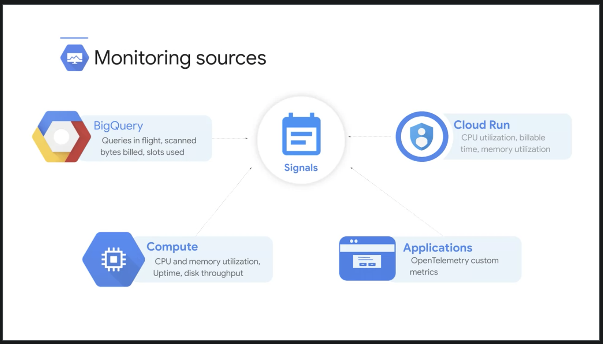

# Course Intro

Welcome to Introduction to Google Cloud Monitoring Tools.

In this module, we'll take some time to do a high-level overview of the various products that constitute Google Cloud's logging, monitoring and observability suite.

The core operations tools in Google Cloud breakdown into two major categories.

The operation's focus components including logging, monitoring, error reporting and service monitoring, tend to be more for personnel who are primarily interested in infrastructure and keeping that infrastructure up, running and error-free.

The application performance management tools including debugger, trace and profiler in contrast, tend to be more for developers who are trying to perfect or troubleshoot applications that are running in one of the Google Cloud compute products.

But it isn't fair to think of these tools as belonging purely to either one of these two groups. A developer would, of course, sometimes need access to logs or monitoring metrics, just like an operations team member might need to trace latency.

For reference the homepage for documentation related to this course can be found at https://cloud.google.com/stackdriver/docs

 

## Overview of Monitoring Tools

Let's start with an overview of why we need these tools and then we'll spend a little time getting to know both operations and the application performance management products.

 

 

If you've ever worked with on premise environments, you know that you are someone in your organization, can actually physically touch any of your servers. If an application becomes unresponsive, someone can walk in and physically investigate, in the cloud though the servers aren't yours there Google's and you won't be able to inspect them physically.

So the question becomes, how do you know what's happening with your server or database or application? The answer is the tools discussed in this course, it all starts with the signals metrics, logging and trace data capturing is integrated into Google products from the hardware layer up from those products. The signal data flows into Google Cloud's operations tools where you can visualize it in dashboards and through the metrics explorer. You can dissect and analyze automated and custom logs in the log viewer monitor services for compliance with service level objectives, SLOs and track error budgets. Use health checks to check up time and latency for external facing sites and services. You can also debug and profile running applications when indicators pick up possible problems. Signal data can generate notifications to code or through various information channels to keep personnel. Error reporting can help operations and developer teams spot count and analyze crashes in cloud based services.

The visualization and analysis tools can then help troubleshoot what's exactly happening in Google cloud.

Ultimately you won't miss that easy server access because Google is going to allow you more precise insights into your cloud installed than you ever had on premise.

 

 

Google cloud has many products from kubernetes to big query to spanner and they all stream metrics and logs into Google cloud's logging and cloud monitoring components. The logs router determines where the data goes and can be used to exclude some type of subentries. Or to route logs to external locations like pub sub or big query perhaps for automated handling and for long term storage and analysis.

An auditor might inspect the log viewer to see when a given spanner instance was created and by whom. Security personnel could use threat detection or the security command center to spot and analyze intrusion attempts. A network engineer might run SQL queries in big query to better understand network flow.

In addition to raw monitoring metrics and logging entries, Google cloud also helps SysOps, SRE and DevOps personnel analyze and improve application performance.

 

 

Take as an example in http based java service running inside of a compute engine VM. Debugger would allow the inspection of the services code state without stopping or degrading its performance. It helps answer the question what was happening in the code when this particular line executed? Similarly, profiler can also be used to examine CPU and memory, used to help spot bottlenecks and improve algorithmic performance. Trace is all about analyzing latency in a multi layer micro service application and the logs. API can be used by developers to write directly to Google cloud logs.

 

### Operations-Based Tools

Now that we've introduced the products in Google Cloud's logging and monitoring tools Suite, let's take a closer look.

 

 

Let's start with the products that tend to be of interest for the operations folk: monitoring, logging, error reporting, and service monitoring.

 

 

When DevOps personnel think about tracking exactly what's happening inside Google Cloud Projects, monitoring is often the first consideration. It's mentioned first on the documentation homepage, just like the first product in the operation section of the Google Cloud navigation menu.

As we stated previously, monitoring starts with signal data. When the data scientists are running massively scalable queries in BigQuery, knowing how many queries are currently in flight, how many bytes have been scanned and added to the bill, and data slot usage patterns, all will be important.

It could also be critical to DevOps teams running containerized applications in Cloud Run to know CPU and memory utilization and add build time. Workloads on Compute Engine will benefit from CPU and memory utilization data along with uptime, disk throughput, and scores of others.

If those same DevOps teams want to augment the signal metrics coming out of their custom application wherever it's running, they could use the open-source open telemetry and create their own metrics.

Google Cloud, by default, collects more than 1000 different streams and metric data which can be incorporated into dashboards, alerts, and a number of other key tools.

 

 

Here we see a project running a Compute Engine VM instance with the logging and monitoring agents installed. Cloud monitoring provides visibility into the performance, uptime, and overall health of Cloud-powered applications. It collects metrics, events, and metadata from projects, logs, services, systems, agents, custom code, and various common application components including Cassandra, Nginx, Apache web server, and Elasticsearch.

Monitoring, ingest that data, and generates insights via dashboards, metrics, explorer charts, and automated alerts.

 

 

Google Cloud Logging is all about collecting, storing, searching, analyzing, monitoring, and alerting on log entry and events.

Automated logging is integrated into Google Cloud products like App Engine, Cloud Run, Compute Engine VMs that run the logging agent, and GKE.

Export log data as files to Cloud Storage as messages through Pub/Sub or into BigQuery tables. Logs-based metrics may be created and integrated into cloud monitoring dashboards, alerts, and service SLOs.

Pub/Sub messages can be analyzed in near real-time using custom code or stream processing technologies like Dataflow.

BigQuery allows analysts to examine logging data through SQL queries and archive log files in Cloud Storage can be analyzed with several tools and techniques.

Default log retention in Cloud Logging depends on the log time. Data access logs are retained by default for 30 days, but this is configurable up to a maximum of 3,650 days. Admin logs are stored by default for 400 days.

You can export logs to Cloud Storage or BigQuery, to extend retention periods.

 

 

The Google Cloud Platform logs are visible to you in Cloud Logging vary depending on which Google Cloud resources you're using and your Google Cloud project organization. Three key categories are audit logs, agent logs, and network logs. Cloud audit logs help answer the question, who did what, where, and when.

Admin Activity tracks configuration changes, data access tracks calls that read configuration or metadata of resources, as well as user-driven calls that create, modify, or read user-provided resource data.

System events are non-human Google Cloud administrative actions that change the configuration of resources.

Access transparency provides you with logs that capture the actions Google personnel take when accessing your content.

Agent logs use a Google customized package `Fluentd` agent that can be installed on any AWS or Google Cloud VM to ingest log data from Google Cloud instances. For example, Compute Engine manage VMs or containers as well as AWS EC2 instances.

Network logs provide both network and security operations with in-depth network service telemetry. VPC flow logs record samples of VPC network flow and can be used for network monitoring, forensics, real-time security analysis, and expense optimization.

Firewall rules logging allows you to audit, verify, and analyze the effects of your firewall rules.

NAT gateway logs capture information on NAT network connection and errors.

 

 

Error reporting counts, analyses, and aggregates the crashes when you're running Cloud services. Its management interface displays the results with sorting and filtering capabilities. A dedicated view shows the error details, time-chart, occurrences, affected user count, first and last scene dates, and cleaned exception stack trace.

You can also create alerts to receive notifications on new errors.

 

 

Service monitoring helps organizations understand and troubleshoot intra-service dependencies. With current support for App Engine, Anthro Service Mesh, and Istio. Service Monitoring streamlines the creation of latency and error-based SLOs to make it easy for organizations to spot customer pain.

When SLOs are created, it also tracks and reports error budget burn to make it clear to DevOps team members when there's budget to spend and when things should be left alone.

 

### Application Performance Management Tools

Now that we've explored the operations based tools, let's spend a little time on the tools designed to help with application performance management, namely, Debugger, Tracer, and Profiler. Google Cloud's Debugger lets you debug your applications while they're running in production without stopping them or slowing them down so you can examine your codes function and performance under actual production conditions.

Easily collaborate with other team members by sharing your debug session. Sharing a debug session is as easy as sending the console URL. Capture the state of your application in production at a specific line location with snapshots. Use logpoints to inject new logging statement on demand at a specific line location. Capture a snapshot or write a logpoint message only when you need it using a simple conditional expression written in your application's language. Cloud Debugger is easily integrated into existing developer workflows. Launch Debugger and take snapshots directly from cloud logging, air reporting, dashboards, IDEs, and the G Cloud command line interface.

And Debugger knows how to display the correct version of the source code because it easily integrates with the version control systems such as Cloud Source Repositories, GitHub, Bitbucket, or GitLab. Based on the tools Google uses on its production services, Cloud Trace is a tracing system that collects latency data from your distributed applications and displays it in the Google Cloud Console. Trace can capture traces from applications deployed on App Engine, Compute Engine VMs, and Google Kubernetes Engine containers. Performance insights are provided in near-real-time and Trace automatically analyzes all of your applications traces to generate in-depth latency reports that can service performance degradations. Trace continuously gathers and analyzes Trace data to automatically identify recent changes to your application's performance. Poorly performing code increases the latency and cost of applications and web services every day without anyone knowing or doing anything about it. Cloud Profiler changes this by using statistical techniques and extremely low impact instrumentation that can run across all production application instances to provide a complete CPU and heat picture of an application without slowing it down.

With broad platform support that includes Compute Engine VMs, App Engine, and Google Kubernetes Engine, it allows developers to analyze applications running anywhere, including Google Cloud as our cloud platforms or on-premise with support for Java, Go, Python and Node.js. Cloud Profiler presents the call hierarchy and resource consumption of the relevant function in an interactive flame graph that helps developers understand which paths consumed the most resources and the different ways in which their code is actually called.

 

### Review: Product Knowledge

 

## Overview: Why Monitor?

 

### Why Monitor?

 

### Critical Measures

 
