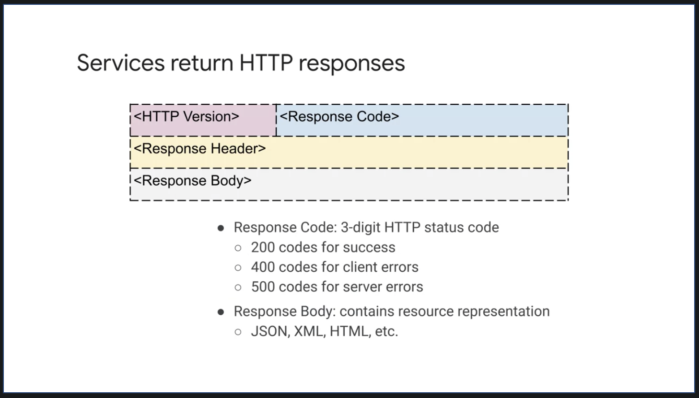

- [Course Intro](#course-intro)
      - [Reading: Workbook](#reading-workbook)
      - [Cloud Architect Workbook](#cloud-architect-workbook)
  - [Intro: Defining a Case Study](#intro-defining-a-case-study)
    - [Defining Your Case Study](#defining-your-case-study)
    - [Module Overview](#module-overview)
    - [Requirements, Analysis & Design](#requirements-analysis--design)
    - [Activity Intro: Analyzing Your Case Study](#activity-intro-analyzing-your-case-study)
    - [Activity Review: Analyzing Your Case Study](#activity-review-analyzing-your-case-study)
    - [KPIs & SLIs](#kpis--slis)
    - [SLOs & SLAs](#slos--slas)
    - [Activity Intro: Defining SLIs & SLOs](#activity-intro-defining-slis--slos)
    - [Activity Review: Defining SLIs & SLOs](#activity-review-defining-slis--slos)
    - [Review](#review)
  - [Module Overview - Application Architecture & Microservice Design](#module-overview---application-architecture--microservice-design)
    - [Microservices](#microservices)
    - [Microservices Best Practices](#microservices-best-practices)
    - [Activity Intro - Designing Microservices for Your Application:](#activity-intro---designing-microservices-for-your-application)
    - [Activity Review - Designing Microservices for Your Application:](#activity-review---designing-microservices-for-your-application)
    - [REST](#rest)
    - [HTTP](#http)
    - [APIs](#apis)
    - [Activity Intro - Designing REST APIs](#activity-intro---designing-rest-apis)
    - [Activity Review - Designing REST APIs](#activity-review---designing-rest-apis)
    - [Review](#review-1)
  - [Module Overview: DevOps Automation](#module-overview-devops-automation)
    - [Continuous Integration Pipelines](#continuous-integration-pipelines)
    - [Infrastructure as Code](#infrastructure-as-code)
      - [Lab Intro - Building a DevOps Pipeline](#lab-intro---building-a-devops-pipeline)
      - [Lab Review - Building a DevOps Pipeline](#lab-review---building-a-devops-pipeline)
    - [Module Review](#module-review)
  - [Module Overview - Google Cloud Storage and Data Solutions](#module-overview---google-cloud-storage-and-data-solutions)
    - [Key Storage Characteristics](#key-storage-characteristics)
    - [Activity Intro: Defining Storage Characteristics](#activity-intro-defining-storage-characteristics)
    - [Activity Review: Defining Storage Characteristics](#activity-review-defining-storage-characteristics)
    - [Choosing Google Cloud Storage & Data Solutions](#choosing-google-cloud-storage--data-solutions)
    - [Activity Intro: Choosing Google Cloud Storage & Data Solutions](#activity-intro-choosing-google-cloud-storage--data-solutions)
    - [Activity Review: Choosing Google Cloud Storage & Data Solutions](#activity-review-choosing-google-cloud-storage--data-solutions)
    - [Review](#review-2)
  - [Module Intro: Designing Google Cloud Networks](#module-intro-designing-google-cloud-networks)
    - [Designing Google Cloud Networks](#designing-google-cloud-networks)
    - [Designing Google Cloud Load Balancers](#designing-google-cloud-load-balancers)
    - [Activity Intro: Defining Network Characteristics](#activity-intro-defining-network-characteristics)
    - [Activity Review: Defining Network Characteristics](#activity-review-defining-network-characteristics)
    - [Connecting Networks](#connecting-networks)
    - [Activity Intro: Diagramming Your Network](#activity-intro-diagramming-your-network)
    - [Activity Review: Diagramming Your Network](#activity-review-diagramming-your-network)
    - [Review](#review-3)

# Course Intro

his course is about architecting, design, and process. A cloud architect's job is to determine which cloud services to use in order to most effectively implement the applications and services they are building.

This is not an easy job. That's right, many services seem interchangeable. In many cases, multiple different services would work for the same use case.

The intent of this course is to simulate the process you can use to design a system that will run on Google Cloud.

This course is not about implementing specific cloud features. It's about architecture, design, and process. We like to joke that the job of an architect is to draw rectangles and point arrows at them. Which to a certain extent is true, that is an important step in designing complex systems.

In this course, you will focus on that design and planning, specifically, you will work on architecting and designing a case study in this course. The starting point for any software development is to figure out what the software is supposed to do, who your users are, and why this is important. You will begin with this requirements gathering phase.

Once you understand your software's requirements and your users, you can start laying out the overall design. In software, this is a process of decomposition, breaking the big thing, your program, into smaller manageable units that you can start programming. In a modern cloud-based system, it is considered a best practice to break your application into microservices.

Microservices refers to an architectural style for developing applications. Microservices allow a large application to be decomposed into independent constituent parts, with each part having its own area of responsibility. To serve a single user or API request, a microservices based application can call many internal microservices to compose its response.

 The architecture and the course will be microservice based. This has a significant effect on the agility of the application in aspects such as development speed, deployment, and monitoring. We will consider the advantages and disadvantages of this architectural style.

 We'll also help you choose the best storage and deployment services using objective criteria. Choosing the right ones can be complicated. Do you want a relational database, a NoSQL database, or a data warehouse? You also need to consider your compute platform. Do you want to deploy your apps to virtual machines, a Kubernetes cluster or an automated platform like app engine?

 You will learn what the factors are and how to choose the right services for your various microservices. Google provides many services that you can use to make your applications reliable. Availability, durability, cost, and disaster recovery are all important considerations when designing systems. If you understand your requirements, you can choose the right Google Cloud services to meet your applications goals for reliability while optimizing costs.

 Now, there's a saying security is not icing on the cake, it is baked into the cake. Before implementing a system on Google Cloud, you should carefully consider its security requirements and use the appropriate security services.

 Security and computer systems is implemented in layers, Google Cloud handle some things for you. For example, Google secures the physical hardware that Google Cloud is running on. Google also provides many controls to help secure your applications and data.

 Security is a shared responsibility though. The way you configure your network, storage services, and machines will determine how your application is secured. When you design your case study, you will consider its security requirements and bake them into the design.

 At the end you will monitor your app to see whether you're meeting your service objectives. In Google Cloud, there are many services for monitoring your application.

  

 

  

 These include dashboards, logs, error reporting and tracing. You start by defining your application requirements, as you develop your solution, you can use the monitoring tools to determine how successful you are at meeting your application goals.

 The Reliable Cloud Infrastructure Design and Process course is a part of the Cloud Infrastructure learning path. This path is designed for IT professionals who are responsible for implementing, deploying, migrating, and maintaining applications in the cloud. The prerequisite for this course is either the Architecting with Google Compute or Engine or the Architecting with Google Kubernetes Engine Course. In other words, this course is not intended to be your first exposure to Google Cloud.

  

 

  

 Now, the course consists of lectures, design activities, and hands-on labs. You should spend a significant amount of time on the design and architecture assignments we will give you. As with many situations, there will be no one right answer and typically different people come up with different solutions. Architecting systems is a matter of weighing the pros and cons of various solutions and trying to find the best solution given your requirements and constraints.

 Now, the more effort you put into these design activities, the more you will learn from this course. Besides this introduction module, there are nine modules in this course.

 First, you will analyze and design a case study application using a microservice architecture.

 Then, we will cover Google Cloud tools for DevOps and Automation and you will choose the appropriate storage services for your case study. After that, you will learn about network design for cloud and hybrid applications and learn how to choose the appropriate deployment service. We will finish by designing for reliability and security and by monitoring your application.

 

#### Reading: Workbook

Throughout this course you will work on design activities in the course’s workbook.You have three options for accessing the workbook:

1. [Google Slides](https://docs.google.com/presentation/d/13ZXquIwCqp9sp2I7eqbQecENH49vx1xvi-E2k1pHTCE/copy)
2. [Powerpoint](https://storage.cloud.google.com/cloud-training/archdp/v2.0/OnDemand/Workbook%20%7C%20Design%20%26%20Process.pptx)
3. [PDF](https://storage.googleapis.com/cloud-training/archdp/v2.0/OnDemand/Workbook%20%7C%20Design%20%26%20Process.pdf)

All of these formats have the exact same content but we recommend picking one for the entire course.

 

#### [Cloud Architect Workbook](../assets/CloudArchitectWorkbook_Design_Process.pdf)

 

## Intro: Defining a Case Study

Slides are great for explaining concepts. But let's start working on the design activity workbook of this course. You can find the full workbook in the resources section of this course.

In the first activity, you need to come up with a case study idea. Whatever your idea is, you don't want it to be too trivial. It should be complex enough idea that designing the solution will be challenging.

For example, you might want to design an online banking portal, a ride sharing application, or an online shopping site. These are all complex applications with many interesting design possibilities.

Now all of these examples have been designed before. Feel free to use your imagination to come up with something that hasn't been done before. You can use something that you might want to develop as part of your work. It's up to you.

As this course is recorded, we won't be able to provide you with specific feedback on your design.

Instead we will provide you with a sample solution for an online travel portal application for each design activity.

Now part A of this activity is to come up with an interesting case study. For part B, write a short description and list the main features and roles of some typical users of your application.

 

### Defining Your Case Study

In this first activity, you were asked to come up with a case study, write a short description, list some of its main features, and list some of the roles users would play while using the application.

To give you an idea of what to come up with, we'll go over our sample solution for an online travel portal application.

Let's call it Click Travel. Click Travel is a global travel agency that wants to build scalable e-commerce platform to serve a global customer base. Let's go over the main features.

Travelers can search and book travel like hotels, flights, trains, and cars. Pricing will be individualized based on the customer's preferences and demand.

There should be a strong social media integration with reviews, post, and analytics.

Suppliers like airlines and hotels can upload their inventory.

As for roles of typical users, we envision a customer, a traveler, an inventory supplier, and a manager.

I'm sure we could come up with more features and roles, but this gives us a good feel for the application we would like to build. Now we can get started working on more detailed requirements and a design.

 

### Module Overview

In this module, we focus on defining services. A new development begins with the planning and design phases.

These require information gathering, starting with business requirements. Once the requirements are defined, it is important to measure that they're providing business value. In this module, we will look at gathering requirements and then techniques from measuring the impact of these solutions.

Let's take a closer look at what we will cover.

In this module, you will learn to describe users of a system in terms of the roles and personas they take. These users will then help define and refine the qualitative requirements which will be captured in the a form of user stories.

These provide a context for the architectural design and subsequent technical decisions you will make as a cloud architect.

Example of business requirements include: accelerating the pace of software development, reducing capital expenditure, and reducing time to recover incidents.

The technical requirements of a systems are both the functional and non-functional features required.

To help identify the most important requirements and measure our impact, you will learn how to measure success using key performance indicators or KPIs.

We will also discuss the importance of using SMART criteria when defining KPIs. We'll finish by considering the most suitable service level objectives or SLOs, and service level indicators or SLIs, and from these service level agreements or SLAs.

 

### Requirements, Analysis & Design

Let's start talking about requirements, analysis, and design.

Useful questions to ask a Cloud architect to help build the requirements are who, what, why, when, and how.

The who is about determining not only the user of the system, but also the developers and stake holders. The aim is to build a full picture of who the system will affect both directly and indirectly.

The what is both simple and difficult, we need to establish the main areas of functionality required, but in a clear, unambiguous manner.

Why the system is needed, is a really important question. What is a problem the proposed system aims to address or solve? Without a clear understanding of the need, it is likely that extra requirements will be added.

The why will also potentially help in defining KPIs, and SLOs, and SLAs. When, helps determine a realistic timeline and can help contain the scope.

How, helps to determine a lot of the non-functional requirements. These could be, for instance, how many users the system needs to support concurrently? What does the average payload size of service requests? Are there latency requirements, etc?

They could be that the users will be located across the world or in a particular region only. All of these requirements are vital to capture, because they impact the potential solution you as a Cloud architect will provide.

In the previous design activity, you defined user roles for your application. Roles represent the goal of a user at some point and they enable the analysis of a requirement in a particular context. It is important to note that a role is not necessarily a person, it is an actor on the system and it could be another system such as a microservice client that is accessing another microservice.

The role should describe the user's objective when using the system. For example, the role of a shopper on an eCommerce application clearly defines what the user wants to do. There are many ways to determine the roles for the requirement you working on.

One process that works particularly well is, first brainstorm an initial set of roles. Write as many roles as you can think of, with each role being a single user. Now, organize this initial set. Here, you can identify overlapping roles and related roles, and group these together.

With the set of roles now grouped, consolidate the roles, the aim here is to consolidate and condense the roles to remove duplication.

Finally, refine the roles including internal and external roles, and the different usage patterns. Here, extra information can be provided, such as the user's level of expertise in the domain or the frequency of use of the proposed software. Following a simple process like this, provide structure and brings focus to the task.

 

 

Identifying user roles is a useful technique that's part of the requirements getting process. An additional technique, in particular for more important roles can be to create a persona for the role. A persona is an imaginary representations of a user role.

The aim of the persona is to help the architect and developers think about the characteristics of users by personalizing them. Often, a role has multiple personas.

Consider the example of requirements for a banking application. We can think in terms of users of the system and many requirements can be gathered this way. Using personas can provide further insights.

For example, Jocelyn is a person who's a busy working mom. Jocelyn wants to save time and money as well as perform these standard banking operations online and receive benefits such as cashback.

Using a persona helps build a fuller picture of the requirements.

For instance, Jocelyn's wanting to save time indicates that the task to be performed should possibly be automated, which affects latency hence service design. In this example, when a question rises from the architect or maybe a developer, they can often better answer that question by thinking, what would Jocelyn want here? Now, user stories describe one thing a user wants the system to do, they are written in a structured way typically using the form as a, type of user, I want to - do something so that I can get some benefit. Another commonly used form is given some context, when I do something, then this should happen.

So when writing stories, give each story a title that describes its purpose as a starting point, follow this with a concise, one-sentence description of the story that follows one of the forms just described. This form describes the user role, what they want to do and why they want to do it.

As an example, consider a banking system and a story to determine the available balance of a bank account. The title of the story could be `balance inquiry`. Then following the template we described the story as an account holder, I want to check my available balance at any time of day, so I am sure not to overdraw my account.

This explains the role, what they want to do and why they want to do it. User stories provide a clear and simple way of agreeing to requirements with a customer/end-user. The INVEST criteria can be used to evaluate good user stories. Let me go through each letter of these criteria.

- Independent, a story should be independent to prevent problems with prioritization and planning.
- Negotiable, they are not written contracts, but are used to stimulate discussion between customer and developers until there is a clear agreement, they add collaboration.
- Valuable, story should provide value to users. Think about outcomes and impact, not outputs and deliverables.
- Estimatable, the story must be estimatable. If it is not, it often indicates missing details or the story is too large.
- Small, good stories should be small, this helps keep scope small and therefore less ambiguous and supports fast feedback from users.
- Testable, stories must be testable so that developers can verify that the story has been implemented correctly and validate when requirement has been met slash/is done.

 

### Activity Intro: Analyzing Your Case Study

In this design activity, you're going to work on activities two A and two B of the design workbook. In the first activity, you defined roles. For an online store, examples of roles might be account holder, shopper, customer, administrator and seller. Roles are played by people and different people playing the same role might be significantly different. In activity two A, you will write some user personas. Personas are stories that describe typical people playing some role while using your system. It's important to understand your users when designing a system. So it's important to write some personas. Now, in a real project, you should find some users and interview them. For this course, feel free to use your imagination. In activity two B, you will write some user stories. User stories are short one sentence descriptions of your applications features.

In the first activity, you listed some features. Now, turn those features into user stories, write your user stories in the form as A and then you fill in the role. I want to and then tell me your goal, so that and you say why this is important to you. For example, an online store might have a feature to search for products. The user story might be, as a shopper, I want to be able to quickly search for products by name keyword or category so I can quickly find information about products I want to purchase.

Here's an example persona.

Jocelyn is a busy working mom who wants to access MegaCorp Bank to check her account balances and make sure that there are enough funds to pay for her kids' music and sports lessons.

She also uses the website to automate payments of bills and see her credit account balances.

Jocelyn wants to save time and money. She wants a credit card that gives her cash back.

Here's an example user story for a feature, balance inquiry.

As a checking account holder, I want to check my available balance at any time of day so that I'm sure not to overdraw my account.

 

### Activity Review: Analyzing Your Case Study

In this second activity, you are asked to write personas and user stories for your case study. Here are a couple of examples of personas for our online travel portal.

Karen is a busy businesswoman who likes to take luxury weekend breaks, often booked at the last minute. A typical booking comprises of a hotel and flight. Recommendations play a major role in the choice Karen makes, as does customer feedback. Karen likes to perform all operations from her phone.

Andrew is a student who likes to travel home to visit parents and also takes vacations twice yearly. His primary concern is cost, and he will always book the lowest price travel regardless of convenience. Andrew has no loyalty, and will use whichever retailer can provide the best deal.

Here are a couple of examples of user stories for our online travel portal.

For the Search for Flight and Hotel feature, I could write:
> as a traveler, I want to search for a flight-hotel combination to a destination on dates of my choice so that I can find the best price.

For the Supply Hotel Inventory feature, I could write:
> as a hotel operator, I want to bulk supply hotel inventory so that ClickTravel can sell it on my behalf.

For the Analyze Sales Performance feature, I could write:
> as a ClickTravel manager, I want to analyze the sales performance data of all of our suppliers so that I can identify poor performers and help them improve.

 

### KPIs & SLIs

With a set of requirements in place, we will now move on to consider how to measure whether the technical and business requirements have been met.

 

 

To manage a service well it is important to understand which behaviors matter and how to measure and evaluate these behaviors. These must always be considered in the context of the constraints which are usually time, funding, and people. Then we consider what can be achieved. The type of system being evaluated determines the data that can be measured, for example, for user-facing systems was a request responded to which refers to availability. How long did it take to respond, which refers to latency. How many requests can be handled, which refers to throughput. For data storage systems, how long does it take to read and write data? That's latency. Is the data there when we need it, that's availability. If there is a failure to we lose any data, that's durability.

The key to all of these items is it the questions can be answered with data gathered from the services.

Business decision makers want to measure the value of projects. This enables them to better support the most valuable projects and not waste resources on those that are not beneficial. A common way to measure success is to use KPIs, KPIs can be categorized as Business KPIs and Technical KPIs.

 

 

Business KPIs are a formal way of measuring what the business values such as ROI in relation to a project or service. Others include, earnings before interest and taxes or impact on users, such as customer churn or maybe employer turnover.

Technical or software KPIs can consider aspects such as how effective the software is through page views, user registration, and number of checkouts. These KPIs should also be closely aligned with business objectives. As an architect, it is important that you understand how the business measures success of the systems that you design. Now, a KPI is not the same thing as a goal or objective. The goal is the outcome or result you want to achieve, the KPI is a metric that indicates whether you are on track to achieve the goal.

To be the most effective, KPIs need an accompanying goal. This should be the starting point in defining KPIs, then for each goal define the KPIs that will allow you to monitor and measure progress. For each KPI, define targets for what success looks like. Monitoring KPIs against goals is important to achieving success and allows readjustment based on feedback.

As an example, a goal may be to increase turnover for an online store and an associated KPI maybe the percentage of conversions on the website.

 

 

For KPIs to be effective, they must be specific rather than general.

For example, user friendly is not specific, it's very subjective. Section 508 Accessible is much more specific.

Measurable is vital because monitoring the KPIs indicates whether you're moving toward or away from your goal.

Being achievable is also important, for example, expecting 100% conversions on a website is not achievable.

Relevant is absolutely vital, without a relevant KPI the goal probably will not be met. In our example of increasing turnover, we're improving the conversion rate as subsequent increase in turnover should be achievable assuming a similar number of users.

Time-bound helps with measuring the KPI. Some KPIs are more sensitive to time, for example, is availability per day, per month or per year.

So to summarize, KPIs are used to measure success or progress toward a goal.

Let's introduce service level terminology. To provide a given level of service to customers, it is important to define service level indicators or SLIs, objectives or SLOs and agreements or SLAs. These are measurements that describe basic properties of the metrics to measure. The values those metrics should read and how to react if the metrics cannot be met.

Service level indicator is a quantitative measure of some aspect of the level of service being provided. Examples include throughput, latency, and error rate.

Service level objective is an agreed upon target or range of values for a service level that is measured by an SLI.

 

 

It is normally stated in the form of SLI is smaller than equal to target or lower bound, which is smaller than, equal to SLI, smaller than, equal to upper bound. An example of an SLO is that an average latency of HTTP requests for our service should be less than 100 milliseconds.

Service level agreement is an agreement between a service provider and a consumer. They define responsibilities for delivering a service and consequences when these responsibilities are not met. The SLA is a more restrictive version of the SLO. We want to architect a solution and maintain an agreed SLO, so that we provide ourselves spare capacity against the SLA.

 

 

Understanding what users want from a service will help inform the selection of indicators. The indicators must be measurable, for example, fast response time is not measurable. Whereas HTTP GET requests that respond within 400 milliseconds aggregated per minute is clearly measurable. Similarly, highly available is not measurable but percentage of successful requests over all request aggregated per minute is measurable. Not only must indicators be measurable but the way they are aggregated needs careful consideration.

For example, consider requests per second to a service, how is the value calculated? By measurements obtained once per second or by averaging request over a minute? The once per second measurement may hide high requests rates that occur in bursts of a few seconds.

For example, consider a service that receives 1,000 requests per second on even-numbered seconds and 0 requests on odd-numbered seconds. The average requests per second could be reported over a minute as 500. However, the reality is that the load at times is twice as large as the average. Similar averages can mask user experience when used for metrics like latency. It can mask the request the take a lot longer to respond than the average.

It is better to use percentiles for such metrics, where a high order percentile, such as 99% shows worst-case values. While the 50th percentile would indicate a typical case.

 

### SLOs & SLAs

The relevancy of SLOs is vital. You want objectives that help or improve the user experience.

 

 

It is easy to define a SLOs based around what is easy to measure rather than what is useful. For clarity, SLOs should specify how they are measured and the conditions when they are valid.

Consider availability as measured with an uptime check over ten seconds aggregated per minute. It is unrealistic as well as undesirable to have SLOs with a 100% target. Such a target results in expensive, overly conservative solutions, that are still unlikely to reach the SLO. It is better to track the rate at which SLOs are missed and work to improve this. In many cases 99% may be good enough availability and be far easier to achieve as well as engineer. It is also highly likely to be much more cost-effective to run.

The use case needs to be considered also.

For example, if a HTTP service for photo uploads requires 99% of uploads to be complete within 100 milliseconds aggregated per minute, this may be unrealistic or overkill if the majority of users are using mobile phones. In such a case, an SLO of 80% is much more achievable and good enough.

It is often okay to specify multiple SLOs.

Consider the following, 99% of HTTP get calls will complete in less than 100 milliseconds. This is a valid SLO, but it may be the case that the shape of the performance curve is important. In this case, the SLO could be written as follows. 90% of HTTP get calls will complete in less than 50 milliseconds, 99% of HTTP get calls will complete in less than 100 milliseconds. And 99.9% of HTTP get calls will complete and less than 500 milliseconds.

Selecting SLOs has both product and business implications. Often trade-offs need to be made based on constraints such as staff, time to market and funding. As the slide states, the aim is to keep users happy, not to have an SLO that requires heroic efforts to maintain.

 

 

Let me give you some tips on selecting SLOs.

Do not make them too high. It is better to have lower SLOs to begin with and tighten them over time as you learn about the system, instead of defining those that are unattainable and require a significant effort and cost try and achieve. Keep them simple. More complex SLOs can obscure important changes in performance.

Avoid absolute values. To have a SLO that states 100% availability is unrealistic. Such an SLO increases the time to build, complexity, and cost to operate. And in most cases is highly unlikely to be required.

Minimize SLOs. A common mistake is to have too many SLOs. The recommendation is to have just enough SLOs to give coverage of the key system attributes. In summary, good SLOs should reflect what the users care about. They work as a forcing function for development teams. A poor SLO will result in a significant amount of wasted work if it is too ambitious or a poor product if it is to relaxed.

An SLA is a business contract between the service provider and the customer.

 

 

A penalty will apply if the service provider does not maintain the levels agreed on. Not every service has an SLA, but all services should have a SLOs. As with SLO, it is better to be conservative with SLAs because it is too difficult to change or remove SLAs that offer little value or cause a large amount of work.

In addition, because they can have a financial implication through compensation to the customer, setting them too high can result in unnecessary compensation being paid. To provide protection and some level of safety, an SLA should have a threshold that is lower than the SLO. This should always be the case.

 

 

Let's consider an example of a service, An SLI, SLO and SLAs for the service. The service is an HTTP endpoint accessed using HTTP get.

The SLI is the end-to-end latency of successful HTTP responses. That is HTTP-200. These are averaged over one minute.

The SLO has been agreed that the latency of 99% of the responses must be less than or equal to 200 milliseconds.

The SLA is set that the user is compensated if the 99th percentile latency exceeds 300 milliseconds. The SLA has clearly built a buffer over the SLO, which means that even if the SLO is exceeded there is some capacity before the SLA is broken.

**This is the wanted position in the relationship between SLO and SLA.**

 

### Activity Intro: Defining SLIs & SLOs

In this design activity, you will define SLIs and SLOs for your case study. Let's say you wanted to write an SLI and SLO for an online shopping application related to availability.

The SLO is what you want to measure. For example, you might want to measure the fraction of successful versus unsuccessful HTTP responses from an API endpoint aggregated per day. The SLO is the target you're trying to achieve.

For your online stores, search for product service that might be 99.95 percent.

Here are a couple of more examples for an imaginary online bank.

The SLI defines what you want to measure, like the fraction of 200 versus 500 HTTP responses from an API endpoint, or the time to last byte GET request measured every 10 seconds aggregated per minute.

The SLO defines the target you want to achieve, like 99.95 percent availability, or that 95 percent of request will complete in under 300 milliseconds.

 

### Activity Review: Defining SLIs & SLOs

In this third activity, you are asked to write SLIs and SLOs for your case study. Here's some example SLOs and SLIs for our travel portal application. Notice that the SLI describes what we're going to measure and how. For example, fraction of 200 vs 500 HTTP responses from API endpoint measured per month.

 

 

This example is a way of measuring availability.

The SLO represents the goal we're trying to achieve for a given SLI. For example, available 99.95% of the time. Feel free to pause the video to read through the other SLOs and SLIs for each user story.

 

### Review

In this module, we learned about qualitative and quantitative requirements.

Qualitative requirements are things that user care about like features. We can express qualitative requirements in the form of user stories. In order to understand our users better, we should write personas.

Quantitative requirements are things we can measure. We can express them as key performance indicators, or KPIs. KPIs and software are things like user sign-ups, clicks, processions, completed purchases, or customer retention. We can also express quantitative requirements as SLOs and SLIs.

These are lower level metrics, things like latency, availability, or response time.

 

## Module Overview - Application Architecture & Microservice Design

In this module, we introduce Application Architecture and Microservice design.

Specifically, you will learn about microservice architectures and how to decompose monolithic applications into microservices. The benefits of a microservice architecture for Cloud-native applications is discussed and contrasted with a monolith.

The challenges of decomposing applications into microservices with clear boundaries to support independently deployable units are investigated.

You will learn how to architect for some of the major technical challenges of microservices architecture, such as state management, reliability, and scalability.

Once a Cloud-native microservice architecture has been chosen, the best practices for development and deployment are introduced based around the widely recognized 12-factor best practices.

At the end of the module, we will go over a core component of the microservices architecture, which is the design of consistent, loosely coupled service interfaces.

 

### Microservices

 

 

Let's begin by looking at microservices in more details. Microservices divide a large program into a number of smaller independent services, as shown on the right. Unlike a monolithic application which implements all features in a single codebase with a database for all data, as shown on the left. Microservices are the current industry trends. However, it's important to ensure that there is a good reason to select this architecture.

The primary reason is to enable teams to work independently and delivered through to production at their own cadence, this supports scaling the organization, adding more teams increases speed. There's also the additional benefit of being able to scale the microservices independently based on their requirements.

Architecturally, an application designed as a monolith or around microservices should be composed of modular components with clearly defined boundaries. With the monolith all the components are packaged at deployment time and deployed together. With microservices, the individual components are deployable.

Google Cloud provides several compute services that facilitate deploying microservices. These include App Engine, Cloud Run, GKE, and Cloud Functions.

Each offers different level of granularity and control and will be discussed later in the course.

To achieve independence on services, each service should have its own datastore. This lets the best datastore solution for that service to be selected and also keeps the services independent. We do not want to introduce coupling between services through a datastore.

A properly designed microservice architecture can help achieve the following goals:

- Define strong contracts between the various microservices.
- Allow for independent deployment cycles, including rollback.
- Facilitate concurrent AB release testing on subsystems.
- Minimize test automation and quality assurance overhead.
- Improve clarity of logging and monitoring.
- Provide fine grained cost accounting.
- Increase overall application scalability and reliability through scaling smaller units.

However, the advantages must be balanced with the challenges this architectural style introduces.

 

 

Some of these challenges include:

It can be difficult to define clear boundaries between services to support independent development and deployment.

Increased complexity of infrastructure with distributed services having more points of failure.

The increased latency introduced by network services and the need to build in resilience to handle possible failures and delays.

Due to the networking involved, there is a need to provide security for service to service communication, which increases complexity of infrastructure.

Strong requirement to manage in version service interfaces with independent deployable services, the need to maintain backward compatibility increases.

 

 

Decomposing applications into microservices is one of the biggest technical challenges of application design. Here are techniques like domains driven design are extremely useful in identifying logical functional groupings. The first step is to decompose the application by feature or functional groupings to minimize dependencies.

Consider, for example, an online retail application. Logical functional groupings could be product management, reviews, accounts, and orders. These groupings then for many applications which exposes an API, each of these mini applications will be implemented by potentially multiple microservices internally.

Internally, these microservices are then organized by architectural layer and each should be independently deployable and scalable. Any analysis will also identify shared services such as authentication, which are then isolated and deployed separately from the mini applications.

When you are designing microservices, services that do not maintain state but obtain their state from the environment or stateless services are easier to manage.

 

 

That is, they are easy to scale, to administer and to migrate to new versions because of their lack of state. However, it is generally not possible to avoid using stateful services at some point in a microservice based application. It is therefore important to understand the implications of having stateful services on the architecture of the system. These include introducing significant challenges in the ability to scale and upgrade the services.

Being aware of how state will be managed is important in the very early stages of microservice application design. Let me introduce some suggestions and best practices on how this can be achieved.

 

 

In memory, shared state has implications that impact and negate many of the benefits of a microservice architecture. The autoscaling potential of individual microservices is hindered because subsequent client requests have to be sent to the same server that the initial request was made to.

In addition, this requires configuration of the load balancers to use sticky sessions, which in Google Cloud is referred to as session affinity. A recognized best practice for designing stateful services is to use backend storage service that are shared by frontend stateless services.

For example, for persistent state, the Google Cloud managed to data services such as Firestore or Cloud SQL maybe suitable then to improve the speed of data access, the data can be cached. The memory store which is a highly available Redis based service, is ideal for this.

 

 

This diagram displays a general solution that shows the separation of the frontend and backend processing stages. A load balancer distributes the load between the backend and frontend services. This allows the backend to scale if it needs to keep up with the demand from the frontend.

In addition, the stateful services or servers are also isolated. The stateful services can make use of the persistent storage services and caching, as previously discussed. This layout allows a large part of the application to make use of the scalability and fault tolerance of Google Cloud Services as stateless services. By isolation of the stateful servers and services, the challenges of Scaling and upgrading are limited to a subset of the overall set of services.

 

### Microservices Best Practices

Let's discuss microservice best practices. The 12-factor app is a set of best practices for building web or software as a service applications. The 12-factor design helps you decouple components of the application so that each component can be deployed to the cloud using continuous deployment and scaled up or down seamlessly.

 

 

The design principles also help maximize portability to different environments. Because the factors are independent of any programming language or software stack, 12-factor design can be applied to a wide variety of applications.

Let's take a look at these best practices.

 

 

The first factor is codebase. The codebase should be tracked in a version control such as Git. Cloud Source repositories provide fully featured private repositories.

The second factor is dependencies. There are two main considerations when it comes to dependencies for 12-factor apps, dependency declaration and dependency isolation. Dependencies should be declared explicitly and stored in version control. Dependency tracking is performed by language specific tools such as Maven for Java and Pip for Python. An application and its dependencies can be isolated by packaging them into a container. Container registry can be used to store the images and provide fine-grained access control.

The third factor is configuration. Every application has a configuration for different environments like test, production and development. This configuration should be external to the code and usually kept in environment variables for deployment flexibility.

Fourth factor is backing services. Every backing service such as database, cache or message service should be accessed via URLs and set by configuration. The backing services act as abstractions for the underlying resource. The aim is to be able to swap one backing service for a different implementation easily.

 

 

The fifth factor is build, release, run. The software deployment process should be broken into three distinct stages, built, release and run. Each state should result in an artifact that's uniquely identifiable. Build will create a deployment package from the source code. Every deployment package should be linked to a specific release that's a result of combining a runtime environment configuration with the build. This allows easy road maps and a visible audit trail of the history of every production deployment. The run stage then simply executes the application.

The sixth factor is processes. Applications run as one or more stateless processes. If state is required, the technique discussed earlier in this module for State Management should be used. For instance, each service should have its own data store and cash using for example Memorystore to cash and share common data between services used.

The seventh factor is port binding. Services should be exposed using a port number. The applications bundle the web server as part of the application and do not require a separate server like Apache. In Google Cloud, such apps can be deployed on platform services such as Compute Engine, GKE, App Engine or Cloud Run.

The eighth factor is concurrency. The application should be able to scale out by starting new processes and scale back in as needed to meet demand or load.

 

 

The ninth factor is disposability, applications should be written to be more reliable than the underlying infrastructure they run on. This means they should be able to handle temporary failures in the underlying infrastructure and gracefully shut down and restart quickly. Applications should also be able to scale up and down quickly, acquiring and releasing resources as needed.

The tenth factor is development production parity. The aim should be to have the same environments used in development and test or staging as are used in production. The infrastructure as code and Docker containers make this easier. Environments can be rapidly and consistently provisioned and configured via environment variables. Google Cloud provides several tools that can be used to build workflows that keep the environments consistent. These tools include Cloud Source repositories, Cloud Storage, Container Registry and Cloud Deployment Manager. Deployment Manager allows the writing of templates to create deployments using Google Cloud services.

The 11th factor is logs, logs provide an of the health of your applications. It's important to decouple the collection processing and analysis of logs from the core logic of your apps. Logging should be to standard output and aggregating into a single source. This is particularly useful when your apps require dynamic scaling and are running on public clouds because it eliminates the overhead of managing the storage location for logs. And the aggregation from distributed and often ephemeral VMs or containers. Google Cloud offers a suite of tools that helps with the collection, processing and structured analysis of logs.

The 12th factor is admin processes. These are usually one-off processes and should be decoupled from the application. These should be automated and repeatable, not manual processes. Depending on your deployment on Google Cloud, there are many options for this including cron jobs in GKE, Cloud tasks on App Engine and Cloud Scheduler.

 

### Activity Intro - Designing Microservices for Your Application:

In this design activity, you're going to work on Activity Four of the Design Workbook. You will design microservices for your application. The primary aim is to diagram the microservices required by your case study application. Some of the things to consider are the microservice boundaries and state management, as well as common services. Use the principle we have discussed in this module so far. Here's an example diagram for microservices for the website and the mobile phone application of an online banking service.

Draw a diagram similar to the one shown here for your case study.

 

### Activity Review - Designing Microservices for Your Application:

In this activity, you were asked to diagram your case study application using microservice style architecture.

The number of microservices appropriate for application and recognizing the microservice boundaries is not obvious.

Two programs might look similar, but their architecture might be considerably different based on the number of users, size of data, security and many other factors.

Fewer services might make deployment and communication between services easier, but also make development and adding new features harder. Having more smaller services makes each individual service easier to understand and implement, but may make the overall architecture of your program more complicated.

Like many things in life, you are looking for the right balance trading off one type of complexity for a different type, hoping to make the system overall as simple and as maintainable as possible. Here is a sample diagram depicting the microservices of our online travel portal.

I suppose we could lay this out in many different ways, there really isn't one and only right way to design an application.

Notice, we have separate services for a web and mobile UIs. There's a shared authentication service and we have microservices for search, orders, inventory, analytics, and reporting. Remember, each of these services will be deployed as a separate application.

Where possible, we want the stateless services, but the orders and inventory services will need databases, and the analytics service will provide a data warehouse. This might make a good starting point and we could adjust as needed when we start implementing the application.

 

### REST

Let's talk about the design of microservices based on rest and HTTP to achieve loosely coupled independent services.

 

 

One of the most important aspects of microservices based applications is the ability to deploy microservices completely independent of one another. To achieve this independence, each microservice must provide a versioned, well-defined contract to its clients, which are other microservices or applications.

Each service must not break these versioned contracts until it's known that no other microservice relies on a particular versioned contract. Remember that other microservices may need to roll back to a previous code version that requires a previous contract. So it's important to account for this fact in your deprecation and turn down policies.

**A culture around strong versioned contracts is probably the most challenging organizational aspect of a stable microservices based application.**

At the lower level of detail, services communicate using HTTPS with text-based payloads, for example, JSON or XML and use the HTTP verbs such as, `get` and `post`, to provide meaning for the actions requested. Clients should just need to know the minimal details to use the service. The URI, the request and the response message formats.

 

 

REST architecture supports loose coupling. REST stands for `Representational State Transfer`. And is protocol independent. The HTTP is the most common protocol but gRPC is also widely used. REST supports loose coupling, but still requires strong engineering practices to maintain that loose coupling. A starting point is to have a strong contract. HTTP-based implementations can use a standard like open API and gRPC provides protocol buffers.

To help maintain loose coupling, it is vital to maintain backward compatibility of the contract and to design an API around a domain and not particular use cases or clients.

If the latter is the case, each new use case or application will require another special purpose REST API regardless of the protocol. Why request-response processing is the typical use case, streaming may also be required and can influence the choice of protocol. gRPC supports streaming, for example.

 

 

Resources are identified by URIs or endpoints and responses to requests return an immutable representation of the resource information. REST applications should provide consistent uniform interfaces and can link to additional resources. Hypermedia as the engine of application state is a component of REST that allows the client to require little prior knowledge of a service because links to additional resources are provided as part of the responses.

It is important that API design is part of the development process. Ideally, a set of API design rules is in place that helps the REST APIs provide a uniform interface. For example, each service reports errors consistently, the structure of the URLs is consistent, and the use of paging is consistent. Also consider caching for performance and resource optimization for immutable resources.

In REST, a client and server exchange representations of resource. A resource is an abstract notion of information. The representation of a resource is a copy of the resource information.

For example, a resource could represent a dog. The representation of a resource is the actual data for a particular dog. For example, Noir who is a Schnoodle or Bree who is Mutt. Two different representations of resource.

The URI provides access to a resource. Making a request for that resource returns a representation of that resource, usually in JSON format. The resource requested can be single items or a collection of items. For performance reasons returning collection of items, instead of individual items can be beneficial. These types of operations are often referred to as batch APIs.

 

 

Representation of a resource between client and services are usually achieved using text-based standard formats. JSON is the norm for text-based formats, although XML can be used as well. For public facing or external facing APIs, JSON is the standard. For internal services, gRPC may be used, in particular, if performance is key.

 

### HTTP

 

 

A client accessing HTTP service forms an HTTP request. HTTP requests are built in three parts.

The request line, header variables and request body.

The request line has the HTTP verb, `GET`, `POST`, `PUT`, etc, the requested URI and the protocol version.

The header variables contain key value pairs. Some of these are standards such as user-agent, which helps the receiver identify the requesting software agent. Metadata about the message format or preferred message formats is also included here for HTTPS based REST services. You can add custom headers here.

The request body contains data to be sent to the server and is only relevant for HTTP commands that send data such as POST and PUT.

Here we see two examples of HTTP client text-based messages.

 

 

The first example shows an HTTP get request to the URL using HTTP version 1.1. There's one request header variable named `host` with the value `pets.drehnstron.com`.

The second example shows an HTTP POST request to the URL/add using HTTP version 1.1. There are three request header variables, `host`, `content-type` set to JSON, `content-length` set to 35 bytes. There is a request body which has the JSON document name Noir, breed, schnoodle. This is the representation of the pet being added.

 

 

As part of a request, the HTTP verb tells the server the action to be performed on a resource. HTTP as a protocol provides nine verbs, but usually only the four listed here are used in REST.

`GET` is used to retrieve resources.
`POST` is used to request the creation of a new resource. The service then creates the resource and usually returns the unique ID generated for the new resource to the client.
`PUT` is used to create a new resource or make a change to an existing resource. `PUT` request should be idempotent, which means that no matter how many times the request is made by the client to a service, the effects on the resource are always exactly the same.
Finally, a `DELETE` request is used to remove a resource.

 

 

HTTP services return responses in a standard format defined by HTTP. These HTTP responses are built in three parts.

The response line, header variables, and response body.

The response line has the HTTP version and a response code. The response codes are broken on boundaries around the hundreds. The 200 range means okay. For example, 200 is okay. 201 means a resource has been created. The 400 range means the client request is an error. For example, 403 means forbidden due to request or not having permission. 404 means requested resource not found. The 500 range means the server encountered an error and cannot process the request. For example, 500 is internal server error. 503 is not available usually because the server is overloaded.

The response header is a set of key value pairs, such as `content-type`, which indicates to the receiver the type of the content the response body contains.

The response body has the resource representation requested in the format specified in the `content-type` header and can be JSON, XML, HTML, etc.

 

 

The guidelines listed here focus on achieving consistency on the API. Singular nouns should be used for individual resources and plural nouns for collections or sets. For an example, consider the following URI `/pet`. Then a GET request for URI `/pet/1` should fetch a pet with ID one, whereas GET `/pets` should fetch all the pets. Do not use URIs such as GET `/GET pets`. The URI should refer to the resource, not the action on the resource. That is the rule of the verb. Remember that URIs are case insensitive and that they include version information.

 

 

It is a good practice to diagram services. This diagram shows that there is a service that provides access to the resource known as pets. The representation of the resource is the pet. When a request is made for the resource via the service, one or more representations of a pet are returned.

 

### APIs

Let's move on to the API design.

 

 

It is important to design consistent APIs for Services, Google provides an API design guide with recommendations on items such as names, error handling documentation, versioning, and compatibility. This guide and the API style book are linked in the slides.

For examples of best practices, it is useful to examine the Google Cloud APIs. Each Google Cloud Service exposes a rest API.

Functions are defined in the form `service.collection.verb`. The service represents the service endpoint example for the Compute Engine API, the service endpoint is `compute.googleapis.com`.

Collections include instances, instance groups, and instance tablets. The verbs then include `list`, `get` and `insert`, for example, to see all your Compute Engine instances make a get request to the link shown on the slide.

Parameters are passed either in the URL or on the request body in JSON format.

 

 

Open API is an industry standard for exposing APIs to clients.

Version 2.0 of the specification was known as Swagger.

Swagger is now a set of open source tools built around open API that with associated tooling supports designing, building, consuming, and documenting APIs.

Open API supports an API first approach.

Designing the API through open API can provide a single source of truth from which source code for client Libraries and server stubs can be generated automatically, as well as API user documentation. Open API is supported by Cloud Endpoints and Apigee.

The example document shows a sample of an open API specification of a pet store service.

The URI is `petstore.swagger.io/v1`. Note the version in the URI here. The example then shows an endpoint slash pets which is accessed using the HTTP `GET` and will provide a list of all pets.

 

 

Developed at Google gRPC is a binary protocol that is extremely useful for internal microservices communication.

It provides support for many programming languages, has strong support for loose coupling via contracts defined using protocol buffers and is high-performing because it's a binary protocol.

It is based on HTTP2 and supports both client and server streaming. The protocol is supported by many Google Cloud services, such as the global load balancer and Cloud Endpoints for microservices, as well as on GKE by using an envoy Proxy.

 

 

Google Cloud provides two tools for managing APIs.

Cloud Endpoints and Apigee.

Cloud Endpoints is an API management gateway which helps you develop, deploy, and manage APIs on any Google Cloud Backend. It runs on Google Cloud and leverages a lot of Google's underlying infrastructure.

Apigee is an API management platform built for enterprises with deployment options on Cloud, on-premises or hybrid. The feature set includes an API Gateway, customizable portal for onboarding partners and developers, monetization and deep analytics around APIs. You can use Apigee for any HTTP/HTTPS back ends, no matter where they are running on-premises, any public cloud, et cetera.

Boot solutions provide tools for services such as user authentication, monitoring and securing, and also for OpenAPI and gRPC.

 

### Activity Intro - Designing REST APIs

You will now design the APIs for the microservices identified for your application.

The aim of this activity is to gain experience designing the APIs and considering aspects such as the API URL structure, the message request response formats and versioning.

Let's say we were defining an API for an online store. The API might look similar to what's shown here. Whether a service provides a user interface or some back-end functionality, it requires a programmatic interface that is callable via HTTPS.

The only difference between a website and a web service is the format of the data that is returned. For a UI service, we might return HTML but a back-end service might return JSON or XML.

Use the principles we have discussed in this module so far and refer to Activity five in the design workbook.

 

### Activity Review - Designing REST APIs

In this activity, you were asked to design a RESTful API for the microservices used in your case study.

Here's an example for our online travel portal.

Obviously, our API would be larger than this, but in a way, the APIs are all more of the same. Each service manages and makes available some collection of data. For any collection of data, there are a handful of typical operations we do with that data.

This is similar to Google Cloud APIs. For example, in Google Cloud, we have a service called Compute Engine, which is used to create and manage virtual machines, networks, and the like. The Compute Engine API has collections like instances, instance groups, networks, sub-networks, and many more. For each collection, various methods are used to manage the data.

 

 

For example, here are the methods for adding, managing, and deleting firewalls. When you're designing your APIs, you should strive to be as consistent as possible. This will make development easier and will also make it easier for clients to learn to use your APIs.

 

### Review

In this module, we focused on microservice design and architecture.

We started out defining what a microservice architecture is and the advantages and disadvantages of using microservices. We also enumerated some microservice best practices.

Then we covered how to design service APIs and implement a rest style architecture.

 

## Module Overview: DevOps Automation

This module introduces DevOps automation, a key factor in achieving consistency, reliability, and speed of deployment.

Specifically, we will talk about services that support continuous integration and continuous delivery practices; part of DevOps way of working.

With DevOps and microservices, automated pipelines for integrating, delivering, and potentially deploying code are required. These pipelines ideally run on on-demand provisioned resources.

This module introduces the Google Cloud tools for developing code and creating automated delivery pipelines that are provisioned on-demand.

We will talk about using Cloud Source Repositories for source and version control.

Cloud Build, including build triggers for automating builds and managing containers with Container Registry.

We will finish by reviewing infrastructure as code tools like Deployment Manager and Terraform.

 

### Continuous Integration Pipelines

Let's begin by talking about continuous integration pipelines.

 

 

Continuous integration pipelines, automate building applications. This graphic shows a very simplistic view of a pipeline which would be customized to meet your requirements.

The process starts with checking code into a repository where all the unit tests are run. On successful passing of the tests, a deployment package is built as a docker image. This image is then saved in a container registry from where it can be deployed.

Each micro service should have its own repository. Typical extra steps include linting of code, quality analysis by tools such as sonarqube, integration tests, generating test reports and image scanning. Google Cloud provides the components required to build a continuous integration pipeline.

Let's go through each of these.

 

 

The Cloud Source Repository Service provides private Git repositories hosted on Google Cloud. These repositories let you develop and deploy an app or service in a space that provides collaboration and working control for your code. Cloud source repositories is integrated with Google Cloud so it provides a seamless developer experience.

Cloud Build executes your builds on Google cloud infrastructure. It can import source code from cloud storage, cloud source repositories, GitHub or Bitbucket, execute a build to your specification and produce artifacts such as docker containers or Java archives. Cloud Build executes your build as a series of build steps where each build step is run in a docker container. A build step can do anything that can be done from a container irrespective of the environment. There are standard steps or you can define your own steps.

A Cloud Build trigger automatically starts a build whenever you make any changes to your source code. You can configure the trigger to build your code on any changes to the source repository or only changes that match the certain criteria.

Container registry is a single place for your team to manage docker images or deployment packages, perform vulnerability analysis and decide who can access what with fine grained access controls.

Let's go through each of these services in more detail.

 

 

Clouds source repositories provide managed Git repositories. You can use Cloud IAM to add team members to your project and to grant them permissions to create, view and update repositories. Repositories can be configured to publish messages to a specific Pub/Sub topic. Messages can be published when a user creates or deletes a repository or pushes a comment. Some other features of cloud source repositories include the ability to debug in production using cloud debugger, audit logging to provide insights into what actions were performed where and when? And direct deployment to app engine. It is also possible to connect an existing Git hub orbit bucket repository to cloud source repositories. Connected repositories are synchronized with clouds source repositories automatically.

 

 

Cloud build, lets you build software quickly across all languages. It is a google hosted Docker build service and is an alternative to using the Docker build. The CLI can be used to submit a build using G cloud. An example is shown on this slide. Gcloud build submits, submits the build and will run as a remote built. The `--tag` is the tag to use when the image is created. The tag must use the `gcr.io` or `star.gcr.io.star` name space. Your source must contain a Docker file if you use the tag. Finally, the dot represents the location of the source to build.

 

 

Build triggers, watch a repository and build a container whenever code is pushed. Google's build triggers support Maven, cloud builds and Docker. A cloud build trigger automatically starts a build whenever a change is made to source code. It can be set to start a build on commits to a particular branch or on commits that contain a particular tag. You can specify a regular expression with the branch or tag value to match. The build configuration can be specified either in a Docker file or a cloud build file. The configuration required is shown on this slide. First, a source is selected. This can be cloud source repositories, GitHub or Bitbucket. In the next stage, a source repositories selected followed by the trigger settings. The trigger settings include information like the branch or tag to use for trigger. And the build configuration, for example, the Docker file or cloud build file.

 

 

Container registry is a Google Cloud hosted Docker repository. Images built using cloud build are automatically saved in container registry. Images are tagged with a prefix as shown on this slide. It is also possible to push and pull images using the standard Docker commands. So to push an image, use `docker push gcr.io/your-project-id/image-name`. To pull an image, use `docker pull gcr.io/your-project-id/image-name`.

 

 

Now, binary authorization allows you to enforce deployment of only trusted containers into GKE. Binary authorization is a Google Cloud service and is based on the KRITIS specification. For this to work, you must enable binary authorization on your GKE cluster where your deployment will be made. A policy is required to sign the images. When an image is built by Cloud Build and an a tester verifies that it was from a trusted repository, for example, source repositories,container registry includes a vulnerability scanner that scans containers.

A typical workflow is shown in the diagram. Check in of code triggers a Cloud Build. As part of the build, container registry will perform a vulnerability scan when a new image is uploaded. The scanner publishes messages to Pub/Sub. The KRITIS signer listens to pops up notifications from a container registry vulnerability scanner, and makes an attestation if the image scanning past the vulnerability scan. Google Cloud binary authorization service then enforces the policy requiring attestations by the KRITIS signer before a container image can be deployed. This flow prevents deployment of images with vulnerabilities below a certain threshold.

 

### Infrastructure as Code

Let's now move on to consider Infrastructure as Code.

 

 

Moving to the Cloud requires a mindset change. The on-demand pay-per-use model of Cloud computing is a different model to traditional on-premise infrastructure provisioning. A typical on-premise model would be to buy machines and keep them running continuously. The Compute Infrastructure is typically built from fewer larger machines. From an accounting view, the machines are capital expenditure that deprecates over time. When using the Cloud, resources are rented instead of purchased, and as a result, we want to turn the machines off as soon as they are not required to save on cost.

The approach is to typically have lots of smaller machines scale out instead of scale up, and to expect an engineer for failure.

From an accounting view, the machines are a monthly operating expenditure.

In other words, in the Cloud, all infrastructure needs to be disposable.

 

 

The key to this is Infrastructure as Code, IaC, which allows for provisioning, configuration, and deployment activities to be automated. Having the process automated minimizes risks, eliminates manual mistakes, and supports repeatable deployments, scale, and speed. Deploying one or 100 machines is the same effort. The automation can be achieved using scripts or declarative tools such as Terraform, which we will discuss later.

It is really important that no time is spent trying to fix broken machines, or installing patches, or upgrades. These will lead to problems recreating the environment at a later date. If a machine requires maintenance, remove it and create a new one instead. Costs can be reduced by provisioning ephemeral environments such as test environments that replicate the production environment.

 

 

In essence, Infrastructure as Code allows for the quick provisioning and removing of infrastructure. The on-demand provisioning of a deployment is extremely powerful. This can be integrated into a continuous integration pipeline, smooths the path to continuous deployment.

Automated infrastructure provisioning means that it can be provisioned on demand and the deployment complexity is managed in code. This provides the flexibility to change infrastructure as requirements change, and all the changes are in one place.

Infrastructure for environments such as deployment and test can now easily replicate production and can be deleted immediately when not in use, all because of Infrastructure as Code.

Several tools can be used for IaC.

Google Cloud provides deployment manager where deployments are described in a YAML file known as Configuration. This details all the resources that should be provisioned. Configurations can be modularized using templates, which allows the abstraction of resources into reusable components across deployments.

In addition to deployment manager, Google Cloud also provides support for other IaC tools including
- Terraform
- CHEF
- Puppet
- Ansible
- Packer.

Let's take a closer look at deployment manager and Terraform.

 

 

Cloud Deployment Manager defines infrastructure using YAML files. Templates allow the separation of configuration into different pieces that can be used and reused across different deployments. These templates can be specific or more generalized. They can make use of template properties, environment variables, and modules to create dynamic configuration and template files. The template files can be written in Python or Jinja, the Python templating language. Deployments can be created using the Google Cloud Console, APIs, or GCloud. The example YAML snippet to the right shows a section from a deployment manager configuration. The configuration must list resources, which in this example is a virtual machine, including the type of VM, zone, disk, and network interface.

 

 

Terraform is similar to deployment manager, but can be used on multiple public and private Clouds. Terraform is already installed in Cloud Shell. The example configuration files shown on the right begins by indicating that the provider is Google Cloud. What follows is the configuration of a compute engine instance and its disk. The output section allows for the IP address of the provisioned instance to be obtained from the deployment.

 

#### Lab Intro - Building a DevOps Pipeline

In this first lab, you will build a DevOps Pipeline using Cloud Source repositories, Cloud Build and Container Registry.

Specifically, you will first create a git repository.

You will then write a simple Python application and add it to your repository.

After that, you will test your web application in Cloud Shell and then define a Docker build.

Once you define the build, you will use Cloud Build to create a Docker image and store the image in container registry.

Then you will see how to automate builds using triggers.

Once you have the trigger, you will test it by making a change to your program and pushing that change to a git repo.

 

#### Lab Review - Building a DevOps Pipeline

In this lab, you learned how to use Google Cloud tools to create a simple and automated continuous integration pipeline. You used Cloud Source repositories to create a Git repository, and then use Cloud Build and triggers to automate the creation of your Docker images when code was checked into that repo. When Cloud Build created your Docker images, it stored them in Container Registry. You saw how to access those images and test them in a Compute Engine VM. You can stay for a lab walk through, but remember that Google Cloud's user interface can change. So your environment might look slightly different. So here I am in the GCP console. The first thing I'm going to do is I'm going to go create a new repository. For that, in the navigation menu, I'm going to scroll down to Source Repositories.

That opens in a new tab.

In here, I'm going to click Add repository.

We're going to create a new one, click Continue, and then we're just going to give it a name, which is the one we have in the lab instructions, which is `devops-repo`.

Now, I want to select the project that I'm working with. So for that, you want to just make sure that you're selecting the actual Qwiklabs project that is displayed in your Qwiklabs UI.

So I'm going to select that, and I'm going to click Create. So this is going to create now. What I'm going to do is I'm going to return to the Cloud Console.

So I'm just switching tabs here.

Within here I'm going to click Activate Cloud Shell.

When prompted, I'm going to click Continue.

So I'm actually also going to move this to a new tab, a specific new window. I can do that right here, and then I can see a little bit more here.

So within here now I'm just going to create a new directory. So let me copy the directory name from the lab instructions, and then I'm just going to navigate to that directory. S

o now we're going to clone the empty repository that we just created, and we should get a warning here. That is because we're actually using an empty directory.

So you can see that right here, you appear to have cloned an empty directory, and that's okay. So this directory now created the folder devops-repo. So we can also navigate to that and right now, right now.

That completes really your first task.

Now, in the next task, we're now going to use the code editor and actually create a file in here. So up here, I'm going to click on Launch editor, and what we're going to do is we're going to go to the File menu and create a new file, but we want to make sure that we do that in the devops-repo.

So let me navigate to the devops-repo here, then click File, New File, we're going to call that main.py. We can see that as now within that directory, and I'm just going to paste the Python code that we have from the lab instructions in there, and then I can save that.

Now, I'm going to now create a new folder in here called templates.

So in the devops-folder, I'm going to right-click and I can click on New Folder and I'm giving it a name templates. In that folder we're going to create the file `layout.html`, which is also from the lab instructions. So these first couple of steps are really just a lot of setting up the code here that we're going to use, and rather than just cloning this from somewhere, we're giving you all of the files and showing you what this code is so that you can understand what this code does.

Again, this is just a simple Python application. So it's just really a little bit better than Hello World, but we're going to use it for the pipeline. We actually are going to use something similar throughout the other labs that we have in this course as well. Now, we also need to create an `index.html`. So I'm going to in the templates folder, also add another file, call it `index.html`, and we're also going to copy code in there, and then we're going to save that as well.

Now, we also need a requirements file. This is typical for Python applications, so it's a prerequisite, and so I'm going to, in the DevOps folder, not the templates folder now, I'm going to add a new file, and call it `requirements.txt` and specify Flask in there.

So now we have some files, we can save them. So what we're going to nano first we need to add all the files that we just created to the local git repo.

So in Cloud Shell, we're going to make sure that we navigate to this folder. So if you copy the lab instructions that just asks you to cd to that folder, and let me make this a little bit bigger here and clear this so we can see more. Navigate, we're still there, and then we're going to run the command `git add --all`.

Now, we're going to commit those changes to the repository. Now, the lab instructions say that you want to enter an email, and then what you want to enter a name, you could use your gmail or anything else here is really up to you. So I'm going to add these first command, and what I can actually do is I can just grab the email that I have in Qwiklabs as an example. So let me get to that.

So in there, for example, from my current session, I have this, so I can run that for the configuration, and then I can also go back to the lab instructions. Now, specify the username, and here I can put my name, and I could just use this part of the email for that.

This is just for illustration purposes, usually you'd want to put your own email and your own name here. This is just a demo.

So we've configured git, so now we can go ahead and actually commit and we give it a name. Let's just call it initial commit.

So here we can see the commits, these are all the files that we just did, again the requirements is directly within a devops-repo folder as well as `main.py`, and then the two HTML files are within the templates. So now we can push this to the master, and we can see that this is done.

Now I can go back and switch to the Source Repositories page, and I can go refresh this, and we should see the code here. So here we go. So this worked successfully and that completes task 2.

So that's all great, but we want to also test this application and actually create the Docker build and all of that. So let's get on that, I am going to go back to Cloud Shell, and first we're going to install the Flask framework using pip. So I want again, just make sure I'm in the right folder by running first the cd command, and then we're going to run `sudo pip3 install`, and that is going to go through, and then we're going to run the program with the Python command.

So we can see that this is configured to run on port 8080, and we can actually preview this, what this looks like. So up here, we have a Web preview button. So if I click on this, and then preview on port 8080, it'll open a new tab for me, and that worked.

So it says Hello DevOps Fans in here.

So this is working, I can stop that if I go back to Cloud Shell and just `ctrl + c` out of this, and what I'm going to do now is I'm going to go into the `main.py` and I'm actually going to change the name. So if I go into `main.py` here, we see this is where that text Hello DevOp Fans was coming from. So we can change that to something else. Let's say for example, Hello Google Cloud Fans, and we're going to save that.

Now we're going to take these changes we just made, and we're going to commit them. So let me just do that and give it a name, second commit, and then we'll also push to the master.

Great, and now if I go back to Cloud Store Repositories, I can go in here into `main.py`, and I can see that this change actually took effect. That's the end of task three.

So now we're actually going to get creative here, and we're going to define a Docker build and actually work on our DevOps pipeline.

The first step to that is to create a file called `Dockerfile`, and that file just defines how I Docker containers constructed. So let me go back to Cloud Shell, and within the DevOps repo folder, I'm going to want to create a new file. I'm just going to give it the name `Dockerfile`, no extension or anything, and the `Dockerfile`.

So here at the top of the file, I'm just going to say from Python 3.7. So this is just the base image, and you can actually choose many base images. In this case, you're using one with Python already installed on it, and then we're going to enter the following.

Workdir app and then copy, and these lines just copy the source code from the current folder into the app folder in the container image.

Then we're also going to add commands, and this uses pip to install the requirements of the Python application into the container, and `gunicorn` is a Python Web server that we use to run the Web app. Then we're also going to enter the environment variables, and this just sets the port of the application running, in this case, port 80, and the last line in here runs a Web app using `gunicorn` Web server.

So you can see that here, and then you are also given, let me just make this a little bigger so we can see this whole file. You also given what the whole file looks like again. So I could also just copy that, and just make sure one more time that I have done everything correctly, and that seems to be the case.

So that's it for task four.

We've defined a Docker build and now we need to actually manage the Docker images with Cloud built and Container Registry. So within Cloud Shell, first I want to make sure we're still in the right folder, and we keep doing that in the lab instructions just in case you do something else or you close Cloud Shell, and reopen it and you are not in the same folder anymore.

So just want to confirm I'm in the right folder. Now we're going to create an environment variable that's specifically for the project, but that's actually already stored in devshell project ID. So let's actually verify that. If I go `echo $DEVSHELL_PROJECT_ID`, we can see right here that I have my project ID, and it can also verify if I go back to my console, that is the current project I'm working on. So you can see that ends with 625c, and the same is true here. So now we're going to go ahead and use that environment variable to now start the belt. So let's do that, and this might ask us now to enable Cloud build, it's downloading.

We're just going to wait for that.

Now in Container Registry, the image name will always begin with `gcr.io/` and then followed by the project ID of the project you're working with, followed by the image, name, and the version, and then the period at the end of the command represents the path to `Dockerfile`.

In this case, it'll be the current directory. So we're just going to wait for this to complete, and then we're going to return to the console, and look at the Container Registry.

All right, it's actually done. So here you can see what I just talked about, the `gcr.io`. Then we have the name of the project. Here we have the project itself, and then the version, so the image name and the version. So I'm going to go back now to Container Registry.

So let me go to Cloud Console, click on Container Registry and we're going to minimize that here, and here we can see that DevOps image. So now what we're going to do is we're going to go to Cloud Build and we should see this already. We're going to go to Compute Engine and create a VM that is going to directly use that container image. So let's go to the navigation menu and then we're going to go to Cloud Build.

It's a long list in here, but here we go, and here we can see the history of that build that just happened. So we can see 50 seconds ago, and we could get some more information.

We can see where this is stored.

We can click into it and I can get all information, and if something were to go wrong, we can see that information here as well.

But for the time being, let's go to Compute Engine and create a new VM, and in the instance creation page, we're going to use the container image that we just created. So I can just leave the name, it's instance one, and I'm going to scroll down, and the key here is now we're going to check this box that says deploy a container image to this VM instance, and then the image. Now, here we need to copy from Cloud Shell.

So let me go back to Cloud Shell. Let me grab this whole path here, copy it once you select it, and then let me paste that in here, and obviously that's going to be different for your projects. So keep in mind, don't just copy the one I have here because you will have different project ideas. Now I also want to enable HTTP traffic. So this is just going to add a network tag, and then create a firewall rule with that tag to allow traffic there, and we're doing that because again, we enabled traffic on port 80, and then we're going to click Create.

We're going to wait for this VM to start, and then we're going to make a request to the external IP address. I can close this over here. This is anytime you're using a new project, you get this Learn page, and with all of Qwiklabs, you're always have new projects for all of your different labs. So here we have the external IP. I can click on here.

Directly, and this might take a while for this to startup, so you might have to wait a minute or so. So let's actually do that and let's get back to here. So here we go.

Took about a minute to two minutes just for that container to start. But here we can see now, the new text that we have in here We can see that this is running. So again, all I did is make a request to the external IP address, and this is the IP address in my case, you can just click on that directly or you could navigate to that by just entering that IP address.

Great, so now what we're going to do is we want to save these changes to our Git Repository. So we're going to go back to Cloud Shell, and let me just clear this to get a bit more space. In here now we're going to make sure we're on the right folder which we already are, and then we're going to `git add --all`.

Then we're going to first commit the changes locally with just a message that we added to Docker Support, and then we're going to push that to the master.

So that worked. So now we can go back to Cloud Source Repository.

So let me switch tabs to that and I'm just going to refresh this page, and there we can now also see our `Dockerfile`. So we can see that's in there too now. So that's all great. But now we want to actually move into the automation piece. So we're going to now automate builds with triggers.

So for that we're going to go to Container Registry, and I have that in a different tab, I believe. Let me close a couple of these. Let's actually go back just to Cloud Console, Navigation menu safety, and then scroll down to Container Registry.

So we have this DevOps image folder here. If I go in there, here we can see the container that we created earlier. So now we're going to go to Cloud Build. Let me go back to navigation menu.

Cloud Build, and we're going to create a trigger. So let's go through the Trigger section. We're going to create a trigger, we're going to do that for our DevOps repository, we're going to give this a name. The lab instructions just has `devops-trigger`.

Now there are a lot of defaults in here. We're going to accept those. It's just going trigger on the branch and you can say what files to include, exclude, the image name, and so on.

In our case, we're just going to go ahead and create this, and then once it's created, we're going to run this trigger. So let's click Run trigger.

So it says that build has started, and then we're going to go to the History link. We're going to ensure that this is actually running. So let me go back here to History, and here we can see that this has triggered. So we're going to wait for this to finish, and then we're going to click on this actual trigger here and scroll down to look at the logs, and the output of the build here is what you would have seen if you're running it on your machine. S

o let's just wait for this to complete and then we're going to explore that. So we can see that this is complete, I'm just going to go click on the link for that, and this is what I mentioned, if you had run this from Cloud Shell like we did earlier, this is the output that you would see.

So you might see this is very familiar to what we saw earlier. So now we're going to go back to the Container Registry service and we should see the new image in there. So if I go to the navigation menu and scroll down, and go to the Container Registry, we now see the devops-image here, we have a devops-repo folder here, and here we have that new image.

Here, sorry, I navigated into the wrong place. So here we see the new image, you can see that this was just created a minute ago. So we're going to go back now, we're going to make changes to our file, and we're going to try to see how these builds are done automated.

Then we want to also test these build changes. So I'm going to navigate back to Cloud Shell, we're going to go to the main function, and just like we did earlier, we're going to change this title, and let's just call it what is in the lab instructions, which is `Hello Build Trigger`.

We're going to save that, and we're going to commit that, first make sure we are in the right folder, and then we're going to push our changes to clutters repositories.

So all I've done now is made the change, and they should now cause a trigger. So if we go back to the Cloud Build service now in the console, we can see here that this is automatically triggered, and that's the end of task 6.

That's all great, but now we want to actually test this. So we're going to wait for this build to complete, we can then click on it to see the detail, and then under the build information, we're going to find the image link, and then we're going to create a new Virtual Machine to test this because this is a new image that we have and we're going to allow HTTP traffic on that, wait for that to start up, and then we should see a text that is different from this.

It shouldn't say Hello Google Cloud Fans, it should say Hello Build Triggers. So here we can see that the build is completed and I can now click on it, and I'm now looking for the image so I can go through the Build Log or it can also go to the Build Artifacts, and here I see the image.

So let me just make some more space here and let's copy that, and then we're going to go to the navigation menu and we're going to head over to Compute Engine and create a new instance on this. So I'll go to Compute Engine, click on Create Instance. I'm going to leave the name and regions on the default.

Now importantly, need to click Deploy a Container. I'm going to paste in the image, allow HTTP traffic, and then we're going to go create that. We're going to wait for this VM to startup, and once it's started, we're going to click in the external IP address, and just like before, that won't be automatically ready because we have to wait for the container to start. So let's just do that.

So here we can see that this is now finished, the container is running, and it now it says, Hello Build Trigger.

That's the end of the lab.

 

### Module Review

In this module you learned about sources you can use to help automate the deployment of your cloud resources and services. You use cloud source repositories, cloud build, triggers, and container registry to create continuous integration pipelines.

A CI pipeline automates the creation of deployment packages like Docker images in response to changes in your source code. You also saw how to automate the creation of infrastructure using infrastructure as code tools like deployment manager and terraform.

 

## Module Overview - Google Cloud Storage and Data Solutions

In this module, we discuss Google Cloud Storage and Data Solutions and how to select the most suitable one to meet your business and technical requirements.

Google Cloud provides a rich set of different storage options that cater to different types of data, sizes of data, lifecycle and also data access patterns.

We will discuss storing binary data with Cloud Storage, relational data with Cloud SQL or Spanner and NoSQL or unstructured data using Firestore and Bigtable. In addition, we will consider caching for fast data access using Memorystore and finally aggregating data for queries and reports using BigQuery as a data warehouse.

 

### Key Storage Characteristics

Let's get started by considering key storage characteristics.

 

 

Google Cloud has a wide range of managed storage and database options in its portfolio. Knowing the characteristics of each and being able to select a suitable solution is vital as an architect during the design process.

From a high-level the services range from relational, NoSQL, object storage, data warehouse, to In-memory. These services are fully managed to scalable and backed by industry leading SLAs. Making a decision on which storage solution is right for your requirements is a balance of a number of characteristics including the type of data, scale, durability, availability, and location requirements.

We will discuss ways in which you can make the decision based on your requirements in this module.

 

 

Different data storage services have different availability SLAs. For a service, the availability SLA is often dependent on the configuration of the service.

For example, for Cloud storage as the slide shows the availability varies depending on whether multi-regional, regional or coldline buckets are created. The same can be seen for Cloud Spanner and Firestore with multi-region offering higher availability than single region configurations.

This is where requirements are extremely important as they will help inform the storage choices.

The availability SLAs are typically defined per month. Monthly uptime percentage means the total number of minutes in a month, minus the number of minutes of downtime suffered from all downtime periods in a month, divided by the total number of minutes in a month.

**For up-to-date SLA numbers refer to the documentation.**

Now durability of data represents the odds of losing the data.

 

 

Depending on the storage solution, the durability is a shared responsibility. Google Cloud's responsibility is to ensure that data is durable in the event of a hardware failure. Your responsibility is performing backups of your data, for example Cloud storage provides you with 11 9's durability and versioning is a feature.

However, it's your responsibility to determine when to use versioning.

I recommend turning versioning on and having older versions archived as part of an object lifetime management policy.

For other storage services to achieve durability, it usually means taking backups of data. For disks this means snapshots. So snapshot jobs should be scheduled.

For Cloud SQL, Google Cloud provides automated machine backups, point-in-time recovery, and optionally a failover server. To improve durability SQL database backup should also be run. Spanner and Firestore provide automatic replication and you should run export jobs with the data being exported to Cloud storage.

 

 

The amount of data and the number of reads and writes are important to know when selecting a data storage service.

Some services scale horizontally by adding nodes, for example, Bigtable and Spanner, which is in contrast to Cloud SQL and Memorystore which scale machines vertically.

Other services scale automatically with no limits for example, Cloud storage, BigQuery, and Firestore.

Strong consistency is another important characteristic to consider when designing data solutions. A strongly consistent database will update all copies of data within a transaction and ensure that everybody gets the latest copy of committed data on reads.

 

 

Google Cloud Services providing strong consistency include Cloud storage, Cloud SQL, Spanner, and Firestore.

Eventual consistent data bases typically have multiple copies of the same data for performance and scalability. They support handling large volumes of writes. They operate by updating one copy of the data synchronously and all copies asynchronously. Which means that not all readers are guaranteed to read the same value at a given point in time. The data will eventually become consistent but not immediately.

Bigtable and Memorystore are examples of Google Cloud data services that have eventual consistency.

 

 

When designing a data storage solution, calculating the total cost per GB is important to help determine the financial implications of a choice.

Bigtable and Spanner are designed for massive data sets and are not as cost effective for small data sets.

Firestore is less expensive per GB stored, but the cost for reads and writes must be considered.

Cloud storage is not as expensive, but is only suitable for certain data types.

BigQuery storage Is relatively cheap but does not provide fast access to records and a cost is incurred for each query.

So as you see the choice of the right storage solution is not simple. It has to be based on the type of data, size of data, and read/write patterns.

 

### Activity Intro: Defining Storage Characteristics

You will now define storage characteristics for each of your case study services.

In a microservice architecture, there is not one big database to store everything for the entire application. Each service should maintain its own data, storage characteristics include whether the data is structured or unstructured, and relational or no SQL.

Ask yourself if you require strong consistency, or if eventual consistency is good enough.

Also think about how much data you have, and if you need read/write or read only.

Here's an example table for an account service that specifies all the business and technical requirements that I just mentioned.

Refer to activities six in your design workbook to fill out a similar table for your service

 

### Activity Review: Defining Storage Characteristics

In this activity, you were asked to define these storage characteristics for the case study you are designing.

These characteristics will help you choose Google Cloud Storage Services the most appropriate for your application.

Here's an example for our online travel portal, Click Travel. We focused on the inventory, inventory uploads, ordering, and analytic services.

As you can see, each of these services has different requirements that might result in choosing different Google Cloud Services.

 

### Choosing Google Cloud Storage & Data Solutions

 

### Activity Intro: Choosing Google Cloud Storage & Data Solutions

 

### Activity Review: Choosing Google Cloud Storage & Data Solutions

 

### Review

 

## Module Intro: Designing Google Cloud Networks

 

### Designing Google Cloud Networks

 

### Designing Google Cloud Load Balancers

 

### Activity Intro: Defining Network Characteristics

 

### Activity Review: Defining Network Characteristics

 

### Connecting Networks

 

### Activity Intro: Diagramming Your Network

 

### Activity Review: Diagramming Your Network

 

### Review

 
