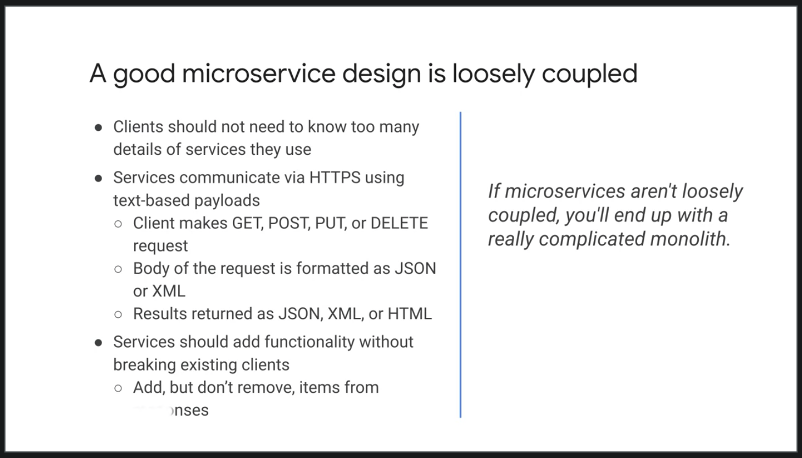

- [Course Intro](#course-intro)
      - [Reading: Workbook](#reading-workbook)
      - [Cloud Architect Workbook](#cloud-architect-workbook)
  - [Intro: Defining a Case Study](#intro-defining-a-case-study)
    - [Defining Your Case Study](#defining-your-case-study)
    - [Module Overview](#module-overview)
    - [Requirements, Analysis & Design](#requirements-analysis--design)
    - [Activity Intro: Analyzing Your Case Study](#activity-intro-analyzing-your-case-study)
    - [Activity Review: Analyzing Your Case Study](#activity-review-analyzing-your-case-study)
    - [KPIs & SLIs](#kpis--slis)
    - [SLOs & SLAs](#slos--slas)
    - [Activity Intro: Defining SLIs & SLOs](#activity-intro-defining-slis--slos)
    - [Activity Review: Defining SLIs & SLOs](#activity-review-defining-slis--slos)
    - [Review](#review)
  - [Module Overview - Application Architecture & Microservice Design](#module-overview---application-architecture--microservice-design)

# Course Intro

his course is about architecting, design, and process. A cloud architect's job is to determine which cloud services to use in order to most effectively implement the applications and services they are building.

This is not an easy job. That's right, many services seem interchangeable. In many cases, multiple different services would work for the same use case.

The intent of this course is to simulate the process you can use to design a system that will run on Google Cloud.

This course is not about implementing specific cloud features. It's about architecture, design, and process. We like to joke that the job of an architect is to draw rectangles and point arrows at them. Which to a certain extent is true, that is an important step in designing complex systems.

In this course, you will focus on that design and planning, specifically, you will work on architecting and designing a case study in this course. The starting point for any software development is to figure out what the software is supposed to do, who your users are, and why this is important. You will begin with this requirements gathering phase.

Once you understand your software's requirements and your users, you can start laying out the overall design. In software, this is a process of decomposition, breaking the big thing, your program, into smaller manageable units that you can start programming. In a modern cloud-based system, it is considered a best practice to break your application into microservices.

Microservices refers to an architectural style for developing applications. Microservices allow a large application to be decomposed into independent constituent parts, with each part having its own area of responsibility. To serve a single user or API request, a microservices based application can call many internal microservices to compose its response.

 The architecture and the course will be microservice based. This has a significant effect on the agility of the application in aspects such as development speed, deployment, and monitoring. We will consider the advantages and disadvantages of this architectural style.

 We'll also help you choose the best storage and deployment services using objective criteria. Choosing the right ones can be complicated. Do you want a relational database, a NoSQL database, or a data warehouse? You also need to consider your compute platform. Do you want to deploy your apps to virtual machines, a Kubernetes cluster or an automated platform like app engine?

 You will learn what the factors are and how to choose the right services for your various microservices. Google provides many services that you can use to make your applications reliable. Availability, durability, cost, and disaster recovery are all important considerations when designing systems. If you understand your requirements, you can choose the right Google Cloud services to meet your applications goals for reliability while optimizing costs.

 Now, there's a saying security is not icing on the cake, it is baked into the cake. Before implementing a system on Google Cloud, you should carefully consider its security requirements and use the appropriate security services.

 Security and computer systems is implemented in layers, Google Cloud handle some things for you. For example, Google secures the physical hardware that Google Cloud is running on. Google also provides many controls to help secure your applications and data.

 Security is a shared responsibility though. The way you configure your network, storage services, and machines will determine how your application is secured. When you design your case study, you will consider its security requirements and bake them into the design.

 At the end you will monitor your app to see whether you're meeting your service objectives. In Google Cloud, there are many services for monitoring your application.

  

 

  

 These include dashboards, logs, error reporting and tracing. You start by defining your application requirements, as you develop your solution, you can use the monitoring tools to determine how successful you are at meeting your application goals.

 The Reliable Cloud Infrastructure Design and Process course is a part of the Cloud Infrastructure learning path. This path is designed for IT professionals who are responsible for implementing, deploying, migrating, and maintaining applications in the cloud. The prerequisite for this course is either the Architecting with Google Compute or Engine or the Architecting with Google Kubernetes Engine Course. In other words, this course is not intended to be your first exposure to Google Cloud.

  

 

  

 Now, the course consists of lectures, design activities, and hands-on labs. You should spend a significant amount of time on the design and architecture assignments we will give you. As with many situations, there will be no one right answer and typically different people come up with different solutions. Architecting systems is a matter of weighing the pros and cons of various solutions and trying to find the best solution given your requirements and constraints.

 Now, the more effort you put into these design activities, the more you will learn from this course. Besides this introduction module, there are nine modules in this course.

 First, you will analyze and design a case study application using a microservice architecture.

 Then, we will cover Google Cloud tools for DevOps and Automation and you will choose the appropriate storage services for your case study. After that, you will learn about network design for cloud and hybrid applications and learn how to choose the appropriate deployment service. We will finish by designing for reliability and security and by monitoring your application.

 

#### Reading: Workbook

Throughout this course you will work on design activities in the course’s workbook.You have three options for accessing the workbook:

1. [Google Slides](https://docs.google.com/presentation/d/13ZXquIwCqp9sp2I7eqbQecENH49vx1xvi-E2k1pHTCE/copy)
2. [Powerpoint](https://storage.cloud.google.com/cloud-training/archdp/v2.0/OnDemand/Workbook%20%7C%20Design%20%26%20Process.pptx)
3. [PDF](https://storage.googleapis.com/cloud-training/archdp/v2.0/OnDemand/Workbook%20%7C%20Design%20%26%20Process.pdf)

All of these formats have the exact same content but we recommend picking one for the entire course.

 

#### [Cloud Architect Workbook](../assets/CloudArchitectWorkbook%20_%20Design%20&%20Process.pdf)

 

## Intro: Defining a Case Study

Slides are great for explaining concepts. But let's start working on the design activity workbook of this course. You can find the full workbook in the resources section of this course.

In the first activity, you need to come up with a case study idea. Whatever your idea is, you don't want it to be too trivial. It should be complex enough idea that designing the solution will be challenging.

For example, you might want to design an online banking portal, a ride sharing application, or an online shopping site. These are all complex applications with many interesting design possibilities.

Now all of these examples have been designed before. Feel free to use your imagination to come up with something that hasn't been done before. You can use something that you might want to develop as part of your work. It's up to you.

As this course is recorded, we won't be able to provide you with specific feedback on your design.

Instead we will provide you with a sample solution for an online travel portal application for each design activity.

Now part A of this activity is to come up with an interesting case study. For part B, write a short description and list the main features and roles of some typical users of your application.

 

### Defining Your Case Study

In this first activity, you were asked to come up with a case study, write a short description, list some of its main features, and list some of the roles users would play while using the application.

To give you an idea of what to come up with, we'll go over our sample solution for an online travel portal application.

Let's call it Click Travel. Click Travel is a global travel agency that wants to build scalable e-commerce platform to serve a global customer base. Let's go over the main features.

Travelers can search and book travel like hotels, flights, trains, and cars. Pricing will be individualized based on the customer's preferences and demand.

There should be a strong social media integration with reviews, post, and analytics.

Suppliers like airlines and hotels can upload their inventory.

As for roles of typical users, we envision a customer, a traveler, an inventory supplier, and a manager.

I'm sure we could come up with more features and roles, but this gives us a good feel for the application we would like to build. Now we can get started working on more detailed requirements and a design.

 

### Module Overview

In this module, we focus on defining services. A new development begins with the planning and design phases.

These require information gathering, starting with business requirements. Once the requirements are defined, it is important to measure that they're providing business value. In this module, we will look at gathering requirements and then techniques from measuring the impact of these solutions.

Let's take a closer look at what we will cover.

In this module, you will learn to describe users of a system in terms of the roles and personas they take. These users will then help define and refine the qualitative requirements which will be captured in the a form of user stories.

These provide a context for the architectural design and subsequent technical decisions you will make as a cloud architect.

Example of business requirements include: accelerating the pace of software development, reducing capital expenditure, and reducing time to recover incidents.

The technical requirements of a systems are both the functional and non-functional features required.

To help identify the most important requirements and measure our impact, you will learn how to measure success using key performance indicators or KPIs.

We will also discuss the importance of using SMART criteria when defining KPIs. We'll finish by considering the most suitable service level objectives or SLOs, and service level indicators or SLIs, and from these service level agreements or SLAs.

 

### Requirements, Analysis & Design

Let's start talking about requirements, analysis, and design.

Useful questions to ask a Cloud architect to help build the requirements are who, what, why, when, and how.

The who is about determining not only the user of the system, but also the developers and stake holders. The aim is to build a full picture of who the system will affect both directly and indirectly.

The what is both simple and difficult, we need to establish the main areas of functionality required, but in a clear, unambiguous manner.

Why the system is needed, is a really important question. What is a problem the proposed system aims to address or solve? Without a clear understanding of the need, it is likely that extra requirements will be added.

The why will also potentially help in defining KPIs, and SLOs, and SLAs. When, helps determine a realistic timeline and can help contain the scope.

How, helps to determine a lot of the non-functional requirements. These could be, for instance, how many users the system needs to support concurrently? What does the average payload size of service requests? Are there latency requirements, etc?

They could be that the users will be located across the world or in a particular region only. All of these requirements are vital to capture, because they impact the potential solution you as a Cloud architect will provide.

In the previous design activity, you defined user roles for your application. Roles represent the goal of a user at some point and they enable the analysis of a requirement in a particular context. It is important to note that a role is not necessarily a person, it is an actor on the system and it could be another system such as a microservice client that is accessing another microservice.

The role should describe the user's objective when using the system. For example, the role of a shopper on an eCommerce application clearly defines what the user wants to do. There are many ways to determine the roles for the requirement you working on.

One process that works particularly well is, first brainstorm an initial set of roles. Write as many roles as you can think of, with each role being a single user. Now, organize this initial set. Here, you can identify overlapping roles and related roles, and group these together.

With the set of roles now grouped, consolidate the roles, the aim here is to consolidate and condense the roles to remove duplication.

Finally, refine the roles including internal and external roles, and the different usage patterns. Here, extra information can be provided, such as the user's level of expertise in the domain or the frequency of use of the proposed software. Following a simple process like this, provide structure and brings focus to the task.

 

 

Identifying user roles is a useful technique that's part of the requirements getting process. An additional technique, in particular for more important roles can be to create a persona for the role. A persona is an imaginary representations of a user role.

The aim of the persona is to help the architect and developers think about the characteristics of users by personalizing them. Often, a role has multiple personas.

Consider the example of requirements for a banking application. We can think in terms of users of the system and many requirements can be gathered this way. Using personas can provide further insights.

For example, Jocelyn is a person who's a busy working mom. Jocelyn wants to save time and money as well as perform these standard banking operations online and receive benefits such as cashback.

Using a persona helps build a fuller picture of the requirements.

For instance, Jocelyn's wanting to save time indicates that the task to be performed should possibly be automated, which affects latency hence service design. In this example, when a question rises from the architect or maybe a developer, they can often better answer that question by thinking, what would Jocelyn want here? Now, user stories describe one thing a user wants the system to do, they are written in a structured way typically using the form as a, type of user, I want to - do something so that I can get some benefit. Another commonly used form is given some context, when I do something, then this should happen.

So when writing stories, give each story a title that describes its purpose as a starting point, follow this with a concise, one-sentence description of the story that follows one of the forms just described. This form describes the user role, what they want to do and why they want to do it.

As an example, consider a banking system and a story to determine the available balance of a bank account. The title of the story could be `balance inquiry`. Then following the template we described the story as an account holder, I want to check my available balance at any time of day, so I am sure not to overdraw my account.

This explains the role, what they want to do and why they want to do it. User stories provide a clear and simple way of agreeing to requirements with a customer/end-user. The INVEST criteria can be used to evaluate good user stories. Let me go through each letter of these criteria.

- Independent, a story should be independent to prevent problems with prioritization and planning.
- Negotiable, they are not written contracts, but are used to stimulate discussion between customer and developers until there is a clear agreement, they add collaboration.
- Valuable, story should provide value to users. Think about outcomes and impact, not outputs and deliverables.
- Estimatable, the story must be estimatable. If it is not, it often indicates missing details or the story is too large.
- Small, good stories should be small, this helps keep scope small and therefore less ambiguous and supports fast feedback from users.
- Testable, stories must be testable so that developers can verify that the story has been implemented correctly and validate when requirement has been met slash/is done.

 

### Activity Intro: Analyzing Your Case Study

In this design activity, you're going to work on activities two A and two B of the design workbook. In the first activity, you defined roles. For an online store, examples of roles might be account holder, shopper, customer, administrator and seller. Roles are played by people and different people playing the same role might be significantly different. In activity two A, you will write some user personas. Personas are stories that describe typical people playing some role while using your system. It's important to understand your users when designing a system. So it's important to write some personas. Now, in a real project, you should find some users and interview them. For this course, feel free to use your imagination. In activity two B, you will write some user stories. User stories are short one sentence descriptions of your applications features.

In the first activity, you listed some features. Now, turn those features into user stories, write your user stories in the form as A and then you fill in the role. I want to and then tell me your goal, so that and you say why this is important to you. For example, an online store might have a feature to search for products. The user story might be, as a shopper, I want to be able to quickly search for products by name keyword or category so I can quickly find information about products I want to purchase.

Here's an example persona.

Jocelyn is a busy working mom who wants to access MegaCorp Bank to check her account balances and make sure that there are enough funds to pay for her kids' music and sports lessons.

She also uses the website to automate payments of bills and see her credit account balances.

Jocelyn wants to save time and money. She wants a credit card that gives her cash back.

Here's an example user story for a feature, balance inquiry.

As a checking account holder, I want to check my available balance at any time of day so that I'm sure not to overdraw my account.

 

### Activity Review: Analyzing Your Case Study

In this second activity, you are asked to write personas and user stories for your case study. Here are a couple of examples of personas for our online travel portal.

Karen is a busy businesswoman who likes to take luxury weekend breaks, often booked at the last minute. A typical booking comprises of a hotel and flight. Recommendations play a major role in the choice Karen makes, as does customer feedback. Karen likes to perform all operations from her phone.

Andrew is a student who likes to travel home to visit parents and also takes vacations twice yearly. His primary concern is cost, and he will always book the lowest price travel regardless of convenience. Andrew has no loyalty, and will use whichever retailer can provide the best deal.

Here are a couple of examples of user stories for our online travel portal.

For the Search for Flight and Hotel feature, I could write:
> as a traveler, I want to search for a flight-hotel combination to a destination on dates of my choice so that I can find the best price.

For the Supply Hotel Inventory feature, I could write:
> as a hotel operator, I want to bulk supply hotel inventory so that ClickTravel can sell it on my behalf.

For the Analyze Sales Performance feature, I could write:
> as a ClickTravel manager, I want to analyze the sales performance data of all of our suppliers so that I can identify poor performers and help them improve.

 

### KPIs & SLIs

With a set of requirements in place, we will now move on to consider how to measure whether the technical and business requirements have been met.

 

 

To manage a service well it is important to understand which behaviors matter and how to measure and evaluate these behaviors. These must always be considered in the context of the constraints which are usually time, funding, and people. Then we consider what can be achieved. The type of system being evaluated determines the data that can be measured, for example, for user-facing systems was a request responded to which refers to availability. How long did it take to respond, which refers to latency. How many requests can be handled, which refers to throughput. For data storage systems, how long does it take to read and write data? That's latency. Is the data there when we need it, that's availability. If there is a failure to we lose any data, that's durability.

The key to all of these items is it the questions can be answered with data gathered from the services.

Business decision makers want to measure the value of projects. This enables them to better support the most valuable projects and not waste resources on those that are not beneficial. A common way to measure success is to use KPIs, KPIs can be categorized as Business KPIs and Technical KPIs.

 

 

Business KPIs are a formal way of measuring what the business values such as ROI in relation to a project or service. Others include, earnings before interest and taxes or impact on users, such as customer churn or maybe employer turnover.

Technical or software KPIs can consider aspects such as how effective the software is through page views, user registration, and number of checkouts. These KPIs should also be closely aligned with business objectives. As an architect, it is important that you understand how the business measures success of the systems that you design. Now, a KPI is not the same thing as a goal or objective. The goal is the outcome or result you want to achieve, the KPI is a metric that indicates whether you are on track to achieve the goal.

To be the most effective, KPIs need an accompanying goal. This should be the starting point in defining KPIs, then for each goal define the KPIs that will allow you to monitor and measure progress. For each KPI, define targets for what success looks like. Monitoring KPIs against goals is important to achieving success and allows readjustment based on feedback.

As an example, a goal may be to increase turnover for an online store and an associated KPI maybe the percentage of conversions on the website.

 

 

For KPIs to be effective, they must be specific rather than general.

For example, user friendly is not specific, it's very subjective. Section 508 Accessible is much more specific.

Measurable is vital because monitoring the KPIs indicates whether you're moving toward or away from your goal.

Being achievable is also important, for example, expecting 100% conversions on a website is not achievable.

Relevant is absolutely vital, without a relevant KPI the goal probably will not be met. In our example of increasing turnover, we're improving the conversion rate as subsequent increase in turnover should be achievable assuming a similar number of users.

Time-bound helps with measuring the KPI. Some KPIs are more sensitive to time, for example, is availability per day, per month or per year.

So to summarize, KPIs are used to measure success or progress toward a goal.

Let's introduce service level terminology. To provide a given level of service to customers, it is important to define service level indicators or SLIs, objectives or SLOs and agreements or SLAs. These are measurements that describe basic properties of the metrics to measure. The values those metrics should read and how to react if the metrics cannot be met.

Service level indicator is a quantitative measure of some aspect of the level of service being provided. Examples include throughput, latency, and error rate.

Service level objective is an agreed upon target or range of values for a service level that is measured by an SLI.

 

 

It is normally stated in the form of SLI is smaller than equal to target or lower bound, which is smaller than, equal to SLI, smaller than, equal to upper bound. An example of an SLO is that an average latency of HTTP requests for our service should be less than 100 milliseconds.

Service level agreement is an agreement between a service provider and a consumer. They define responsibilities for delivering a service and consequences when these responsibilities are not met. The SLA is a more restrictive version of the SLO. We want to architect a solution and maintain an agreed SLO, so that we provide ourselves spare capacity against the SLA.

 

 

Understanding what users want from a service will help inform the selection of indicators. The indicators must be measurable, for example, fast response time is not measurable. Whereas HTTP GET requests that respond within 400 milliseconds aggregated per minute is clearly measurable. Similarly, highly available is not measurable but percentage of successful requests over all request aggregated per minute is measurable. Not only must indicators be measurable but the way they are aggregated needs careful consideration.

For example, consider requests per second to a service, how is the value calculated? By measurements obtained once per second or by averaging request over a minute? The once per second measurement may hide high requests rates that occur in bursts of a few seconds.

For example, consider a service that receives 1,000 requests per second on even-numbered seconds and 0 requests on odd-numbered seconds. The average requests per second could be reported over a minute as 500. However, the reality is that the load at times is twice as large as the average. Similar averages can mask user experience when used for metrics like latency. It can mask the request the take a lot longer to respond than the average.

It is better to use percentiles for such metrics, where a high order percentile, such as 99% shows worst-case values. While the 50th percentile would indicate a typical case.

 

### SLOs & SLAs

The relevancy of SLOs is vital. You want objectives that help or improve the user experience.

 

 

It is easy to define a SLOs based around what is easy to measure rather than what is useful. For clarity, SLOs should specify how they are measured and the conditions when they are valid.

Consider availability as measured with an uptime check over ten seconds aggregated per minute. It is unrealistic as well as undesirable to have SLOs with a 100% target. Such a target results in expensive, overly conservative solutions, that are still unlikely to reach the SLO. It is better to track the rate at which SLOs are missed and work to improve this. In many cases 99% may be good enough availability and be far easier to achieve as well as engineer. It is also highly likely to be much more cost-effective to run.

The use case needs to be considered also.

For example, if a HTTP service for photo uploads requires 99% of uploads to be complete within 100 milliseconds aggregated per minute, this may be unrealistic or overkill if the majority of users are using mobile phones. In such a case, an SLO of 80% is much more achievable and good enough.

It is often okay to specify multiple SLOs.

Consider the following, 99% of HTTP get calls will complete in less than 100 milliseconds. This is a valid SLO, but it may be the case that the shape of the performance curve is important. In this case, the SLO could be written as follows. 90% of HTTP get calls will complete in less than 50 milliseconds, 99% of HTTP get calls will complete in less than 100 milliseconds. And 99.9% of HTTP get calls will complete and less than 500 milliseconds.

Selecting SLOs has both product and business implications. Often trade-offs need to be made based on constraints such as staff, time to market and funding. As the slide states, the aim is to keep users happy, not to have an SLO that requires heroic efforts to maintain.

 

 

Let me give you some tips on selecting SLOs.

Do not make them too high. It is better to have lower SLOs to begin with and tighten them over time as you learn about the system, instead of defining those that are unattainable and require a significant effort and cost try and achieve. Keep them simple. More complex SLOs can obscure important changes in performance.

Avoid absolute values. To have a SLO that states 100% availability is unrealistic. Such an SLO increases the time to build, complexity, and cost to operate. And in most cases is highly unlikely to be required.

Minimize SLOs. A common mistake is to have too many SLOs. The recommendation is to have just enough SLOs to give coverage of the key system attributes. In summary, good SLOs should reflect what the users care about. They work as a forcing function for development teams. A poor SLO will result in a significant amount of wasted work if it is too ambitious or a poor product if it is to relaxed.

An SLA is a business contract between the service provider and the customer.

 

 

A penalty will apply if the service provider does not maintain the levels agreed on. Not every service has an SLA, but all services should have a SLOs. As with SLO, it is better to be conservative with SLAs because it is too difficult to change or remove SLAs that offer little value or cause a large amount of work.

In addition, because they can have a financial implication through compensation to the customer, setting them too high can result in unnecessary compensation being paid. To provide protection and some level of safety, an SLA should have a threshold that is lower than the SLO. This should always be the case.

 

 

Let's consider an example of a service, An SLI, SLO and SLAs for the service. The service is an HTTP endpoint accessed using HTTP get.

The SLI is the end-to-end latency of successful HTTP responses. That is HTTP-200. These are averaged over one minute.

The SLO has been agreed that the latency of 99% of the responses must be less than or equal to 200 milliseconds.

The SLA is set that the user is compensated if the 99th percentile latency exceeds 300 milliseconds. The SLA has clearly built a buffer over the SLO, which means that even if the SLO is exceeded there is some capacity before the SLA is broken.

**This is the wanted position in the relationship between SLO and SLA.**

 

### Activity Intro: Defining SLIs & SLOs

In this design activity, you will define SLIs and SLOs for your case study. Let's say you wanted to write an SLI and SLO for an online shopping application related to availability.

The SLO is what you want to measure. For example, you might want to measure the fraction of successful versus unsuccessful HTTP responses from an API endpoint aggregated per day. The SLO is the target you're trying to achieve.

For your online stores, search for product service that might be 99.95 percent.

Here are a couple of more examples for an imaginary online bank.

The SLI defines what you want to measure, like the fraction of 200 versus 500 HTTP responses from an API endpoint, or the time to last byte GET request measured every 10 seconds aggregated per minute.

The SLO defines the target you want to achieve, like 99.95 percent availability, or that 95 percent of request will complete in under 300 milliseconds.

 

### Activity Review: Defining SLIs & SLOs

In this third activity, you are asked to write SLIs and SLOs for your case study. Here's some example SLOs and SLIs for our travel portal application. Notice that the SLI describes what we're going to measure and how. For example, fraction of 200 vs 500 HTTP responses from API endpoint measured per month.

 

 

This example is a way of measuring availability.

The SLO represents the goal we're trying to achieve for a given SLI. For example, available 99.95% of the time. Feel free to pause the video to read through the other SLOs and SLIs for each user story.

 

### Review

In this module, we learned about qualitative and quantitative requirements.

Qualitative requirements are things that user care about like features. We can express qualitative requirements in the form of user stories. In order to understand our users better, we should write personas.

Quantitative requirements are things we can measure. We can express them as key performance indicators, or KPIs. KPIs and software are things like user sign-ups, clicks, processions, completed purchases, or customer retention. We can also express quantitative requirements as SLOs and SLIs.

These are lower level metrics, things like latency, availability, or response time.

 

## Module Overview - Application Architecture & Microservice Design

In this module, we introduce Application Architecture and Microservice design.

Specifically, you will learn about microservice architectures and how to decompose monolithic applications into microservices. The benefits of a microservice architecture for Cloud-native applications is discussed and contrasted with a monolith.

The challenges of decomposing applications into microservices with clear boundaries to support independently deployable units are investigated.

You will learn how to architect for some of the major technical challenges of microservices architecture, such as state management, reliability, and scalability.

Once a Cloud-native microservice architecture has been chosen, the best practices for development and deployment are introduced based around the widely recognized 12-factor best practices.

At the end of the module, we will go over a core component of the microservices architecture, which is the design of consistent, loosely coupled service interfaces.

 

### Microservices

 

 

Let's begin by looking at microservices in more details. Microservices divide a large program into a number of smaller independent services, as shown on the right. Unlike a monolithic application which implements all features in a single codebase with a database for all data, as shown on the left. Microservices are the current industry trends. However, it's important to ensure that there is a good reason to select this architecture.

The primary reason is to enable teams to work independently and delivered through to production at their own cadence, this supports scaling the organization, adding more teams increases speed. There's also the additional benefit of being able to scale the microservices independently based on their requirements.

Architecturally, an application designed as a monolith or around microservices should be composed of modular components with clearly defined boundaries. With the monolith all the components are packaged at deployment time and deployed together. With microservices, the individual components are deployable.

Google Cloud provides several compute services that facilitate deploying microservices. These include App Engine, Cloud Run, GKE, and Cloud Functions.

Each offers different level of granularity and control and will be discussed later in the course.

To achieve independence on services, each service should have its own datastore. This lets the best datastore solution for that service to be selected and also keeps the services independent. We do not want to introduce coupling between services through a datastore.

A properly designed microservice architecture can help achieve the following goals:

- Define strong contracts between the various microservices.
- Allow for independent deployment cycles, including rollback.
- Facilitate concurrent AB release testing on subsystems.
- Minimize test automation and quality assurance overhead.
- Improve clarity of logging and monitoring.
- Provide fine grained cost accounting.
- Increase overall application scalability and reliability through scaling smaller units.

However, the advantages must be balanced with the challenges this architectural style introduces.

 

 

Some of these challenges include:

It can be difficult to define clear boundaries between services to support independent development and deployment.

Increased complexity of infrastructure with distributed services having more points of failure.

The increased latency introduced by network services and the need to build in resilience to handle possible failures and delays.

Due to the networking involved, there is a need to provide security for service to service communication, which increases complexity of infrastructure.

Strong requirement to manage in version service interfaces with independent deployable services, the need to maintain backward compatibility increases.

 

 

Decomposing applications into microservices is one of the biggest technical challenges of application design. Here are techniques like domains driven design are extremely useful in identifying logical functional groupings. The first step is to decompose the application by feature or functional groupings to minimize dependencies.

Consider, for example, an online retail application. Logical functional groupings could be product management, reviews, accounts, and orders. These groupings then for many applications which exposes an API, each of these mini applications will be implemented by potentially multiple microservices internally.

Internally, these microservices are then organized by architectural layer and each should be independently deployable and scalable. Any analysis will also identify shared services such as authentication, which are then isolated and deployed separately from the mini applications.

When you are designing microservices, services that do not maintain state but obtain their state from the environment or stateless services are easier to manage.

 

 

That is, they are easy to scale, to administer and to migrate to new versions because of their lack of state. However, it is generally not possible to avoid using stateful services at some point in a microservice based application. It is therefore important to understand the implications of having stateful services on the architecture of the system. These include introducing significant challenges in the ability to scale and upgrade the services.

Being aware of how state will be managed is important in the very early stages of microservice application design. Let me introduce some suggestions and best practices on how this can be achieved.

 

 

In memory, shared state has implications that impact and negate many of the benefits of a microservice architecture. The autoscaling potential of individual microservices is hindered because subsequent client requests have to be sent to the same server that the initial request was made to.

In addition, this requires configuration of the load balancers to use sticky sessions, which in Google Cloud is referred to as session affinity. A recognized best practice for designing stateful services is to use backend storage service that are shared by frontend stateless services.

For example, for persistent state, the Google Cloud managed to data services such as Firestore or Cloud SQL maybe suitable then to improve the speed of data access, the data can be cached. The memory store which is a highly available Redis based service, is ideal for this.

 

 

This diagram displays a general solution that shows the separation of the frontend and backend processing stages. A load balancer distributes the load between the backend and frontend services. This allows the backend to scale if it needs to keep up with the demand from the frontend.

In addition, the stateful services or servers are also isolated. The stateful services can make use of the persistent storage services and caching, as previously discussed. This layout allows a large part of the application to make use of the scalability and fault tolerance of Google Cloud Services as stateless services. By isolation of the stateful servers and services, the challenges of Scaling and upgrading are limited to a subset of the overall set of services.

 

### Microservices Best Practices

Let's discuss microservice best practices. The 12-factor app is a set of best practices for building web or software as a service applications. The 12-factor design helps you decouple components of the application so that each component can be deployed to the cloud using continuous deployment and scaled up or down seamlessly.

 

 

The design principles also help maximize portability to different environments. Because the factors are independent of any programming language or software stack, 12-factor design can be applied to a wide variety of applications.

Let's take a look at these best practices.

 

 

The first factor is codebase. The codebase should be tracked in a version control such as Git. Cloud Source repositories provide fully featured private repositories.

The second factor is dependencies. There are two main considerations when it comes to dependencies for 12-factor apps, dependency declaration and dependency isolation. Dependencies should be declared explicitly and stored in version control. Dependency tracking is performed by language specific tools such as Maven for Java and Pip for Python. An application and its dependencies can be isolated by packaging them into a container. Container registry can be used to store the images and provide fine-grained access control.

The third factor is configuration. Every application has a configuration for different environments like test, production and development. This configuration should be external to the code and usually kept in environment variables for deployment flexibility.

Fourth factor is backing services. Every backing service such as database, cache or message service should be accessed via URLs and set by configuration. The backing services act as abstractions for the underlying resource. The aim is to be able to swap one backing service for a different implementation easily.

 

 

The fifth factor is build, release, run. The software deployment process should be broken into three distinct stages, built, release and run. Each state should result in an artifact that's uniquely identifiable. Build will create a deployment package from the source code. Every deployment package should be linked to a specific release that's a result of combining a runtime environment configuration with the build. This allows easy road maps and a visible audit trail of the history of every production deployment. The run stage then simply executes the application.

The sixth factor is processes. Applications run as one or more stateless processes. If state is required, the technique discussed earlier in this module for State Management should be used. For instance, each service should have its own data store and cash using for example Memorystore to cash and share common data between services used.

The seventh factor is port binding. Services should be exposed using a port number. The applications bundle the web server as part of the application and do not require a separate server like Apache. In Google Cloud, such apps can be deployed on platform services such as Compute Engine, GKE, App Engine or Cloud Run.

The eighth factor is concurrency. The application should be able to scale out by starting new processes and scale back in as needed to meet demand or load.

 

 

The ninth factor is disposability, applications should be written to be more reliable than the underlying infrastructure they run on. This means they should be able to handle temporary failures in the underlying infrastructure and gracefully shut down and restart quickly. Applications should also be able to scale up and down quickly, acquiring and releasing resources as needed.

The tenth factor is development production parity. The aim should be to have the same environments used in development and test or staging as are used in production. The infrastructure as code and Docker containers make this easier. Environments can be rapidly and consistently provisioned and configured via environment variables. Google Cloud provides several tools that can be used to build workflows that keep the environments consistent. These tools include Cloud Source repositories, Cloud Storage, Container Registry and Cloud Deployment Manager. Deployment Manager allows the writing of templates to create deployments using Google Cloud services.

The 11th factor is logs, logs provide an of the health of your applications. It's important to decouple the collection processing and analysis of logs from the core logic of your apps. Logging should be to standard output and aggregating into a single source. This is particularly useful when your apps require dynamic scaling and are running on public clouds because it eliminates the overhead of managing the storage location for logs. And the aggregation from distributed and often ephemeral VMs or containers. Google Cloud offers a suite of tools that helps with the collection, processing and structured analysis of logs.

The 12th factor is admin processes. These are usually one-off processes and should be decoupled from the application. These should be automated and repeatable, not manual processes. Depending on your deployment on Google Cloud, there are many options for this including cron jobs in GKE, Cloud tasks on App Engine and Cloud Scheduler.

 

### Activity Intro - Designing Microservices for Your Application:

In this design activity, you're going to work on Activity Four of the Design Workbook. You will design microservices for your application. The primary aim is to diagram the microservices required by your case study application. Some of the things to consider are the microservice boundaries and state management, as well as common services. Use the principle we have discussed in this module so far. Here's an example diagram for microservices for the website and the mobile phone application of an online banking service.

Draw a diagram similar to the one shown here for your case study.

 

### Activity Review - Designing Microservices for Your Application:

In this activity, you were asked to diagram your case study application using microservice style architecture.

The number of microservices appropriate for application and recognizing the microservice boundaries is not obvious.

Two programs might look similar, but their architecture might be considerably different based on the number of users, size of data, security and many other factors.

Fewer services might make deployment and communication between services easier, but also make development and adding new features harder. Having more smaller services makes each individual service easier to understand and implement, but may make the overall architecture of your program more complicated.

Like many things in life, you are looking for the right balance trading off one type of complexity for a different type, hoping to make the system overall as simple and as maintainable as possible. Here is a sample diagram depicting the microservices of our online travel portal.

I suppose we could lay this out in many different ways, there really isn't one and only right way to design an application.

Notice, we have separate services for a web and mobile UIs. There's a shared authentication service and we have microservices for search, orders, inventory, analytics, and reporting. Remember, each of these services will be deployed as a separate application.

Where possible, we want the stateless services, but the orders and inventory services will need databases, and the analytics service will provide a data warehouse. This might make a good starting point and we could adjust as needed when we start implementing the application.

 

### REST

Let's talk about the design of microservices based on rest and HTTP to achieve loosely coupled independent services.

 

 

One of the most important aspects of microservices based applications is the ability to deploy microservices completely independent of one another. To achieve this independence, each microservice must provide a versioned, well-defined contract to its clients, which are other microservices or applications.

Each service must not break these versioned contracts until it's known that no other microservice relies on a particular versioned contract. Remember that other microservices may need to roll back to a previous code version that requires a previous contract. So it's important to account for this fact in your deprecation and turn down policies.

**A culture around strong versioned contracts is probably the most challenging organizational aspect of a stable microservices based application.**

At the lower level of detail, services communicate using HTTPS with text-based payloads, for example, JSON or XML and use the HTTP verbs such as, `get` and `post`, to provide meaning for the actions requested. Clients should just need to know the minimal details to use the service. The URI, the request and the response message formats.

 

 

REST architecture supports loose coupling. REST stands for `Representational State Transfer`. And is protocol independent. The HTTP is the most common protocol but gRPC is also widely used. REST supports loose coupling, but still requires strong engineering practices to maintain that loose coupling. A starting point is to have a strong contract. HTTP-based implementations can use a standard like open API and gRPC provides protocol buffers.

To help maintain loose coupling, it is vital to maintain backward compatibility of the contract and to design an API around a domain and not particular use cases or clients.

If the latter is the case, each new use case or application will require another special purpose REST API regardless of the protocol. Why request-response processing is the typical use case, streaming may also be required and can influence the choice of protocol. gRPC supports streaming, for example.

 

 

Resources are identified by URIs or endpoints and responses to requests return an immutable representation of the resource information. REST applications should provide consistent uniform interfaces and can link to additional resources. Hypermedia as the engine of application state is a component of REST that allows the client to require little prior knowledge of a service because links to additional resources are provided as part of the responses.

It is important that API design is part of the development process. Ideally, a set of API design rules is in place that helps the REST APIs provide a uniform interface. For example, each service reports errors consistently, the structure of the URLs is consistent, and the use of paging is consistent. Also consider caching for performance and resource optimization for immutable resources.

In REST, a client and server exchange representations of resource. A resource is an abstract notion of information. The representation of a resource is a copy of the resource information.

For example, a resource could represent a dog. The representation of a resource is the actual data for a particular dog. For example, Noir who is a Schnoodle or Bree who is Mutt. Two different representations of resource.

The URI provides access to a resource. Making a request for that resource returns a representation of that resource, usually in JSON format. The resource requested can be single items or a collection of items. For performance reasons returning collection of items, instead of individual items can be beneficial. These types of operations are often referred to as batch APIs.

 

 

Representation of a resource between client and services are usually achieved using text-based standard formats. JSON is the norm for text-based formats, although XML can be used as well. For public facing or external facing APIs, JSON is the standard. For internal services, gRPC may be used, in particular, if performance is key.

 
